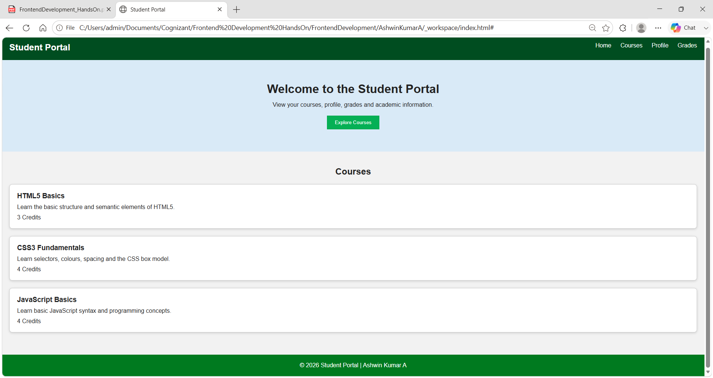
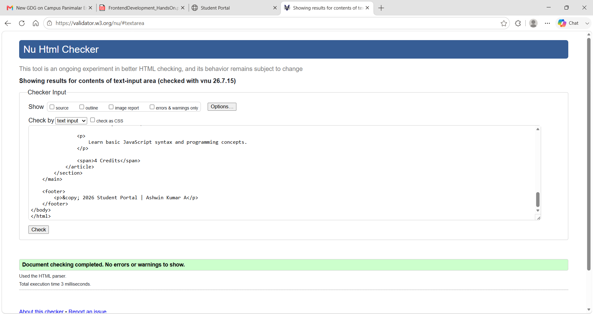
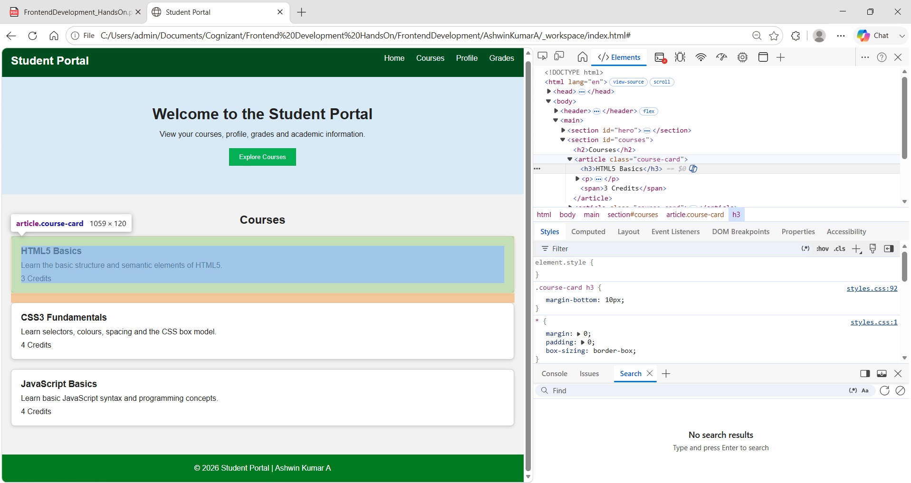

# Hands-On 1 -- HTML5 Semantic Structure & CSS3 Foundations

**Author:** Ashwin Kumar A\
**Track:** Python Full Stack Engineer\
**Module:** Module 2 -- Frontend Development

------------------------------------------------------------------------

## Objective

Build the basic **Student Portal** using semantic HTML5 and CSS3
fundamentals.

------------------------------------------------------------------------

## Folder Structure

``` text
handson_01
│
├── images
│   ├── output_01_student_portal_page.png
│   ├── output_02_html_validation.png
│   └── output_03_course_card_box_model.png
│
├── index.html
├── styles.css
└── README.md
```

------------------------------------------------------------------------

## Files

-   `index.html`
-   `styles.css`

------------------------------------------------------------------------

## Features Implemented

-   HTML5 Semantic Elements
-   Header
-   Navigation
-   Hero Section
-   Courses Section
-   Three Course Cards
-   Footer
-   CSS Reset
-   Flexbox Header
-   Styled Navigation
-   Styled Button with Hover Effect
-   Course Card Styling

------------------------------------------------------------------------

## Output

### Student Portal Page



------------------------------------------------------------------------

### HTML Validation



------------------------------------------------------------------------

### CSS Box Model



------------------------------------------------------------------------

## How to Run

1.  Open the project in VS Code.
2.  Open `index.html` in Chrome.

------------------------------------------------------------------------

## Expected Result

-   Student Portal page loads successfully.
-   Navigation is visible.
-   Hero section is displayed.
-   Three course cards are shown.
-   Button hover effect works.
-   HTML validation shows zero errors.

------------------------------------------------------------------------

## Status

✅ Hands-On 1 Completed
