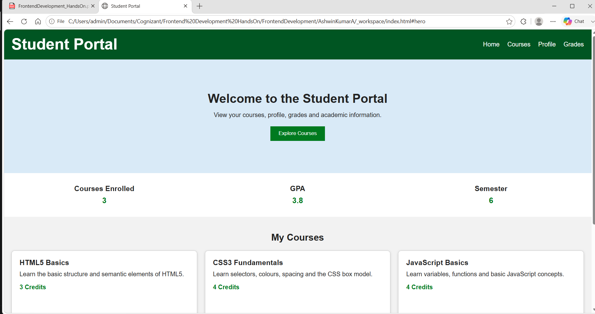
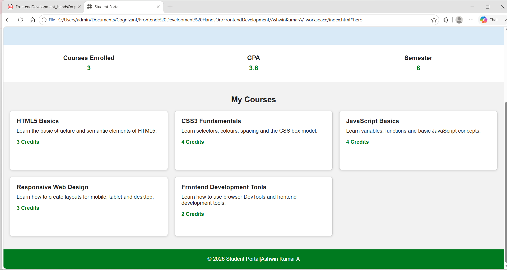
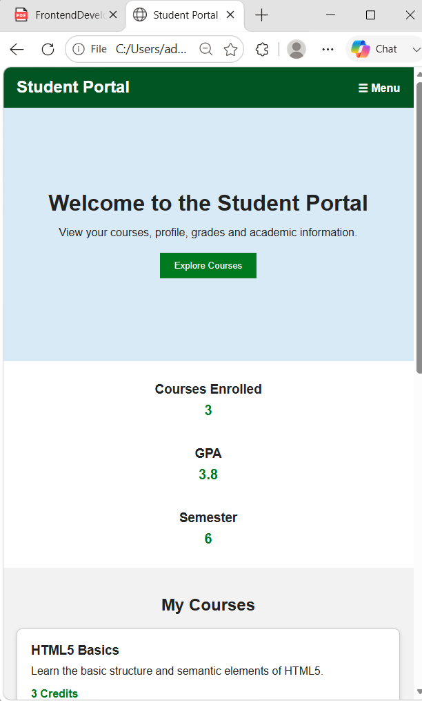
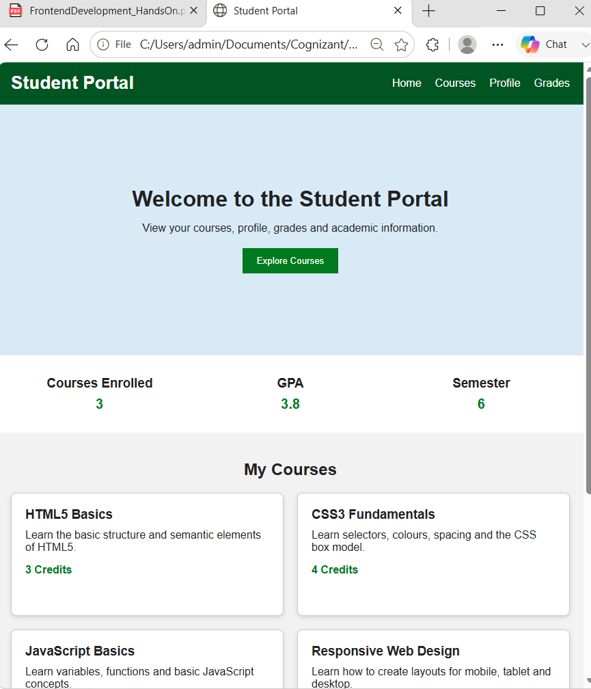
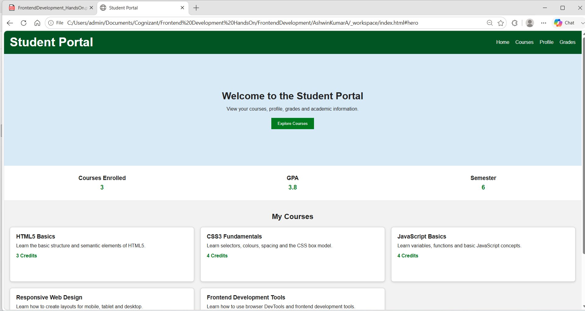

# Hands-On 2 – CSS Flexbox, Grid & Responsive Design

## Student Details

**Name:** Ashwin Kumar A  
**Track:** Python Full Stack Engineer  
**Module:** Frontend Development  
**Hands-On:** 2  

---

## Objective

The objective of this Hands-On is to continue the Student Portal developed in Hands-On 1 and make it responsive using CSS Flexbox, CSS Grid and media queries.

---

# Task 1 – Flexbox Navigation & Header Layout

In this task, I updated the header, navigation, hero section and student statistics section using Flexbox.

## Steps Completed

- Applied `display: flex` to the header.
- Used `align-items: center`.
- Used `justify-content: space-between`.
- Styled the navigation using Flexbox.
- Added spacing between navigation links using `gap`.
- Used Flexbox in the hero section.
- Arranged the hero heading, paragraph and button vertically.
- Added a student statistics bar below the hero section.
- Added Courses Enrolled, GPA and Semester.
- Arranged the statistics using Flexbox with equal spacing.

## Task 1 Output



---

# Task 2 – CSS Grid Course Card Layout

In this task, I arranged the course cards using CSS Grid.

## Steps Completed

- Wrapped the course articles inside a `<div class="course-grid">`.
- Applied `display: grid` to `.course-grid`.
- Initially tested a three-column grid using `repeat(3, 1fr)`.
- Added spacing between cards using `gap`.
- Added a minimum height to each course card.
- Used `align-self: stretch`.
- Added two more course cards.
- Displayed a total of five course cards.
- Tested `repeat(auto-fit, minmax(280px, 1fr))` and observed how the cards automatically reflow while resizing the browser.

## Task 2 Output



---

# Task 3 – Responsive Design with Media Queries

In this task, I rewrote the CSS using a mobile-first approach and added media queries for tablet and desktop layouts.

## Steps Completed

- Used a single-column layout as the default mobile layout.
- Displayed a hamburger placeholder on mobile.
- Added a media query at `min-width: 768px`.
- Displayed the full navigation bar at `768px`.
- Changed the course grid to two columns at `768px`.
- Added a media query at `min-width: 1024px`.
- Changed the course grid to three columns at `1024px`.
- Increased the hero section padding at `1024px`.
- Set the hero section minimum height to `40vh`.
- Used `clamp(1.5rem, 3vw, 2.5rem)` for the site title.
- Tested the layout at 375px, 768px and 1280px.
- Checked that there was no overflow or layout break.

## Mobile View – 375px

At 375px, the course cards are displayed in one column and the mobile menu placeholder is visible.



## Tablet View – 768px

At 768px, the full navigation bar is visible and the course cards are displayed in two columns.



## Desktop View – 1280px

At 1280px, the full navigation bar is visible, the hero section has more padding and the course cards are displayed in three columns.



---

# Files Used

```text
handson_02
├── index.html
├── styles.css
├── README.md
└── images
    ├── task1-flexbox.png
    ├── task2-grid.png
    ├── mobile-375px.png
    ├── tablet-768px.png
    └── desktop-1280px.png
```

---

# Steps Completed

- Step 14: Continued from the existing Hands-On 1 files.
- Step 15: Applied Flexbox to the header with centred alignment and space between items.
- Step 16: Styled the navigation as a Flexbox container with spacing between links.
- Step 17: Created the hero section using Flexbox with a column layout.
- Step 18: Added the student statistics bar using Flexbox.
- Step 19: Wrapped all course articles inside `.course-grid`.
- Step 20: Applied CSS Grid and tested a three-column layout.
- Step 21: Added minimum height and stretching to the course cards.
- Step 22: Added two additional cards to make a total of five.
- Step 23: Tested `auto-fit` and `minmax()` for automatic grid reflow.
- Step 24: Rewrote the CSS using a mobile-first approach.
- Step 25: Added the `768px` media query with two columns and full navigation.
- Step 26: Added the `1024px` media query with three columns and increased hero padding.
- Step 27: Used `40vh` and `clamp()` for a fluid layout.
- Step 28: Tested the portal at 375px, 768px and 1280px.

---

# Result

I completed Hands-On 2 successfully. The Student Portal uses Flexbox for the header, navigation, hero and statistics bar. It uses CSS Grid for the five course cards and works correctly on mobile, tablet and desktop screen sizes.
