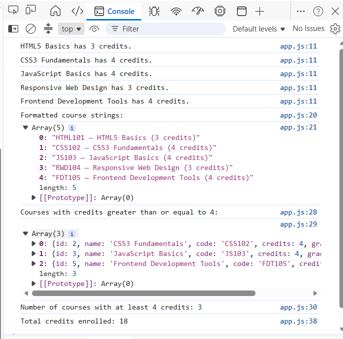
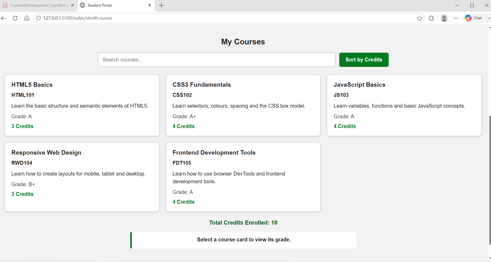
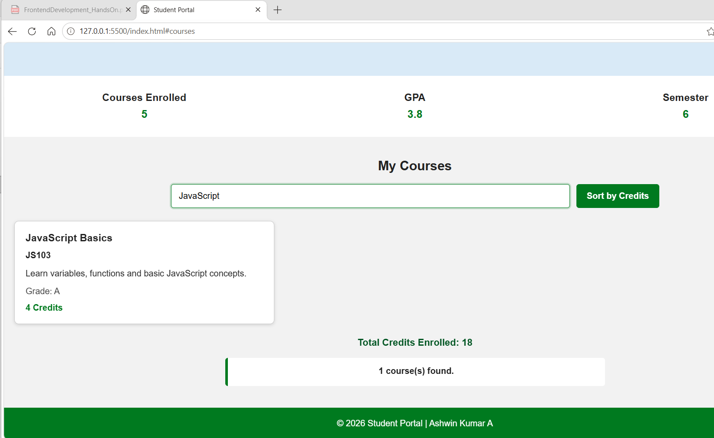
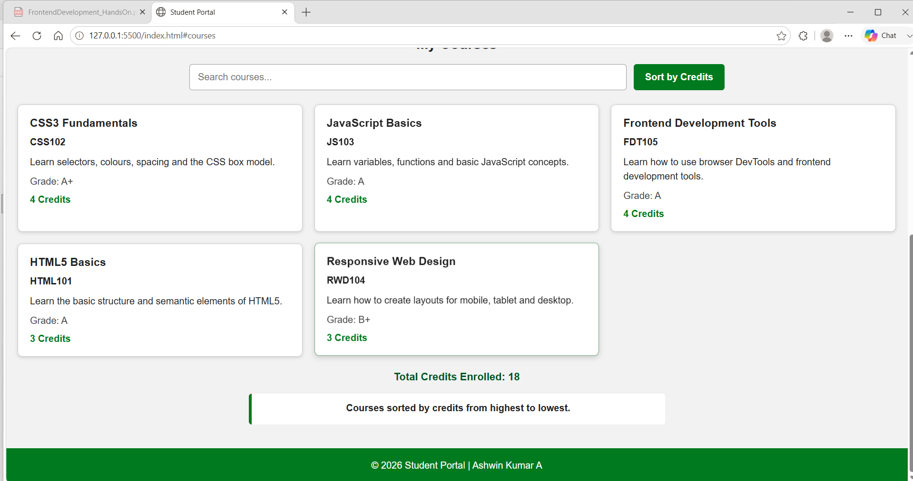
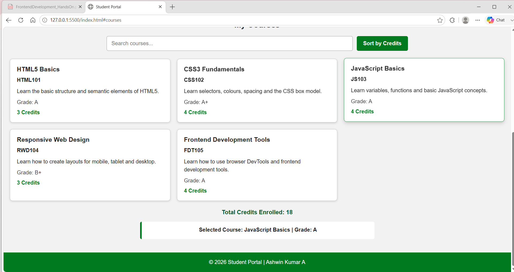

# Module 2 Frontend Development — Hands-On 3

## Student Details

**Student Name:** Ashwin Kumar A  
**Track:** Python Full Stack Engineer  
**Program:** Cognizant Digital Nurture 5.0  
**Module:** Module 2 — Frontend Development  
**Project:** Student Portal  
**Hands-On:** Hands-On 3 — JavaScript ES6+ and DOM Manipulation

## Objective

The objective of this hands-on is to continue the existing Student Portal project and add JavaScript ES6+ features, dynamic DOM rendering and user interactions.

The existing responsive layout from Hands-On 2 was preserved. The course cards are now created dynamically from JavaScript data instead of being hardcoded in HTML.

---

## Task 1 — ES6+ Syntax Practice

### Steps Completed

1. Created `data.js`.
2. Exported a constant array containing five course objects.
3. Added `id`, `name`, `code`, `credits` and `grade` properties to every course.
4. Imported the course array into `app.js` using ES6 module syntax.
5. Used object destructuring to extract course values.
6. Used arrow functions and template literals.
7. Used `map()` to create formatted course strings.
8. Used `filter()` to find courses with four or more credits.
9. Used `reduce()` to calculate the total enrolled credits.
10. Logged all required results in the browser console.

### Expected Output

The console displays:

- The course name and credits using destructuring.
- A formatted array of course strings.
- Courses with credits greater than or equal to four.
- The number of matching courses.
- Total enrolled credits as 18.

### Screenshot



---

## Task 2 — DOM Selection and Dynamic Rendering

### Steps Completed

1. Removed all hardcoded course cards from `index.html`.
2. Kept the `.course-grid` container empty in HTML.
3. Selected the course grid using `document.querySelector()`.
4. Created every course card using `document.createElement()`.
5. Set the card class using `className`.
6. Used a template literal to add the course name, code, description, grade and credits.
7. Added each card to the grid using `appendChild()`.
8. Added the `total-credits` paragraph below the grid.
9. Updated the total credits using `textContent`.
10. Preserved the responsive CSS Grid layout from Hands-On 2.

### Expected Output

Five course cards are rendered dynamically when the page loads. The page displays:

`Total Credits Enrolled: 18`

### Screenshot



---

## Task 3 — Event Listeners and Interactivity

### Steps Completed

1. Added the Search Courses input above the course grid.
2. Added an `input` event listener.
3. Filtered courses by name using a case-insensitive search.
4. Re-rendered only the matching course cards.
5. Added the Sort by Credits button.
6. Added a click event that sorts courses by credits in descending order.
7. Added a selected-course output section.
8. Added one delegated click listener to the course grid.
9. Used `event.target.closest('.course-card')` to identify the clicked card.
10. Displayed the selected course name and grade.
11. Cleared the grid before every re-render to prevent duplicate cards.

### Expected Output

- Typing in the search box filters courses immediately.
- Clicking Sort by Credits displays higher-credit courses first.
- Clicking a course card displays its course name and grade.

### Search Screenshot



### Sorted Courses Screenshot



### Selected Course Screenshot



---

## Files Used

- `index.html` — Student Portal page structure and Hands-On 3 controls
- `styles.css` — responsive layout and component styling
- `data.js` — exported course data
- `app.js` — ES6 syntax, dynamic rendering and event handling
- `README.md` — Hands-On 3 documentation
- `images/` — Hands-On 2 and Hands-On 3 screenshots

## Folder Structure

```text
handson_03
├── index.html
├── styles.css
├── data.js
├── app.js
├── README.md
└── images
    ├── task1-flexbox.png
    ├── task2-grid.png
    ├── mobile-375px.png
    ├── tablet-768px.png
    ├── desktop-1280px.png
    ├── initial-courses.png
    ├── console-output.png
    ├── search-filter.png
    ├── sorted-courses.png
    └── selected-course.png
```

## PDF Steps Completed

### Task 1

- Step 29 — Created and exported five course objects.
- Step 30 — Imported data and used destructuring.
- Step 31 — Used `map()`.
- Step 32 — Used `filter()`.
- Step 33 — Used `reduce()`.
- Step 34 — Used arrow functions and template literals.

### Task 2

- Step 35 — Removed hardcoded course articles.
- Step 36 — Selected the grid using `querySelector()`.
- Step 37 — Created course articles dynamically.
- Step 38 — Appended cards using `appendChild()`.
- Step 39 — Displayed total credits dynamically.

### Task 3

- Step 40 — Added the course search input.
- Step 41 — Added real-time case-insensitive filtering.
- Step 42 — Added descending credit sorting.
- Step 43 — Displayed selected course details.
- Step 44 — Used event delegation with `closest()`.

## Testing Performed

The project was tested using Live Server because the JavaScript files use ES6 module import and export syntax.

The following tests were completed:

1. Confirmed all five courses load dynamically.
2. Confirmed the total enrolled credits display as 18.
3. Confirmed the browser console contains the required `map()`, `filter()` and `reduce()` results.
4. Confirmed searching for JavaScript displays only the JavaScript course.
5. Confirmed clearing the search restores all courses.
6. Confirmed sorting places four-credit courses before three-credit courses.
7. Confirmed clicking a course card displays its name and grade.
8. Confirmed the layout remains responsive.
9. Confirmed no hardcoded course articles remain in `index.html`.
10. Confirmed the browser console has no JavaScript errors.

## Result

Hands-On 3 was completed successfully by continuing the existing Student Portal project from Hands-On 2.

The portal now uses modern JavaScript ES6+ features, JavaScript modules, array methods, dynamic DOM creation, search, sorting and event delegation while preserving the existing responsive Flexbox and CSS Grid layout.
