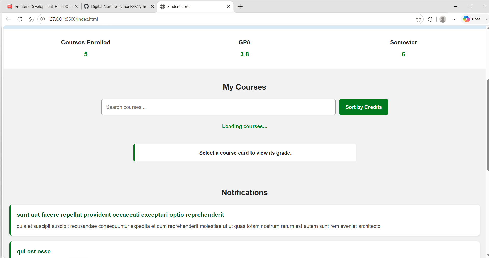
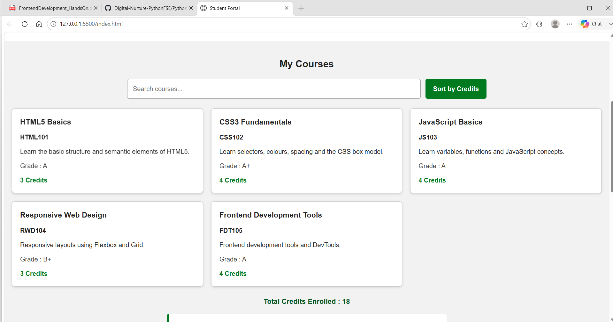
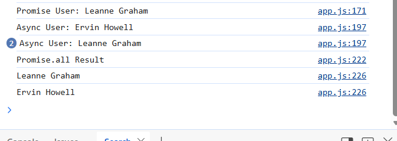
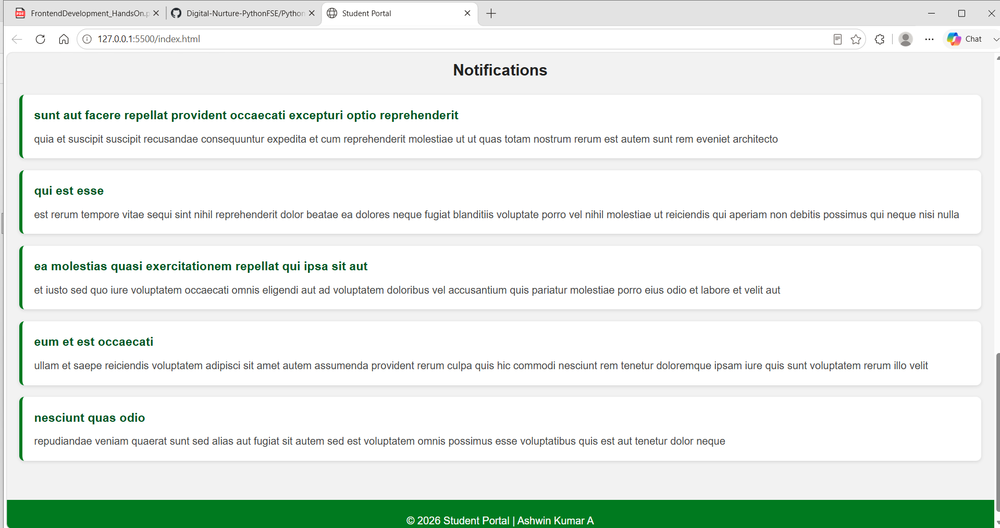
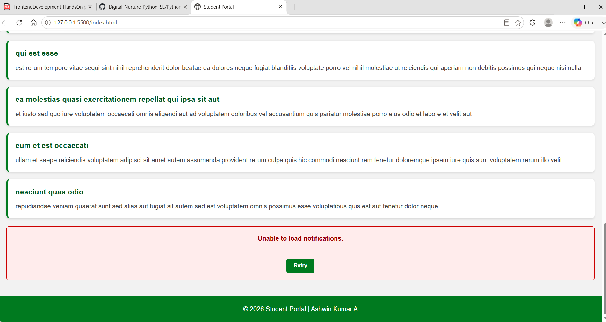
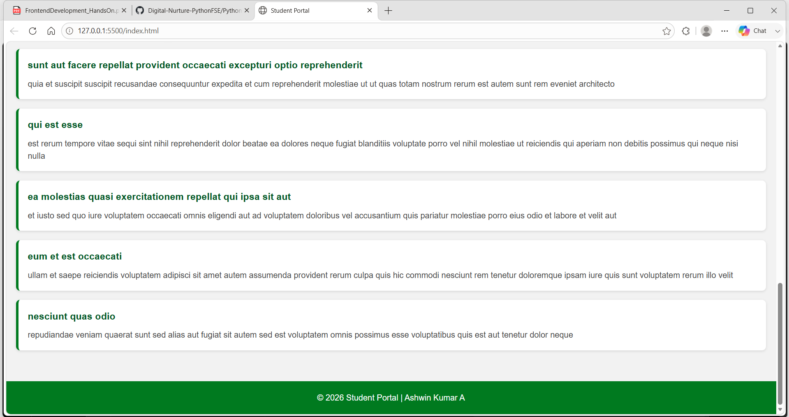
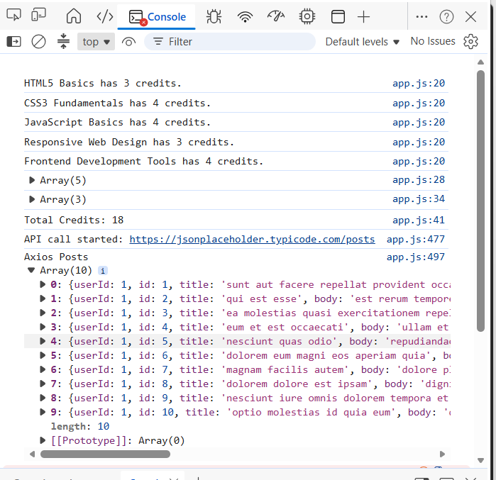

# Module 2 Frontend Development --- Handss-On 4

## Student Details

**Student Name:** Ashwin Kumar A\
**Track:** Python Full Stack Engineer\
**Program:** Cognizant Digital Nurture 5.0\
**Module:** Module 2 --- Frontend Development\
**Project:** Student Portal\
**Hands-On:** Hands-On 4 --- Asynchronous JavaScript, Fetch API and
Axios

## Objective

The objective of this hands-on is to extend the existing Student Portal
developed in Hands-On 3 by implementing asynchronous JavaScript concepts
using Promises, `async/await`, Fetch API and Axios. The application also
demonstrates loading indicators, API integration, error handling and
retry functionality while preserving the responsive UI and dynamic
course features from the previous hands-on.

------------------------------------------------------------------------

## Task 1 --- Promises and Async/Await

### Steps Completed

1.  Created a Promise-based function to simulate asynchronous course
    loading.
2.  Displayed a **Loading courses...** message.
3.  Used `setTimeout()` to simulate a one-second delay.
4.  Implemented `fetchUser()` using `.then()`.
5.  Implemented `fetchUserAsync()` using `async/await`.
6.  Used `Promise.all()` to execute multiple asynchronous requests.
7.  Logged Promise results to the browser console.

### Expected Output

-   Loading message appears before courses load.
-   Courses render after one second.
-   Promise and async results appear in the console.
-   `Promise.all()` prints multiple users.

### Screenshot



After loading:



Console Output:



------------------------------------------------------------------------

## Task 2 --- Fetch API and Error Handling

### Steps Completed

1.  Created a reusable `apiFetch()` function.
2.  Retrieved notifications from JSONPlaceholder.
3.  Displayed a loading indicator while fetching data.
4.  Dynamically rendered notification cards.
5.  Added friendly error handling using `try...catch`.
6.  Displayed a Retry button when an error occurs.
7.  Reloaded notifications successfully after clicking Retry.

### Expected Output

-   Notifications load successfully.
-   Error message appears for failed requests.
-   Retry button reloads notifications.

### Screenshot



Error Handling:



Retry Success:



------------------------------------------------------------------------

## Task 3 --- Axios Integration

### Steps Completed

1.  Added Axios using CDN.
2.  Performed API requests using `axios.get()`.
3.  Passed query parameters using `params`.
4.  Configured an Axios request interceptor.
5.  Compared Fetch API and Axios using comments.

### Expected Output

-   Axios request logged in the browser console.
-   API response displayed successfully.

### Screenshot



------------------------------------------------------------------------

## Files Used

-   `index.html` --- Updated Student Portal structure
-   `styles.css` --- Styling for loading, notifications and retry UI
-   `data.js` --- Course data
-   `app.js` --- Promise, Fetch API and Axios implementation
-   `README.md` --- Hands-On 4 documentation
-   `images/` --- Hands-On screenshots

## Folder Structure

``` text
handson_04
├── index.html
├── styles.css
├── data.js
├── app.js
├── README.md
└── images
    ├── loading-courses.png
    ├── courses-after-delay.png
    ├── promise-all-console.png
    ├── notifications-loaded.png
    ├── error-message.png
    ├── retry-success.png
    └── axios-console.png
```

## PDF Steps Completed

### Task 1

-   Step 45 --- Promise using `.then()`
-   Step 46 --- `async/await`
-   Step 47 --- Simulated delay
-   Step 48 --- Loading indicator
-   Step 49 --- `Promise.all()`

### Task 2

-   Step 50 --- Reusable Fetch API
-   Step 51 --- Notifications section
-   Step 52 --- Loading indicator
-   Step 53 --- Error handling
-   Step 54 --- Retry button

### Task 3

-   Step 55 --- Axios CDN
-   Step 56 --- `axios.get()`
-   Step 57 --- Query parameters
-   Step 58 --- Request interceptor
-   Step 59 --- Fetch vs Axios comparison

## Testing Performed

1.  Verified loading indicator.
2.  Verified delayed course rendering.
3.  Verified Promise and async console output.
4.  Verified `Promise.all()`.
5.  Verified notifications API.
6.  Verified loading indicator for notifications.
7.  Verified error handling.
8.  Verified Retry button.
9.  Verified Axios API call.
10. Verified responsive UI and previous Hands-On 3 features.

## Result

Hands-On 4 was completed successfully by extending the Student Portal
with asynchronous JavaScript concepts including Promises, `async/await`,
Fetch API, Axios, loading indicators, error handling and retry
functionality while preserving all Hands-On 3 features.
