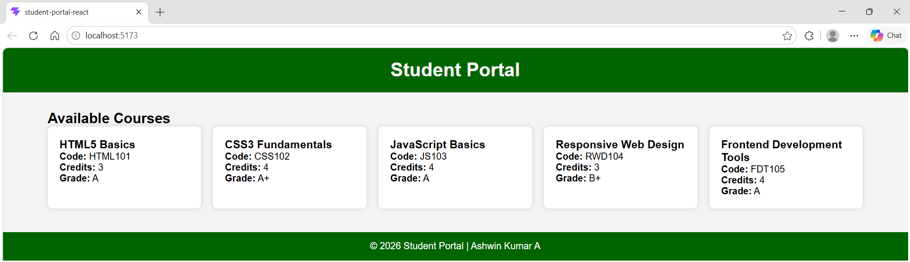
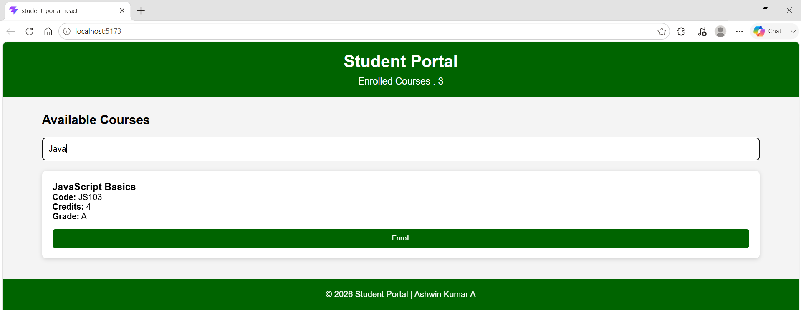
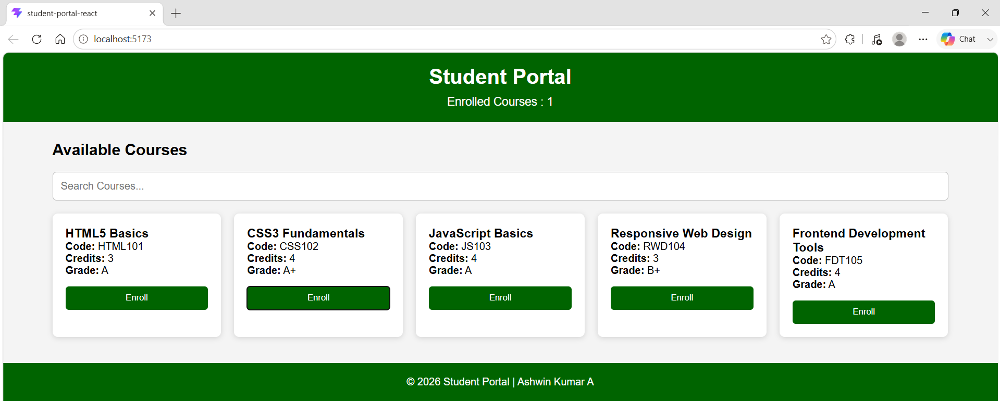
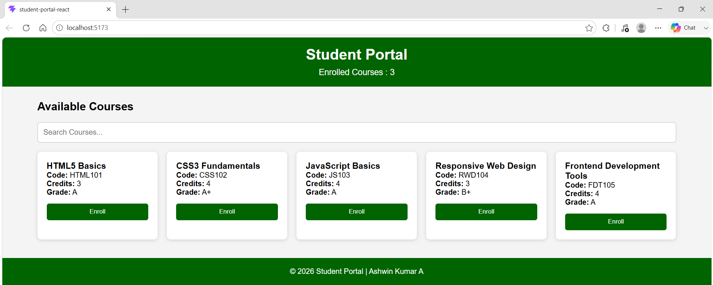
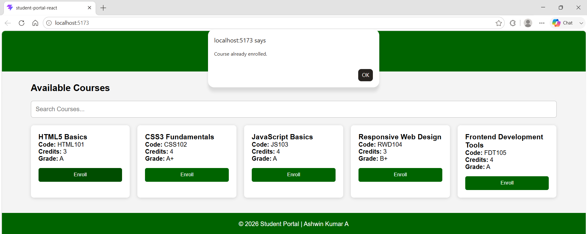
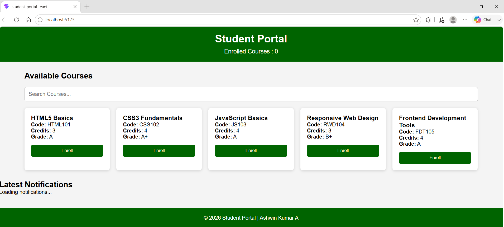
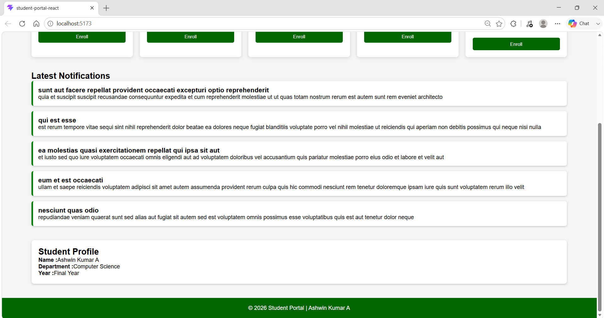
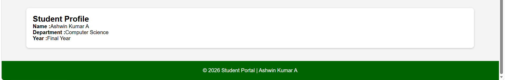
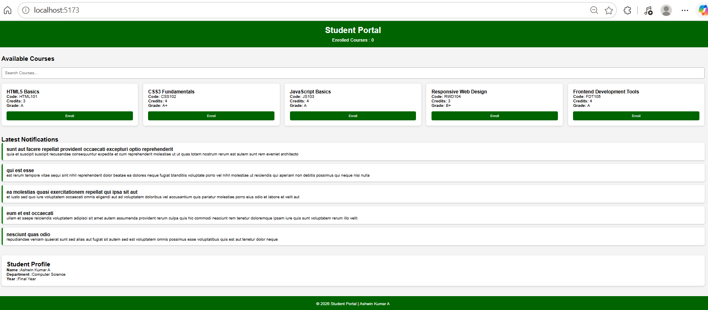

# Hands-On 5 -- Student Portal (React)

## Overview

This project implements a **Student Portal** using **React + Vite**. The
application demonstrates React components, props, state management,
event handling, filtering, `useEffect()`, API integration, and
component-based UI development.

------------------------------------------------------------------------

# Technologies Used

-   React
-   Vite
-   JavaScript (ES6)
-   HTML5
-   CSS3

------------------------------------------------------------------------

# Project Structure

``` text
student-portal-react/
│
├── images/
│   ├── task1-student-portal-home.png
│   ├── task2-search-course.png
│   ├── task2-enroll-course.png
│   ├── multiple-enrollments.png
│   ├── duplicate-enrollment-alert.png
│   ├── task3-loading.png
│   ├── task3-notifications.png
│   ├── task3-student-profile.png
│   └── task3-final-output.png
│
├── src/
├── public/
├── package.json
└── README.md
```

------------------------------------------------------------------------

# Task 1 (PDF Steps 60--65)

## Features Implemented

-   Created React application using Vite
-   Removed default Vite boilerplate
-   Created reusable Header component
-   Created reusable Footer component
-   Created reusable CourseCard component
-   Passed `siteName` using props

## Screenshot



------------------------------------------------------------------------

# Task 2 (PDF Steps 66--70)

## Features Implemented

-   Implemented `useState`
-   Stored course data in state
-   Added search functionality
-   Added Enroll button
-   Maintained enrolled course count
-   Prevented duplicate enrollment

### Screenshot 1 -- Search



------------------------------------------------------------------------

### Screenshot 2 -- Enroll Course



------------------------------------------------------------------------

### Screenshot 3 -- Multiple Enrollments



------------------------------------------------------------------------

### Screenshot 4 -- Duplicate Enrollment Alert



------------------------------------------------------------------------

# Task 3 (PDF Steps 71--75)

## Features Implemented

-   Used `useEffect()` to fetch notifications from JSONPlaceholder
-   Displayed loading message while fetching
-   Added API error handling
-   Created `StudentProfile` component using `useState`
-   Used empty dependency array (`[]`) so API runs once on page load

### Screenshot 1 -- Loading State



------------------------------------------------------------------------

### Screenshot 2 -- Notifications Loaded



------------------------------------------------------------------------

### Screenshot 3 -- Student Profile



------------------------------------------------------------------------

### Screenshot 4 -- Final Output



------------------------------------------------------------------------

# How to Run

``` bash
npm install
npm run dev
```

Open:

    http://localhost:5173

------------------------------------------------------------------------

# Learning Outcomes

-   React Components
-   Props
-   useState Hook
-   useEffect Hook
-   Event Handling
-   Search Filtering
-   Conditional Rendering
-   API Fetching
-   Component Reusability

------------------------------------------------------------------------

# Author

**Ashwin Kumar A**

Frontend Development Hands-On 5
