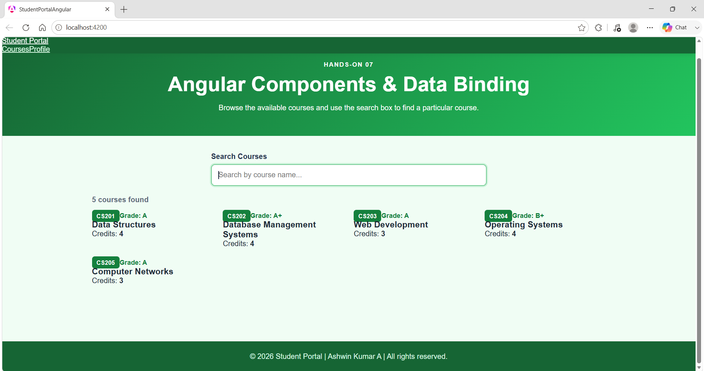
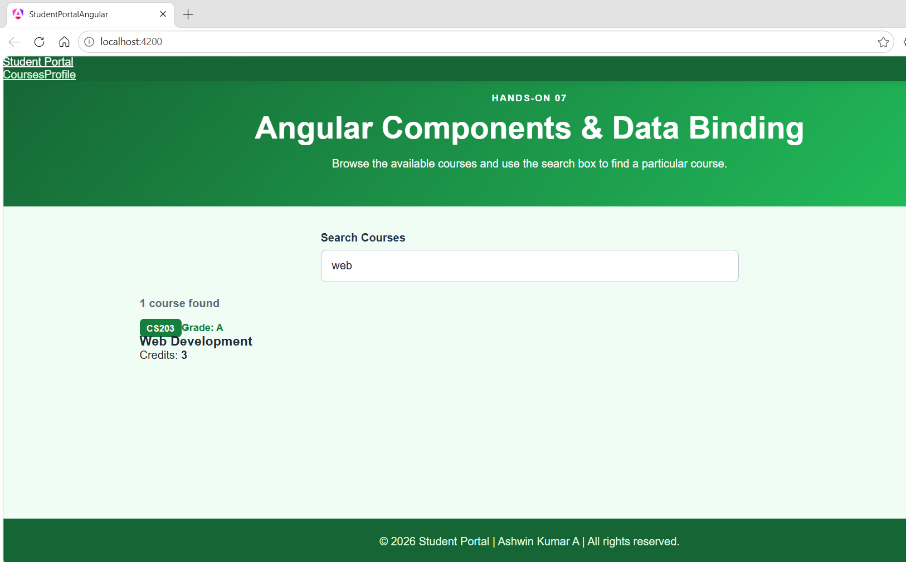
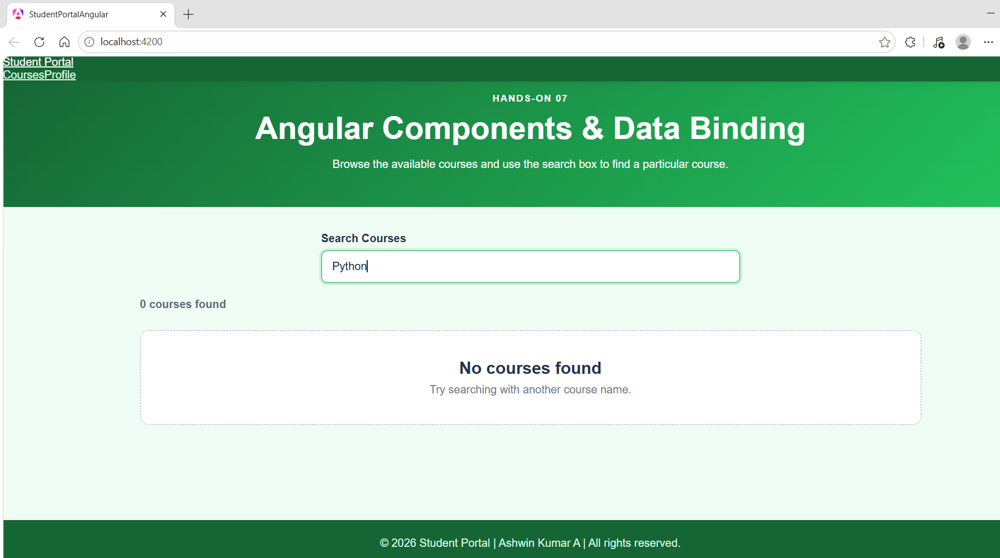
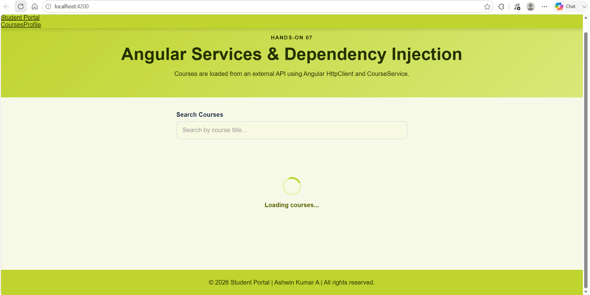
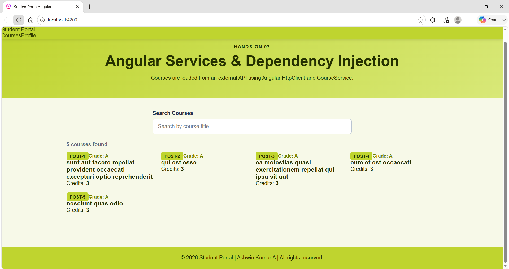
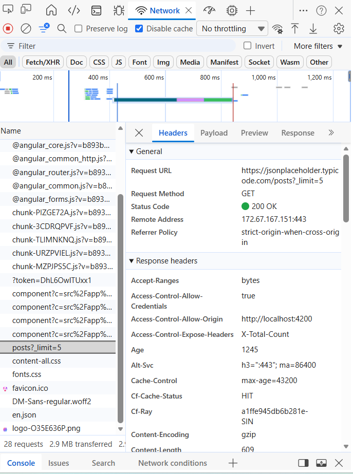
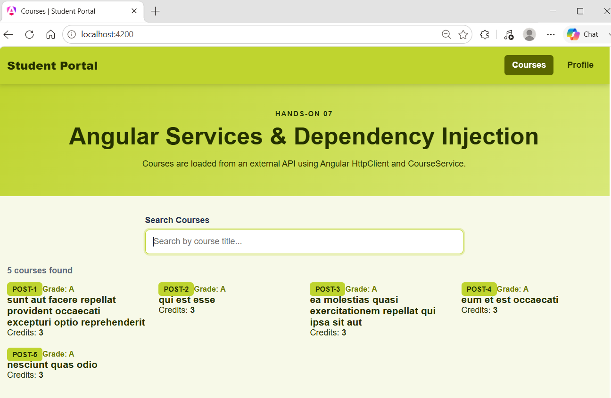
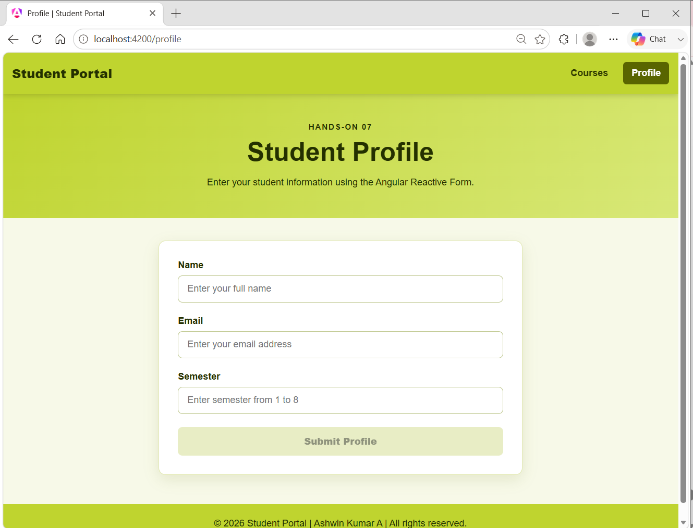
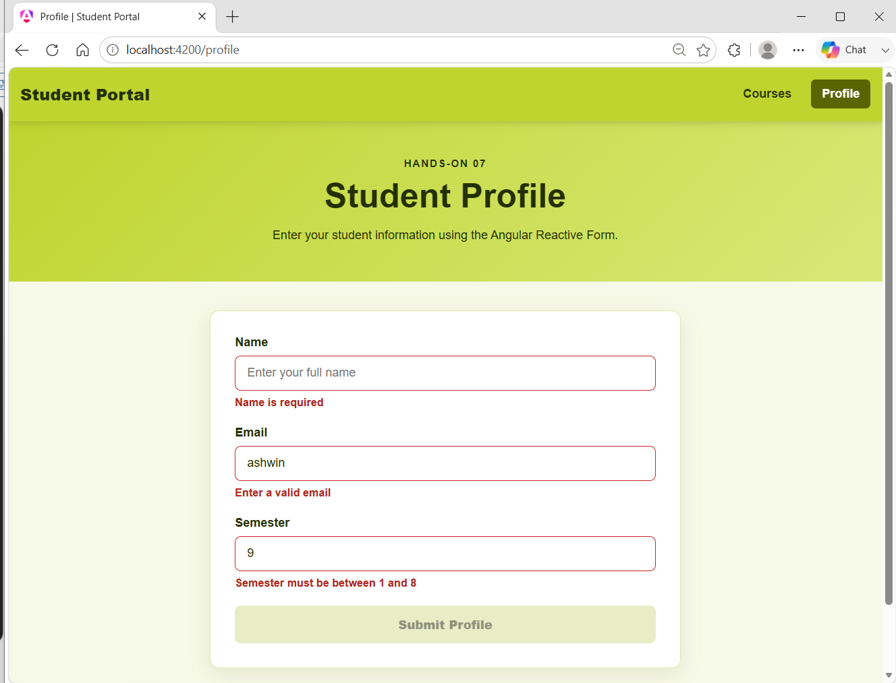
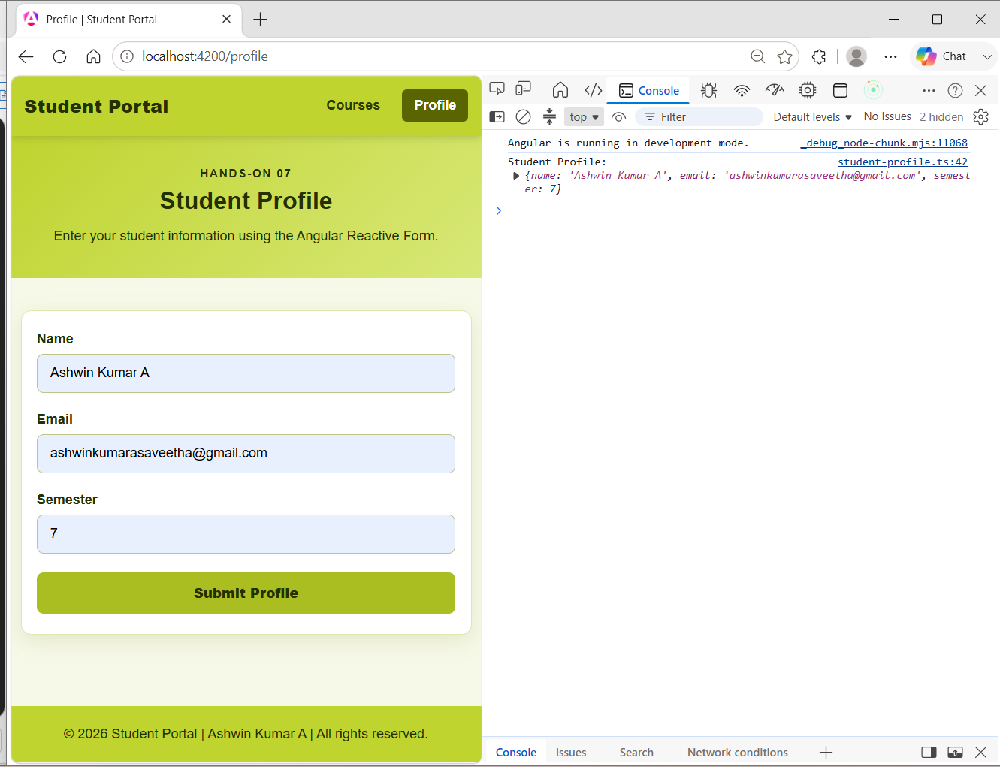

# 🎓 Hands-On 07 -- Angular Student Portal

  **Student Name**   Ashwin Kumar A
  **Hands-On**       07
  **Technology**     Angular
  **Framework**      Angular (Standalone Components)

------------------------------------------------------------------------

# Project Overview

This project is a **Student Portal** developed using **Angular
Standalone Components** as part of **Cognizant Digital Nurture 5.0 --
Frontend Development Hands-On 07**.

The application demonstrates Angular fundamentals including:

-   Angular Components
-   Property Binding
-   Interpolation
-   Two-way Data Binding
-   Structural Directives (`*ngFor`, `*ngIf`)
-   Angular Services
-   Dependency Injection
-   HttpClient
-   RxJS Observable
-   Angular Routing
-   Reactive Forms
-   Form Validation

------------------------------------------------------------------------

# Project Structure

``` text
student-portal-angular/
│
├── images/
├── src/
├── angular.json
├── package.json
├── README.md
└── ...
```

------------------------------------------------------------------------

# Task 1 -- Angular Components & Data Binding

## Objective

Create reusable Angular components and display course information using
Angular data binding.

### Features Implemented

-   Header Component
-   Course List Component
-   Course Card Component
-   Student Profile Component
-   Property Binding using `@Input()`
-   `*ngFor` for rendering cards
-   `[(ngModel)]` for search
-   `*ngIf` for empty search results

------------------------------------------------------------------------

## Screenshot 1 -- Complete Course List

Shows all available course cards.



------------------------------------------------------------------------

## Screenshot 2 -- Search Functionality

Typing **Web** filters the displayed course.



------------------------------------------------------------------------

## Screenshot 3 -- No Courses Found

Displays a friendly message when no matching course exists.



------------------------------------------------------------------------

# Task 2 -- Angular Services & Dependency Injection

## Objective

Retrieve course data using Angular Service and HttpClient.

### Features Implemented

-   CourseService
-   Dependency Injection
-   HttpClient
-   Observable
-   Loading Spinner
-   External REST API Integration

API Used:

``` text
https://jsonplaceholder.typicode.com/posts?_limit=5
```

------------------------------------------------------------------------

## Screenshot 4 -- Loading Spinner

The application displays a loading indicator while waiting for the API
response.



------------------------------------------------------------------------

## Screenshot 5 -- API Data Loaded

Course cards generated from API data.



------------------------------------------------------------------------

## Screenshot 6 -- Network Request

Successful HttpClient request captured from browser Developer Tools.



------------------------------------------------------------------------

# Task 3 -- Angular Routing & Reactive Forms

## Objective

Implement navigation between pages and create a validated Reactive Form.

### Features Implemented

-   Angular Routing
-   Router Outlet
-   RouterLink Navigation
-   Reactive Forms
-   Validators
-   Disabled Submit Button
-   Form Submission

------------------------------------------------------------------------

## Screenshot 7 -- Courses Route

Default application landing page.



------------------------------------------------------------------------

## Screenshot 8 -- Profile Route

Navigation to the Student Profile page.



------------------------------------------------------------------------

## Screenshot 9 -- Validation Errors

Inline validation messages for invalid input.



------------------------------------------------------------------------

## Screenshot 10 -- Valid Form

Submit button becomes enabled after entering valid data.



------------------------------------------------------------------------

## Screenshot 11 -- Form Submission

Successful submission logged in the browser console.


------------------------------------------------------------------------

# Technologies Used

-   Angular
-   TypeScript
-   HTML5
-   CSS3
-   RxJS
-   Angular Router
-   Angular Reactive Forms

------------------------------------------------------------------------

# Application Workflow

1.  Open the application.
2.  View the course list.
3.  Search for courses.
4.  Data is fetched from the REST API.
5.  Navigate to the Profile page.
6.  Complete the form.
7.  Validation is applied instantly.
8.  Submit valid data.
9.  Form values are logged in the browser console.

------------------------------------------------------------------------

# How to Run

Install dependencies:

``` bash
npm install
```

Start the development server:

``` bash
ng serve
```

If Angular CLI is not added to PATH:

``` powershell
& "$env:APPDATA\npm\ng.cmd" serve
```

Open:

``` text
http://localhost:4200
```

------------------------------------------------------------------------

# Build

``` bash
ng build
```

------------------------------------------------------------------------

# Learning Outcomes

-   Developed reusable Angular components.
-   Used Angular data binding techniques.
-   Consumed REST APIs using HttpClient.
-   Applied Dependency Injection.
-   Configured Angular Routing.
-   Built a Reactive Form with validation.
-   Implemented responsive UI using a custom green theme (`#bfd42f`).

------------------------------------------------------------------------

# Author

**Ashwin Kumar A**

**Cognizant Digital Nurture 5.0 -- Frontend Development Hands-On 07**
