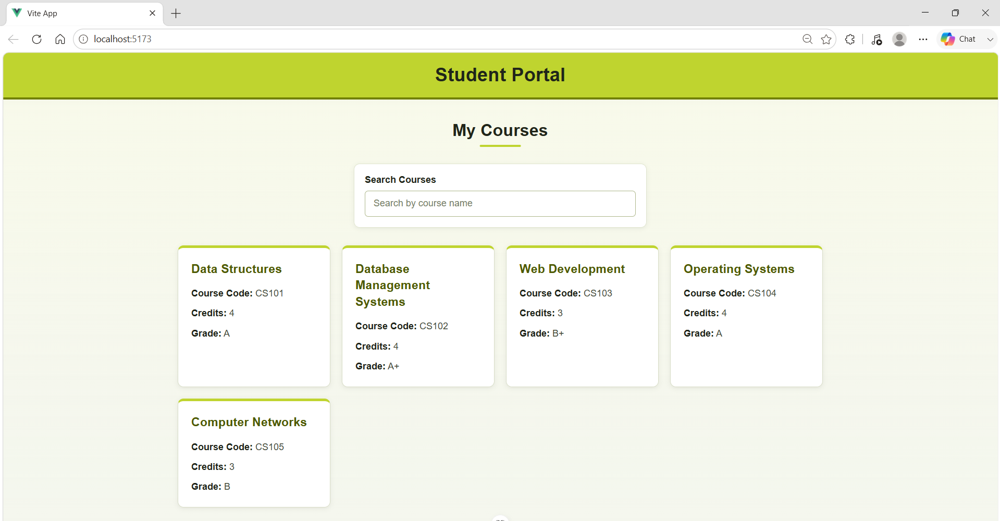
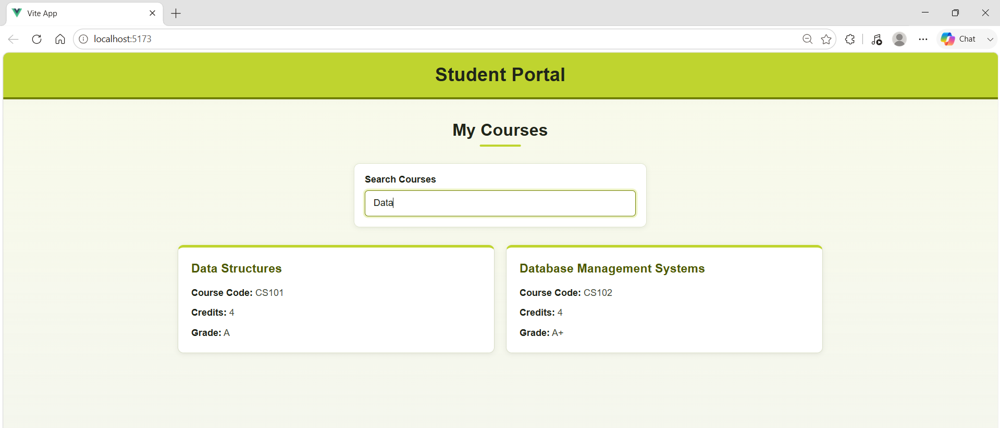
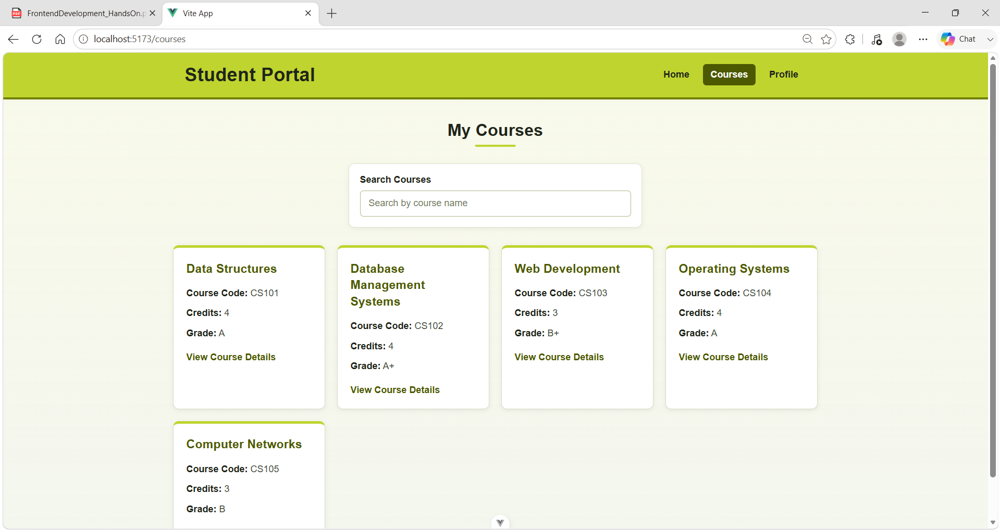
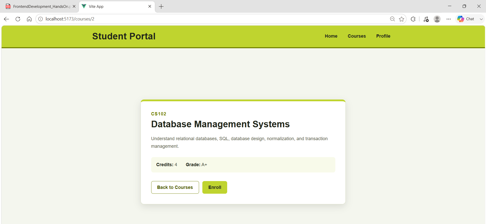
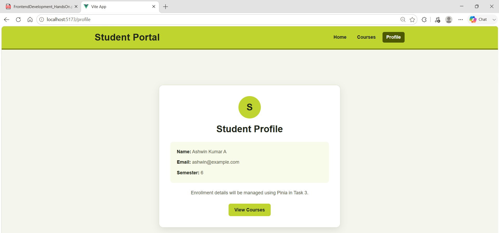
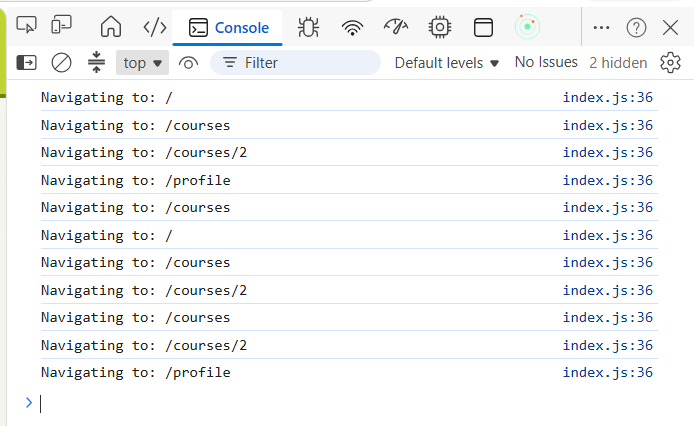
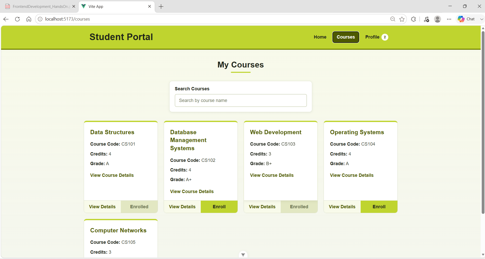
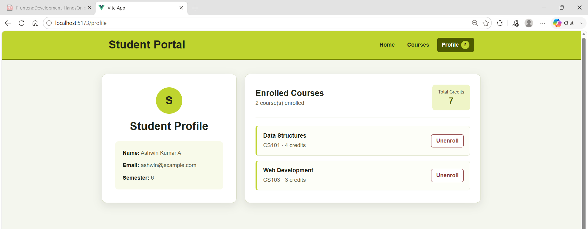
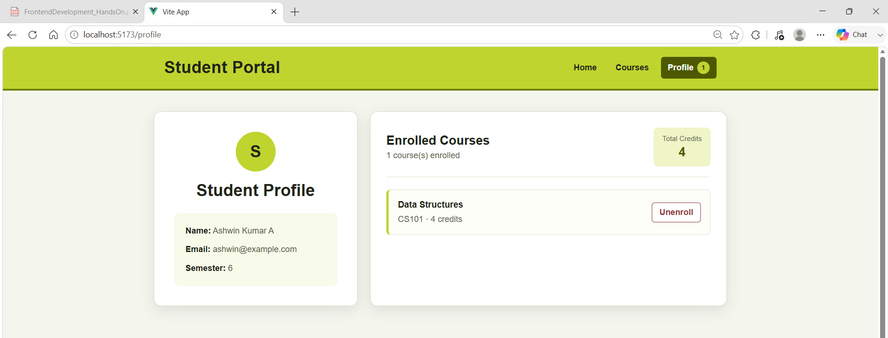
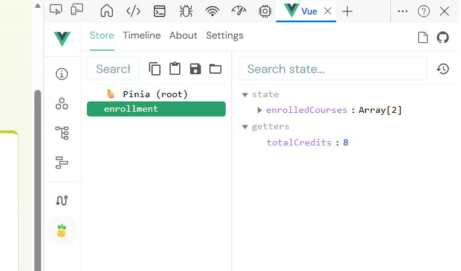

# Hands-On 08 — Vue.js Composition API, Vue Router and Pinia

## Cognizant Digital Nurture 5.0

**Module:** Module 2 — Frontend Development  
**Participant:** Ashwin Kumar A  
**Project:** Student Portal  
**Framework:** Vue.js 3  

---

## Project Folder Structure

```text
student-portal-vue/
├── images/
│   ├── task1_01_courses_overview.png
│   ├── task1_02_search_filter.png
│   ├── task2_01_courses_route.png
│   ├── task2_02_course_detail.png
│   ├── task2_03_enroll_redirect.png
│   ├── task2_04_console.png
│   ├── task3_01_courses_enrolled.png
│   ├── task3_02_profile_enrollments.png
│   ├── task3_03_unenroll_update.png
│   └── task3_04_pinia_devtools.png
├── public/
├── src/
│   ├── assets/
│   │   └── main.css
│   ├── components/
│   │   ├── CourseCard.vue
│   │   └── Header.vue
│   ├── data/
│   │   └── courses.js
│   ├── router/
│   │   └── index.js
│   ├── stores/
│   │   └── enrollment.js
│   ├── views/
│   │   ├── CourseDetailView.vue
│   │   ├── CoursesView.vue
│   │   ├── HomeView.vue
│   │   └── ProfileView.vue
│   ├── App.vue
│   └── main.js
├── .gitignore
├── index.html
├── package-lock.json
├── package.json
├── README.md
└── vite.config.js
```

---

# Task 1 — Vue 3 Components and Reactive Data

## Objective

Create reusable Vue components and implement reactive course data using the Composition API.

## Implemented Requirements

- Created `Header.vue`
- Created reusable `CourseCard.vue`
- Defined props using `defineProps`
- Created a reactive courses array using `ref([])`
- Initialised five course objects inside `onMounted`
- Rendered course cards using `v-for`
- Passed course data using prop binding
- Created a search field using `v-model`
- Added real-time filtering using `computed`

## Task 1 Result — Course Overview

The Courses page displays all five course cards using reusable Vue components. The green theme is applied consistently across the header, search field, cards, and page background.



## Task 1 Result — Search Filtering

The search field is bound using `v-model`. As the user types, the `computed` property filters the course list in real time without reloading the page.



---

# Task 2 — Vue Router for Navigation

## Objective

Configure client-side routing between the Student Portal views.

## Implemented Routes

| Route | View | Purpose |
|---|---|---|
| `/` | `HomeView.vue` | Displays the landing page |
| `/courses` | `CoursesView.vue` | Displays the course list |
| `/courses/:id` | `CourseDetailView.vue` | Displays the selected course |
| `/profile` | `ProfileView.vue` | Displays student profile information |

## Implemented Requirements

- Configured routes in `src/router/index.js`
- Added `RouterLink` navigation
- Added `RouterView` as the route outlet
- Used `useRoute()` to read the dynamic course ID
- Used `useRouter().push('/profile')` for programmatic navigation
- Added `router.beforeEach()` to log route changes
- Preserved all Task 1 search functionality

## Task 2 Result — Courses Route

The `/courses` route displays all courses and allows the user to navigate to individual course details without a full-page reload.



## Task 2 Result — Dynamic Course Details

The dynamic route `/courses/:id` reads the course ID using `useRoute()` and displays the corresponding course information.



## Task 2 Result — Programmatic Navigation

Clicking the Enroll button on the course detail page uses `useRouter().push('/profile')` to redirect the user to the Profile page.



## Task 2 Result — Navigation Guard

A global navigation guard logs the destination path before each route change.



---

# Task 3 — Pinia for State Management

## Objective

Manage shared enrollment state using Pinia.

## Store Location

```text
src/stores/enrollment.js
```

## Store Features

The enrollment store contains:

- `enrolledCourses` — reactive array created using `ref([])`
- `totalCredits` — computed value based on enrolled courses
- `enroll(course)` — adds a course to the enrollment list
- `unenroll(courseId)` — removes a course using its ID

Duplicate enrollment is prevented by checking whether the course already exists in the store.

## Implemented Requirements

- Created a Pinia setup store using `defineStore`
- Connected the store to `CoursesView.vue`
- Added course enrollment buttons
- Displayed the enrollment count in `Header.vue`
- Displayed enrolled courses in `ProfileView.vue`
- Displayed total credits
- Added unenrollment functionality
- Verified store state using Vue DevTools

## Task 3 Result — Course Enrollment

After enrolling in courses, the corresponding buttons change to `Enrolled`, become disabled, and the Profile count updates reactively.



## Task 3 Result — Profile Enrollment Summary

The Profile page displays all enrolled courses and calculates the total credits using a Pinia computed property.



## Task 3 Result — Unenrollment Update

When a course is removed, the enrollment list, Profile count, and total credits update immediately.



## Task 3 Result — Pinia DevTools Verification

The Pinia state was inspected through Vue DevTools to confirm that enrollment actions correctly update the shared store.




## Author

**Ashwin Kumar A**  
Cognizant Digital Nurture 5.0  
Module 2 — Frontend Development  
Hands-On 08
