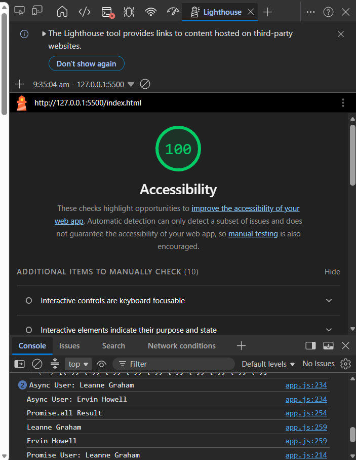
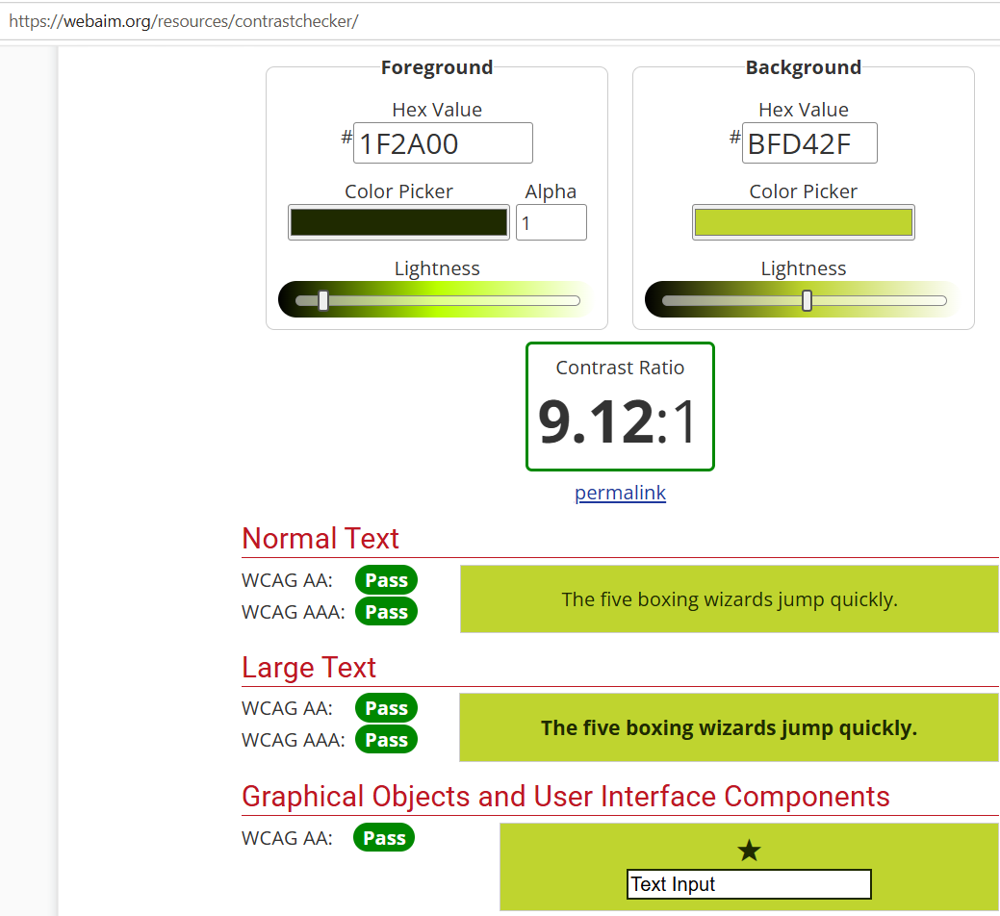
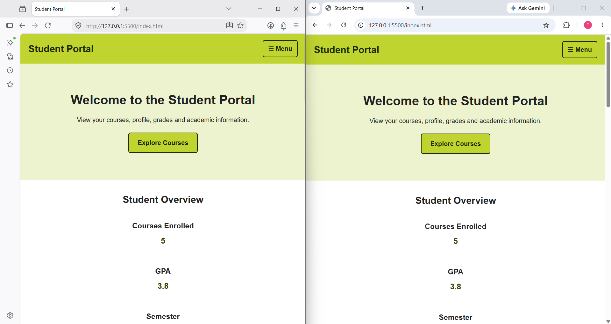

# Hands-On 09 -- Accessibility and Cross-Browser Compatibility

## Student Details

**Student Name:** Ashwin Kumar A\
**Track:** Python Full Stack Engineer\
**Program:** Cognizant Digital Nurture 5.0

## Project Overview

This project was completed as part of **Cognizant Digital Nurture 5.0 --
Module 2: Frontend Development (Hands-On 09)**.

The objective was to improve the accessibility, keyboard usability,
colour contrast and browser compatibility of the existing **Student
Portal** application while following WCAG accessibility guidelines and
frontend best practices.

------------------------------------------------------------------------

# Features Implemented

## Task 1 -- Accessibility Audit

-   Initial Accessibility Score: **87**
-   Fixed heading hierarchy.
-   Added accessible labels.
-   Improved semantic HTML.
-   Corrected button accessibility.
-   Final Accessibility Score: **100**

### Screenshot

**Initial Accessibility Audit**


**Improved Accessibility Audit**


------------------------------------------------------------------------

## Task 2 -- ARIA and Keyboard Navigation

-   Added `aria-label`, `aria-current`, `aria-live`, `role="status"` and
    `aria-expanded`.
-   Enabled keyboard navigation for course cards.
-   Added Enter-key activation.
-   Verified keyboard-only navigation.

### Screenshot

**Keyboard Navigation**



------------------------------------------------------------------------

## Task 3 -- Colour Contrast and Browser Compatibility

### Colour Theme

-   Primary Colour: **#bfd42f**
-   Primary Text: **#1f2a00**
-   WCAG AA compliant contrast.

### Browser Compatibility

-   CSS Grid support verified using Can I Use.
-   CSS feature detection implemented.
-   Flexbox fallback added.
-   css-vars-ponyfill integrated.
-   Cross-browser testing completed.

### Screenshots

**Colour Contrast**



**CSS Grid Browser Support**


**Cross Browser Testing**



**Final Accessibility Audit**


------------------------------------------------------------------------

# Folder Structure

``` text
handson_09
├── images/
├── index.html
├── styles.css
├── app.js
├── data.js
└── README.md
```

------------------------------------------------------------------------


# Application Flow

1.  Student Portal loads.
2.  Student statistics are displayed.
3.  Courses load dynamically.
4.  Search and sort features work.
5.  Notifications are loaded.
6.  Keyboard navigation is supported.

------------------------------------------------------------------------

# Validation

-   Lighthouse Accessibility Audit
-   Keyboard Navigation
-   ARIA Validation
-   Colour Contrast Verification
-   Browser Compatibility
-   Responsive Layout

------------------------------------------------------------------------


# Conclusion

The Student Portal was enhanced with semantic HTML, ARIA attributes,
keyboard accessibility, improved colour contrast, browser compatibility
verification and responsive design. The project successfully achieved a
**100/100 Lighthouse Accessibility Score**.
