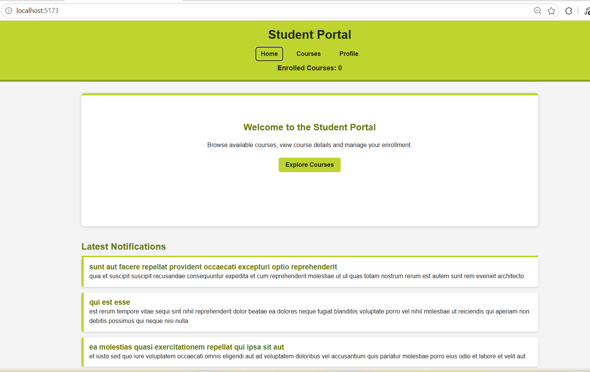
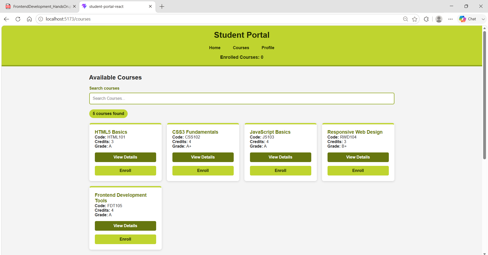
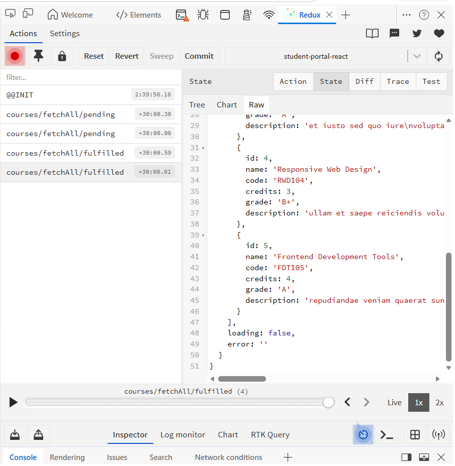
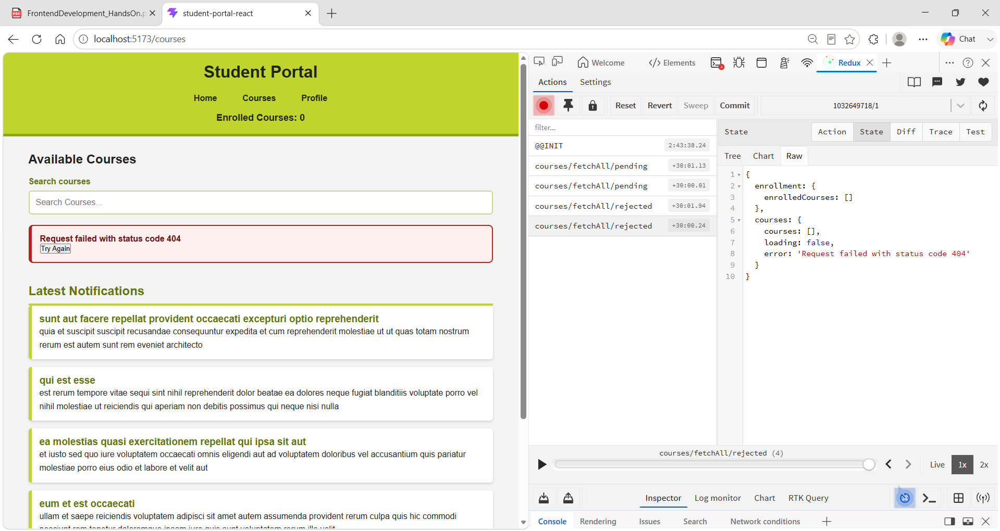
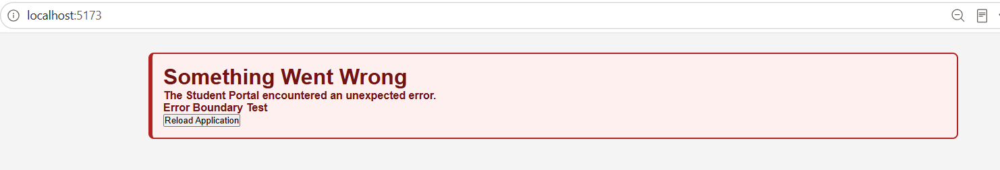
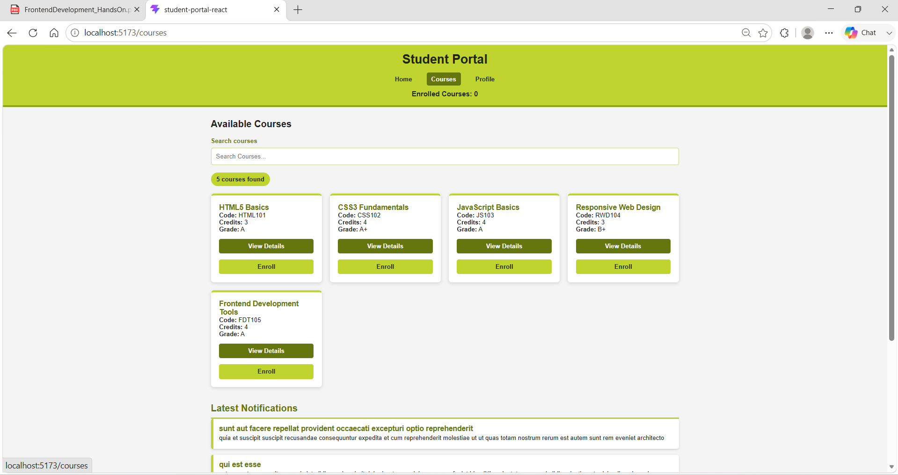

# Cognizant Digital Nurture 5.0

# Frontend Development -- Hands-On 10

## API Integration & Advanced State Management

# Project Folder Structure

``` text
student-portal-react/
│
├── images/
│   ├── 01-task1-centralized-api-working.png
│   ├── Task2_Courses_Loaded.png
│   ├── Task2_Fulfilled_Action.png
│   ├── Task2_Rejected_Action.png
│   ├── Task3_ErrorBoundary.png
│   └── Task3_Final_Application.png
│
├── public/
├── src/
│   ├── api/
│   │   ├── apiClient.js
│   │   ├── courseApi.js
│   │   └── notificationApi.js
│   ├── assets/
│   ├── components/
│   ├── data/
│   ├── pages/
│   ├── redux/
│   │   ├── courseSlice.js
│   │   ├── enrollmentSlice.js
│   │   └── store.js
│   ├── App.jsx
│   └── main.jsx
│
├── package.json
└── README.md
```

------------------------------------------------------------------------

# Task 1 -- Centralized API Service Layer

## Objective

Create a reusable API layer so that every component communicates through
a single Axios client instead of making direct HTTP requests.

### Implementation

-   Created `apiClient.js`
-   Configured Base URL
-   Added Authorization header using Request Interceptor
-   Added Response Interceptor
-   Standardized error handling
-   Created reusable `courseApi.js` and `notificationApi.js`

### Benefits

-   Easy API maintenance
-   Single place to update API configuration
-   Cleaner React components
-   Reusable API functions

### Screenshot



------------------------------------------------------------------------

# Task 2 -- Advanced Redux Toolkit

## Objective

Use **createAsyncThunk** to load courses asynchronously and manage
loading and error states through Redux.

### Redux Flow

``` text
Courses Page
      │
      ▼
dispatch(fetchAllCourses())
      │
      ▼
createAsyncThunk
      │
      ▼
Centralized API Layer
      │
      ▼
Redux Store
      │
      ▼
Selectors
      │
      ▼
User Interface
```

### Implementation

-   Added `courseSlice.js`
-   Used `createAsyncThunk`
-   Implemented Pending State
-   Implemented Fulfilled State
-   Implemented Rejected State
-   Created Selectors
-   Removed direct course API calls from components

### Screenshot -- Courses Loaded



The application successfully loads the course list through Redux Toolkit
instead of making direct API calls from the component.

### Screenshot -- Fulfilled Action



The Redux DevTools confirms that the asynchronous API request completed
successfully and populated the Redux store.

### Screenshot -- Rejected Action



An invalid endpoint was tested to verify proper error handling. The
rejected thunk updated the error state and displayed a user-friendly
message.

------------------------------------------------------------------------

# Task 3 -- Global Error Handling

## Objective

Improve application stability by catching unexpected runtime errors
using a React Error Boundary.

### Implementation

-   Created `ErrorBoundary.jsx`
-   Wrapped the entire application
-   Displayed fallback UI
-   Logged errors to the browser console

### Screenshot -- Error Boundary



The application displays a friendly fallback screen instead of crashing
completely.

### Screenshot -- Final Working Application



------------------------------------------------------------------------

# Comparison of State Management

  Feature       React + Redux Toolkit   Angular + NgRx   Vue + Pinia
  ------------- ----------------------- ---------------- ---------------
  State         Store                   Store            Store
  Async         createAsyncThunk        Effects          Async Actions
  Selectors     Yes                     Yes              storeToRefs
  Boilerplate   Medium                  High             Low
  DevTools      Redux DevTools          NgRx DevTools    Vue DevTools

------------------------------------------------------------------------

# Conclusion

This project demonstrates best practices for building modern React
applications. The centralized API layer improves maintainability, Redux
Toolkit simplifies asynchronous state management, and the Error Boundary
ensures graceful handling of unexpected errors. Together, these patterns
produce a cleaner, more scalable, and production-ready application.

------------------------------------------------------------------------

## Author

**Ashwin Kumar A**

**Project:** Student Portal

**Course:** Cognizant Digital Nurture 5.0 -- Frontend Development

**Framework:** React + Redux Toolkit
