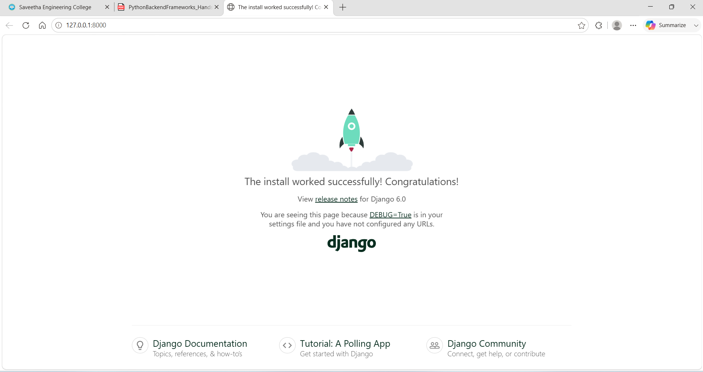
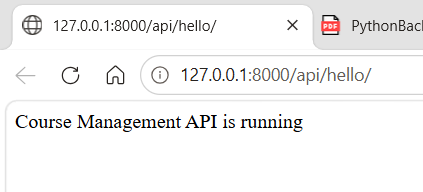

# Python Backend Frameworks - Hands-On 1

## Web Framework Foundations & Django Project Setup

### Author
**Ashwin Kumar A**

---

## Objective

The objective of this Hands-On is to learn the fundamentals of the Django framework by creating a Django project, creating an application, configuring project settings, mapping URLs to views, and returning a simple HTTP response.

---

## Technologies Used

- Python 3.12
- Django 6.0.6
- SQLite (Default Database)

---

## Project Structure

```text
handson_01/
├── coursemanager/
├── courses/
├── images/
│   ├── output_01.png
│   └── output_02.png
├── manage.py
├── db.sqlite3
├── notes.py
├── requirements.txt
└── README.md
```

---

## Tasks Completed

- Created a Python virtual environment.
- Installed Django.
- Created the Django project.
- Created the `courses` application.
- Registered the application in `INSTALLED_APPS`.
- Created the `hello_view`.
- Configured URL routing.
- Tested the application successfully.
- Added theory notes in `notes.py`.
- Generated `requirements.txt`.

---

# Output Screenshots

## Output 1 – Django Welcome Page



---

## Output 2 – API Response



---

## API Tested

**URL**

```text
http://127.0.0.1:8000/api/hello/
```

**Output**

```text
Course Management API is running
```

---

## How to Run

Install the required packages:

```bash
pip install -r requirements.txt
```

Run the Django server:

```bash
python manage.py runserver
```

Open:

```text
http://127.0.0.1:8000/api/hello/
```

---

## Files Included

| File | Description |
|------|-------------|
| manage.py | Django management utility |
| notes.py | Theory explanations |
| requirements.txt | Python dependencies |
| settings.py | Project configuration |
| urls.py | URL routing |
| views.py | Application logic |
| wsgi.py | WSGI entry point |
| asgi.py | ASGI entry point |

---

## Status

✅ Hands-On 1 Completed Successfully

---

**Prepared By**

**Ashwin Kumar A**