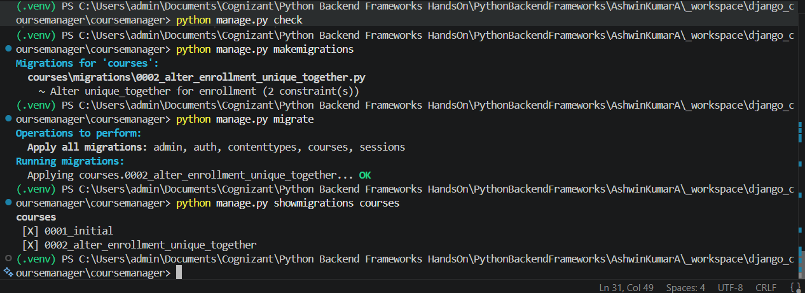
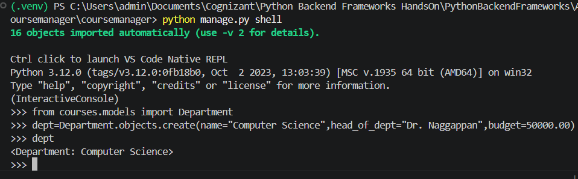
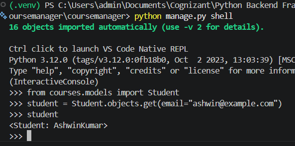

# Hands-On 2: Django Models, Relationships and Migrations

## Overview

This hands-on exercise demonstrates how to define Django models, create
relationships using `ForeignKey`, generate and apply migrations, enforce
a uniqueness constraint on enrollments, and verify data using the Django
ORM.

The Course Management System contains:

-   `Department`
-   `Course`
-   `Student`
-   `Enrollment`

## Task 1: Define Models and Run Migrations

### Objective

1.  Define Django models.
2.  Establish model relationships.
3.  Add human-readable `__str__()` methods.
4.  Prevent duplicate student-course enrollments.
5.  Create and apply migrations.
6.  Verify migrations.
7.  Verify data using Django ORM.

## Project Structure

``` text
handson_02/
├── coursemanager/
│   ├── __init__.py
│   ├── asgi.py
│   ├── settings.py
│   ├── urls.py
│   └── wsgi.py
├── courses/
│   ├── migrations/
│   │   ├── __init__.py
│   │   ├── 0001_initial.py
│   │   └── 0002_alter_enrollment_unique_together.py
│   ├── __init__.py
│   ├── admin.py
│   ├── apps.py
│   ├── models.py
│   ├── tests.py
│   └── views.py
├── images/
│   ├── output_01_migrations_applied.png
│   ├── output_02_department_orm.png
│   └── output_03_student_orm.png
├── db.sqlite3
├── manage.py
├── requirements.txt
└── README.md
```

## Complete Model Definitions

File: `courses/models.py`

``` python
from django.db import models


class Department(models.Model):
    name = models.CharField(max_length=100)
    head_of_dept = models.CharField(max_length=100)
    budget = models.DecimalField(max_digits=12, decimal_places=2)

    def __str__(self):
        return self.name


class Course(models.Model):
    name = models.CharField(max_length=200)
    code = models.CharField(max_length=20, unique=True)
    credits = models.IntegerField()
    department = models.ForeignKey(Department, on_delete=models.CASCADE)

    def __str__(self):
        return self.name


class Student(models.Model):
    first_name = models.CharField(max_length=100)
    last_name = models.CharField(max_length=100)
    email = models.EmailField(unique=True)
    department = models.ForeignKey(Department, on_delete=models.CASCADE)
    enrollment_year = models.IntegerField()

    def __str__(self):
        return f"{self.first_name} {self.last_name}"


class Enrollment(models.Model):
    student = models.ForeignKey(Student, on_delete=models.CASCADE)
    course = models.ForeignKey(Course, on_delete=models.CASCADE)
    enrollment_date = models.DateField()
    grade = models.CharField(max_length=10, null=True)

    def __str__(self):
        return f"{self.student} - {self.course}"

    class Meta:
        unique_together = [["student", "course"]]
```

## Model Details

### Department

Stores department information:

-   `name`
-   `head_of_dept`
-   `budget`

The `__str__()` method returns the department name.

### Course

Stores:

-   course name
-   unique course code
-   credits
-   linked department

``` python
department = models.ForeignKey(Department, on_delete=models.CASCADE)
```

One Department can have many Courses, while each Course belongs to one
Department.

### Student

Stores:

-   first name
-   last name
-   unique email
-   linked department
-   enrollment year

The readable representation is:

``` python
def __str__(self):
    return f"{self.first_name} {self.last_name}"
```

### Enrollment

Connects a Student and a Course and stores:

-   student
-   course
-   enrollment date
-   optional grade

## Relationships

``` text
Department ─────< Course
     │
     └──────────< Student

Student ────────< Enrollment >──────── Course
```

Relationship summary:

-   One Department has many Courses.
-   One Department has many Students.
-   One Student has many Enrollments.
-   One Course has many Enrollments.
-   Each Enrollment links one Student to one Course.

## ForeignKey and CASCADE

Example:

``` python
department = models.ForeignKey(Department, on_delete=models.CASCADE)
```

A `ForeignKey` creates a many-to-one relationship.

Django can follow the relationship:

``` python
course.department
```

Example output:

``` text
<Department: Computer Science>
```

`on_delete=models.CASCADE` means related child records are deleted when
the referenced parent record is deleted.

## Preventing Duplicate Enrollments

The Enrollment model contains:

``` python
class Meta:
    unique_together = [["student", "course"]]
```

This prevents the same Student from being enrolled in the same Course
more than once.

## System Check

Run:

``` powershell
python manage.py check
```

Expected output:

``` text
System check identified no issues (0 silenced).
```

## Create Initial Migration

Run:

``` powershell
python manage.py makemigrations
```

Output:

``` text
Migrations for 'courses':
  courses\migrations\0001_initial.py
    + Create model Department
    + Create model Course
    + Create model Student
    + Create model Enrollment
```

## Apply Initial Migration

Run:

``` powershell
python manage.py migrate
```

Successful output includes:

``` text
Applying courses.0001_initial... OK
```

## Add and Apply Enrollment Uniqueness Migration

After adding `unique_together`, run:

``` powershell
python manage.py makemigrations
```

Generated file:

``` text
courses/migrations/0002_alter_enrollment_unique_together.py
```

Apply it:

``` powershell
python manage.py migrate
```

Successful output:

``` text
Applying courses.0002_alter_enrollment_unique_together... OK
```

## Verify Migration Status

Run:

``` powershell
python manage.py showmigrations courses
```

Verified output:

``` text
courses
 [X] 0001_initial
 [X] 0002_alter_enrollment_unique_together
```

`[X]` means the migration was applied successfully.

### Migration Output Screenshot



## Django ORM Verification

Open the Django shell:

``` powershell
python manage.py shell
```

### Department ORM

Import the model:

``` python
from courses.models import Department
```

Create a Department:

``` python
dept = Department.objects.create(
    name="Computer Science",
    head_of_dept="Dr. Naggappan",
    budget=50000.00
)
```

Display it:

``` python
dept
```

Output:

``` text
<Department: Computer Science>
```

This verifies the database insert and `Department.__str__()`.

### Department ORM Screenshot



### Course ORM and ForeignKey

Import:

``` python
from courses.models import Course
```

Create a Course linked to the Department:

``` python
course = Course.objects.create(
    name="Python Backend",
    code="CS101",
    credits=4,
    department=dept
)
```

Retrieve the existing Course:

``` python
course = Course.objects.get(code="CS101")
```

Display:

``` python
course
```

Expected output:

``` text
<Course: Python Backend>
```

Verify the ForeignKey:

``` python
course.department
```

Output:

``` text
<Department: Computer Science>
```

### Student ORM

Import:

``` python
from courses.models import Student
```

Retrieve the Student using the unique email:

``` python
student = Student.objects.get(email="ashwin@example.com")
```

Display:

``` python
student
```

The readable value is produced by `Student.__str__()`.

### Student ORM Screenshot



> Note: the final `Student.__str__()` implementation includes a space
> between first and last name:
>
> ``` python
> return f"{self.first_name} {self.last_name}"
> ```

## Database

The project uses SQLite:

``` text
db.sqlite3
```

## Database Shell Note

The following command was tested:

``` powershell
python manage.py dbshell
```

On the Windows development environment, Django reported that the
separate `sqlite3` command-line executable was not installed or
available on `PATH`.

This does not prevent Django from using SQLite through Python.
Migrations and ORM operations continued to work successfully.

## Setup Instructions

### 1. Navigate to Hands-On 2

``` powershell
cd "Python FSE\Deepskilling\PythonBackendFrameworks\AshwinKumarA\handson_02"
```

### 2. Create Virtual Environment

``` powershell
python -m venv .venv
```

### 3. Activate Virtual Environment

``` powershell
.\.venv\Scripts\Activate.ps1
```

### 4. Install Dependencies

``` powershell
pip install -r requirements.txt
```

### 5. Check Project

``` powershell
python manage.py check
```

### 6. Apply Migrations

``` powershell
python manage.py migrate
```

### 7. Run Development Server

``` powershell
python manage.py runserver
```

Local development address:

``` text
http://127.0.0.1:8000/
```

## Useful Commands

``` powershell
python manage.py check
python manage.py makemigrations
python manage.py migrate
python manage.py showmigrations courses
python manage.py shell
python manage.py runserver
```

## Technologies Used

-   Python 3.12
-   Django 6
-   SQLite
-   Django ORM
-   Visual Studio Code
-   Git
-   GitHub

## Key Learning Outcomes

-   Define Django models.
-   Use appropriate model fields.
-   Create relationships with `ForeignKey`.
-   Understand `on_delete=models.CASCADE`.
-   Add readable `__str__()` methods.
-   Use unique fields.
-   Prevent duplicate student-course enrollments.
-   Generate and apply migrations.
-   Verify migration status.
-   Create and retrieve records with Django ORM.
-   Traverse ForeignKey relationships.

## Completion Status

Task 1 completed successfully:

-   Department model created
-   Course model created
-   Student model created
-   Enrollment model created
-   ForeignKey relationships configured
-   `__str__()` methods added
-   Unique enrollment constraint added
-   Initial migration generated
-   Second migration generated
-   Migrations applied
-   Migration status verified
-   Department ORM operation verified
-   Course relationship verified
-   Student ORM retrieval verified

## Author

**Ashwin Kumar A**

Python Full Stack Engineering\
Deepskilling --- Python Backend Frameworks
