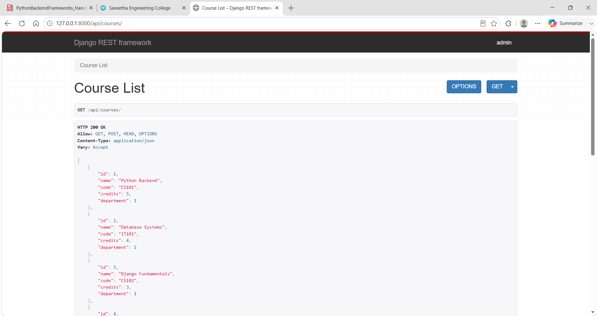
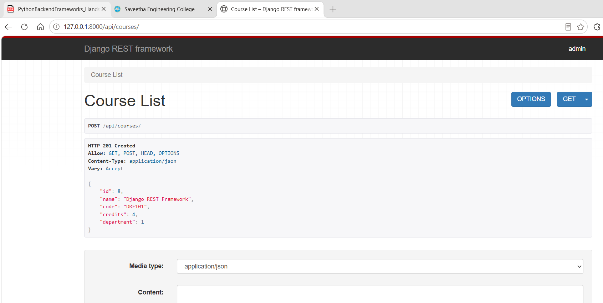
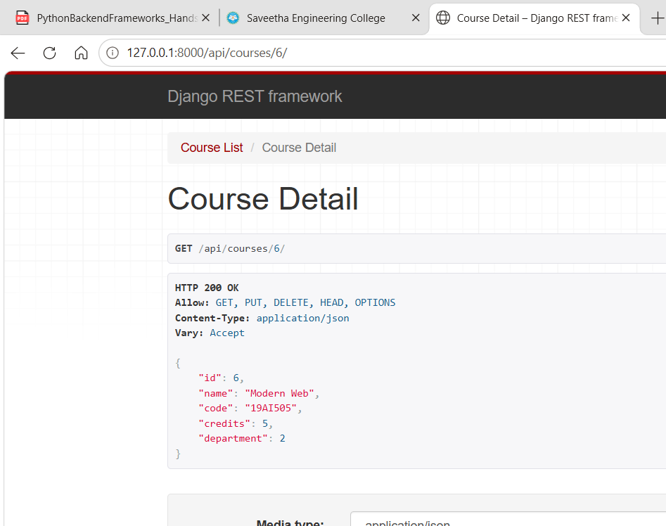
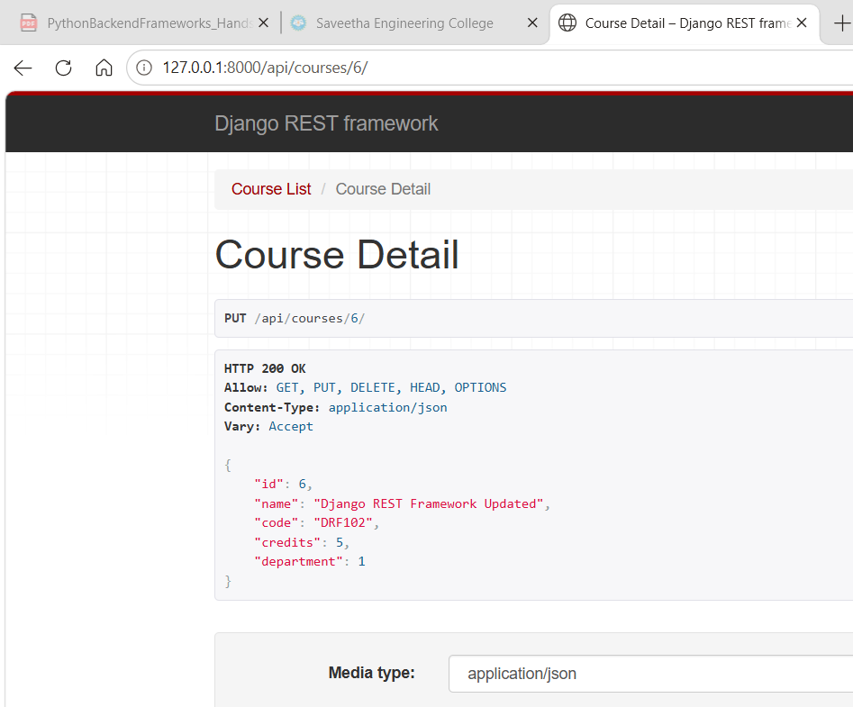
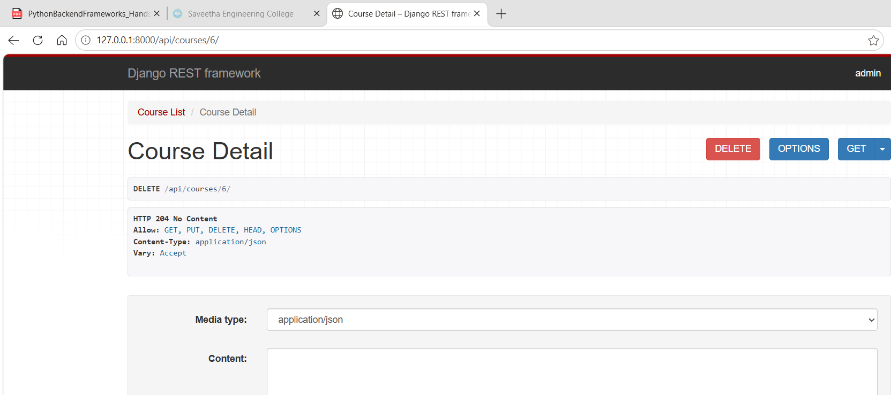
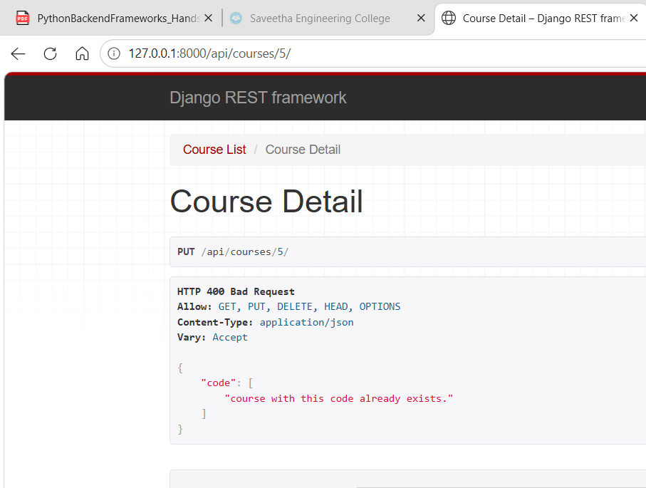
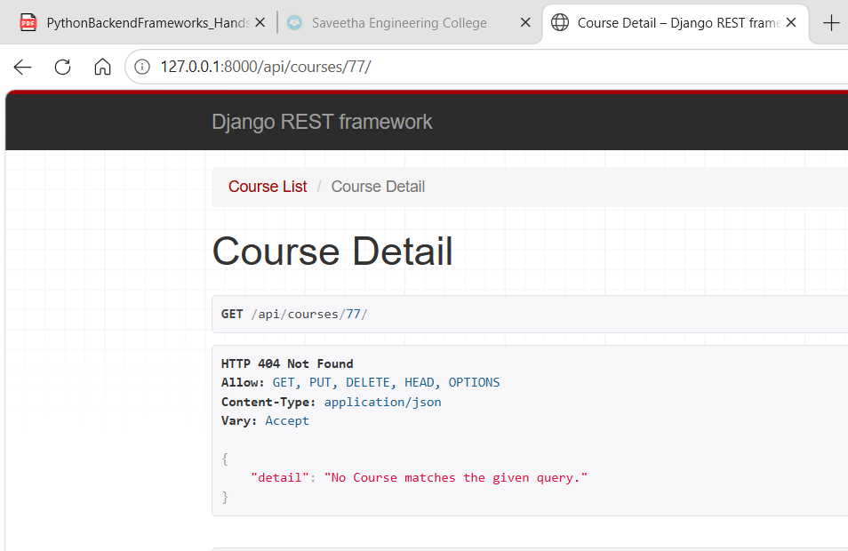
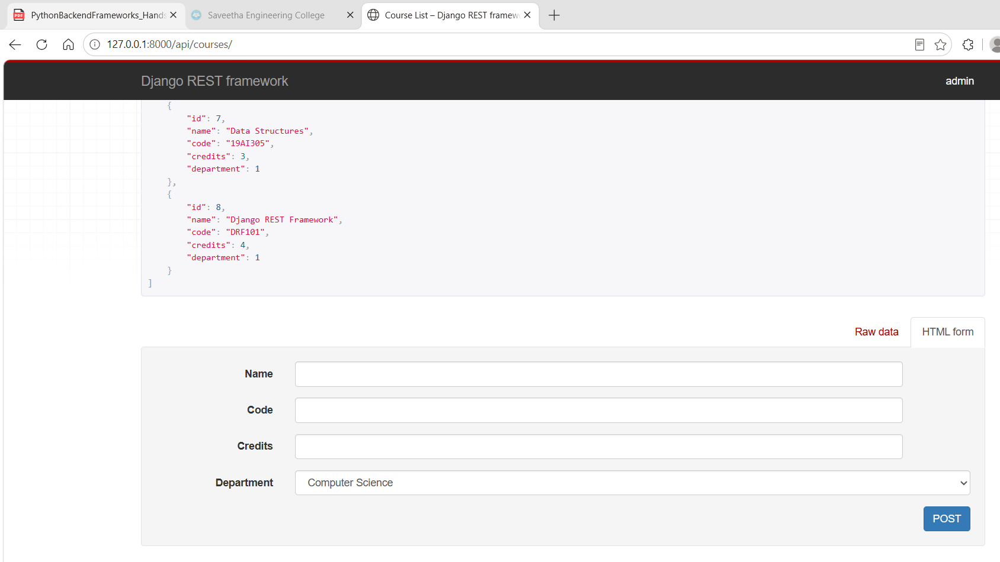
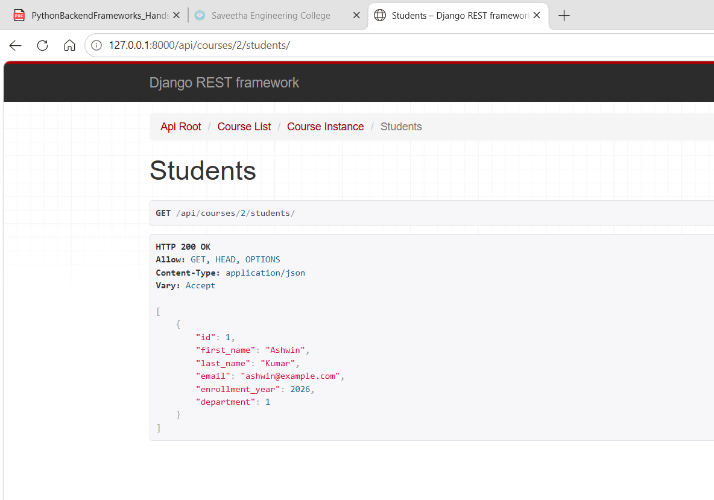

# Hands-On 3 — Django REST Views, URL Routing & Forms

## Overview

This project is part of the **Cognizant Digital Nurture 5.0 — Python Full Stack Engineer Track** under **Python Backend Frameworks Deepskilling**.

Hands-On 3 extends the existing Course Management Django application with **Django REST Framework (DRF)**. The completed work covers serializers, APIView-based CRUD endpoints, ViewSets, automatic routing with `DefaultRouter`, and a custom action for retrieving students enrolled in a specific course.

## Author Details

- **Name:** Ashwin Kumar A
- **Track:** Python Full Stack Engineering
- **Module:** Python Backend Frameworks
- **Hands-On:** 3
- **Environment:** Windows PowerShell
- **Python:** 3.12
- **Framework:** Django with Django REST Framework
- **Database:** SQLite

## Setup

Django REST Framework was installed with:

```powershell
pip install djangorestframework
```

The installed packages were recorded with:

```powershell
pip freeze > requirements.txt
```

`rest_framework` was added to `INSTALLED_APPS`.

---

## Task 1 — Serializers and Basic API Views

### Step 1: Create ModelSerializers

Created `courses/serializers.py` with serializers for all four models:

- `DepartmentSerializer`
- `CourseSerializer`
- `StudentSerializer`
- `EnrollmentSerializer`

All model fields are included using `fields = '__all__'`.

Example:

```python
class CourseSerializer(serializers.ModelSerializer):
    class Meta:
        model = Course
        fields = '__all__'
```

A serializer converts Django model objects into API-friendly data and validates incoming request data.

### Step 2: Create CourseListView

Created `CourseListView` using DRF `APIView`.

- `GET` returns all courses.
- `POST` creates a course from `request.data`.
- Valid POST data returns `201 Created`.
- Invalid data returns `400 Bad Request`.

The GET course-list endpoint was tested successfully.



The POST endpoint was tested by creating a course successfully.



### Step 3: Create CourseDetailView

Created `CourseDetailView` for operations on one course identified by primary key.

- `GET` retrieves one course.
- `PUT` updates a course.
- `DELETE` removes a course.

The GET detail endpoint was tested successfully.



The PUT endpoint was tested successfully.



The DELETE endpoint was tested successfully.



### Step 4: Validation and Error Responses

A duplicate course code was submitted to verify serializer validation. The API returned `400 Bad Request`.



A non-existent course ID was requested to verify not-found handling. The API returned `404 Not Found`.



### Step 5: APIView URL Routing

The APIView routes were configured under `/api/` for:

```text
/api/courses/
/api/courses/{id}/
```

Task 1 testing covered:

- `200 OK`
- `201 Created`
- `204 No Content`
- `400 Bad Request`
- `404 Not Found`

> The APIView implementation was completed and tested first. It was then replaced by ViewSets for Task 2.

---

## Task 2 — ViewSets and Routers

### Step 1: Replace APIViews with ViewSets

Replaced the course list/detail APIViews with `CourseViewSet`.

Also created:

- `StudentViewSet`
- `EnrollmentViewSet`

Example:

```python
class CourseViewSet(viewsets.ModelViewSet):
    queryset = Course.objects.all()
    serializer_class = CourseSerializer
```

`ModelViewSet` provides standard CRUD operations through one class.

### Step 2: Configure DefaultRouter

Created a DRF `DefaultRouter` and registered the ViewSets:

```python
router = DefaultRouter()

router.register('courses', CourseViewSet)
router.register('students', StudentViewSet)
router.register('enrollments', EnrollmentViewSet)
```

The router automatically generates the standard list, create, retrieve, update, and delete routes.

The router-based courses endpoint was tested successfully.



### Step 3: Add Custom Course Students Action

Added a custom `@action` endpoint:

```text
GET /api/courses/{id}/students/
```

Implementation:

```python
class CourseViewSet(viewsets.ModelViewSet):
    queryset = Course.objects.all()
    serializer_class = CourseSerializer

    @action(detail=True, methods=['get'])
    def students(self, request, pk=None):
        course = self.get_object()
        students = Student.objects.filter(enrollment__course=course)
        serializer = StudentSerializer(students, many=True)
        return Response(serializer.data)
```

The endpoint returns only students enrolled in the specified course.



---

## API Endpoints

| Method | Endpoint | Purpose |
|---|---|---|
| GET | `/api/courses/` | List courses |
| POST | `/api/courses/` | Create a course |
| GET | `/api/courses/{id}/` | Retrieve a course |
| PUT | `/api/courses/{id}/` | Update a course |
| DELETE | `/api/courses/{id}/` | Delete a course |
| GET | `/api/students/` | List students |
| POST | `/api/students/` | Create a student |
| GET | `/api/enrollments/` | List enrollments |
| POST | `/api/enrollments/` | Create an enrollment |
| GET | `/api/courses/{id}/students/` | List students enrolled in a course |

## Important Commands Used

Run Django system checks:

```powershell
python manage.py check
```

Start the development server:

```powershell
python manage.py runserver
```

## Project Structure

```text
handson_03/
├── coursemanager/
│   ├── __init__.py
│   ├── asgi.py
│   ├── settings.py
│   ├── urls.py
│   └── wsgi.py
├── courses/
│   ├── migrations/
│   ├── __init__.py
│   ├── admin.py
│   ├── apps.py
│   ├── models.py
│   ├── serializers.py
│   ├── tests.py
│   ├── urls.py
│   └── views.py
├── images/
│   ├── output_01_get_courses_list.png
│   ├── output_02_post_create_course.png
│   ├── output_03_get_course_detail.png
│   ├── output_04_put_update_course.png
│   ├── output_05_delete_course.png
│   ├── output_06_400_bad_request.png
│   ├── output_07_404_not_found.png
│   ├── output_08_viewset_router_courses.png
│   └── output_09_course_enrolled_students_custom_action.png
├── db.sqlite3
├── manage.py
├── README.md
└── requirements.txt
```

## Completion Status

- [x] Django REST Framework installed and configured
- [x] Four ModelSerializers created
- [x] Course APIView list/create operations implemented and tested
- [x] Course APIView detail/update/delete operations implemented and tested
- [x] APIView URL routing configured
- [x] HTTP success and error responses tested
- [x] CourseViewSet implemented
- [x] StudentViewSet implemented
- [x] EnrollmentViewSet implemented
- [x] DefaultRouter configured
- [x] Custom course students action implemented
- [x] Custom action tested
- [x] Evidence screenshots documented

## Final Result

Hands-On 3 is completed with Django REST Framework serializers, CRUD API functionality, ViewSets, router-generated URLs, and a custom endpoint for retrieving students enrolled in a specific course.
