# Hands-On 4 --- Flask: App Structure, Routing, Jinja2 & Blueprints

## Author

**Name:** Ashwin Kumar A\
**Track:** Python Full Stack Engineering\
**Module:** Deepskilling --- Python Backend Frameworks

## Overview

This Hands-On rebuilds the Course Management API in Flask. The
implementation focuses on Flask application structure, routing, request
and response handling, Blueprints, configuration, JSON validation,
CRUD-style course routes, and JSON error handlers.

## Topics Covered

-   Flask App Structure
-   Routing and URL Rules
-   Jinja2 Templates
-   Request and Response Objects
-   Blueprints for Modular Design
-   Flask Configuration

> Note: The exercise title includes Jinja2 Templates as a covered topic.
> The implemented tasks in this Hands-On focus on the exact requested
> Flask app structure, routing, Blueprints, configuration, request
> handling, JSON responses, CRUD routes, and JSON error handlers.

## Setup

The project was developed and tested with Python 3.12 on Windows
PowerShell.

### Create and activate a virtual environment

``` powershell
python -m venv .venv
.\.venv\Scripts\Activate.ps1
```

### Install required packages

``` powershell
python -m pip install flask flask-sqlalchemy flask-migrate
```

### Run the application

``` powershell
python app.py
```

The Flask development server runs at:

``` text
http://127.0.0.1:5000
```

## Project Structure

``` text
handson_04/
│   app.py
│   config.py
│   README.md
│   requirements.txt
│
├── courses/
│   │   __init__.py
│   └── routes.py
│
└── images/
    ├── output_01_get_empty_courses.png
    ├── output_02_post_create_course.png
    ├── output_03_get_course_by_id.png
    ├── output_04_put_update_course.png
    ├── output_05_missing_fields_400.png
    ├── output_06_unknown_course_404.png
    ├── output_07_delete_course.png
    ├── output_08_post_create_201.png
    ├── output_09_get_courses_list_200.png
    ├── output_10_get_course_detail_200.png
    └── output_11_put_update_course_200.png
```

# Task 1 --- Flask App Structure and Basic Routing

## 1. Create the Flask project structure

The Flask project uses:

-   `app.py` as the entry point
-   `config.py` for configuration
-   `courses/` as a modular package
-   `courses/routes.py` for Course API routes
-   `courses/__init__.py` to mark the directory as a Python package

## 2. Flask Configuration

`config.py` defines the requested configuration values:

``` python
class Config:
    SQLALCHEMY_DATABASE_URI = "sqlite:///courses.db"
    SECRET_KEY = "dev-secret-key"
    DEBUG = True
```

The configuration is loaded into the Flask application with:

``` python
app.config.from_object(Config)
```

## 3. Application Factory Pattern

The Flask application is created through `create_app()`:

``` python
def create_app():
    app = Flask(__name__)
    app.config.from_object(Config)
    app.register_blueprint(courses_bp)
    return app
```

The application factory pattern keeps app creation inside a function.
This improves testability and supports cleaner modular organisation.

## 4. Blueprint Registration

The Course routes use a Blueprint:

``` python
courses_bp = Blueprint(
    "courses",
    __name__,
    url_prefix="/api/courses"
)
```

A Blueprint groups related routes into a module. The application
registers it with:

``` python
app.register_blueprint(courses_bp)
```

## 5. GET `/api/courses/`

The GET list route initially returns an empty JSON array.

**Tested result:** Empty course list returned successfully.

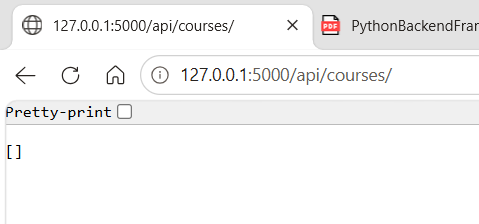

## 6. POST `/api/courses/`

The POST route accepts JSON course data and creates an in-memory course
record.

Example request body:

``` json
{
  "name": "Python Basics",
  "code": "PY101",
  "credits": 4
}
```

**Tested result:** Course creation succeeded and the created course
appeared in the GET list.

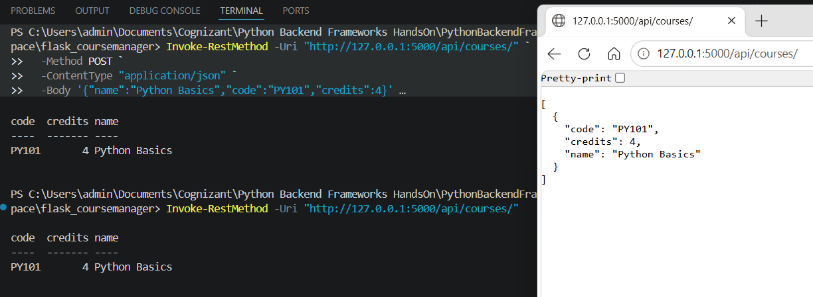

# Task 2 --- Request Handling and JSON Responses

## 7. Parse and Validate JSON Requests

The POST route uses:

``` python
data = request.get_json()
```

Required fields are:

-   `name`
-   `code`
-   `credits`

If fields are missing, the API returns a descriptive `400 Bad Request`
response.

## 8. Consistent JSON Success Envelope

The helper function returns successful responses in a consistent
structure:

``` python
def make_response_json(data, status_code=200):
    response = {
        "status": "success",
        "data": data
    }
    return jsonify(response), status_code
```

Example success envelope:

``` json
{
  "status": "success",
  "data": {}
}
```

## 9. GET Course by ID

Endpoint:

``` text
GET /api/courses/<course_id>/
```

The route searches for one course by ID and returns it in the success
envelope.

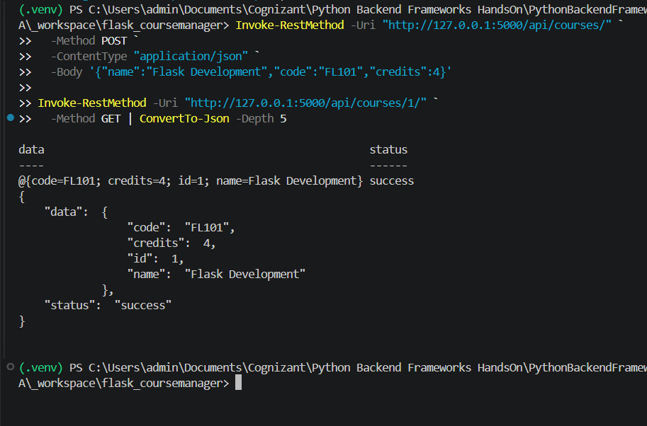

## 10. PUT Update Course

Endpoint:

``` text
PUT /api/courses/<course_id>/
```

The PUT route validates the JSON body and updates the selected course.

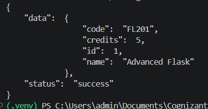

## 11. Missing Required Fields --- 400

An invalid POST request was tested with missing required fields.

Example invalid body:

``` json
{
  "name": "Incomplete Course"
}
```

**Tested result:** The API returned HTTP `400` with a descriptive
missing-fields response.

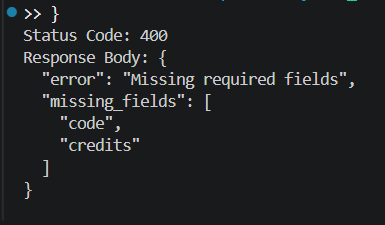

## 12. Unknown Course ID --- 404

An unknown course ID was requested:

``` text
GET /api/courses/999/
```

**Tested result:** The API returned HTTP `404` with a JSON error
response.

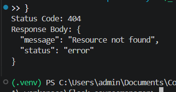

## 13. DELETE Course

Endpoint:

``` text
DELETE /api/courses/<course_id>/
```

The selected course was deleted successfully and the course list was
checked afterward.

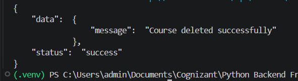

## 14. Successful POST Status --- 201

A successful course creation was tested with explicit HTTP status
output.

**Tested result:** `POST Status: 201`

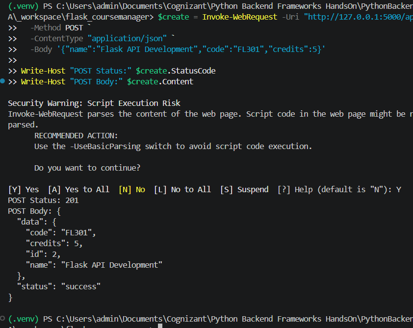

## 15. Successful GET List Status --- 200

The course list endpoint was tested with explicit HTTP status output.

**Tested result:** `GET List Status: 200`

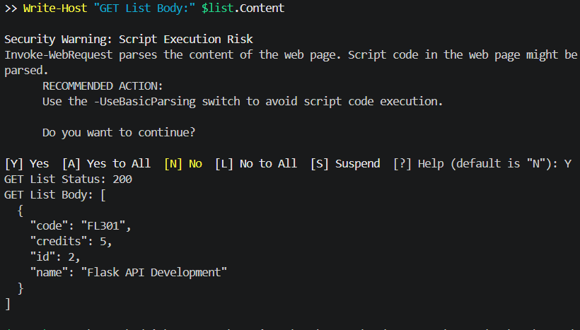

## 16. Successful GET Detail Status --- 200

The course detail endpoint was tested with explicit HTTP status output.

**Tested result:** `GET Detail Status: 200`

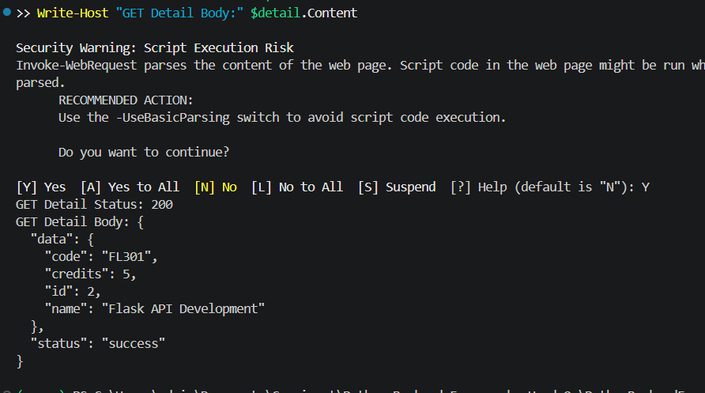

## 17. Successful PUT Status --- 200

The update endpoint was tested with explicit HTTP status output.

**Tested result:** `PUT Status: 200`

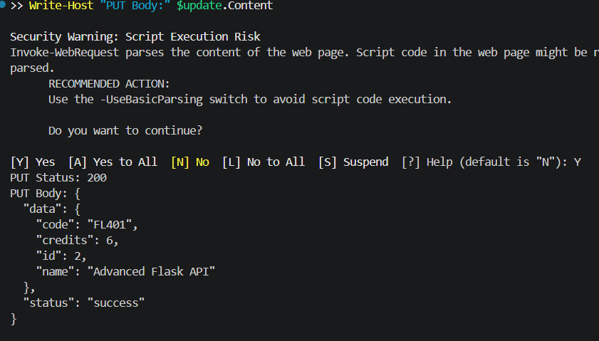

## JSON Error Handlers

The Flask application includes JSON error handlers for `404` and `500`:

``` python
@app.errorhandler(404)
def not_found_error(error):
    return jsonify({
        "status": "error",
        "message": "Resource not found"
    }), 404


@app.errorhandler(500)
def internal_server_error(error):
    return jsonify({
        "status": "error",
        "message": "Internal server error"
    }), 500
```

This prevents API clients from receiving Flask's default HTML error
pages for these errors.

## Implemented Endpoints

  Method   Endpoint                      Purpose               Tested Status
  -------- ----------------------------- --------------------- ---------------
  GET      `/api/courses/`               List all courses      200
  POST     `/api/courses/`               Create a course       201
  GET      `/api/courses/<course_id>/`   Retrieve one course   200 / 404
  PUT      `/api/courses/<course_id>/`   Update one course     200 / 404
  DELETE   `/api/courses/<course_id>/`   Delete one course     200 / 404

## Important Concepts Learned

### Flask Application Factory

`create_app()` creates and configures the Flask application. This
supports cleaner setup and easier testing.

### Blueprint

A Blueprint groups related routes. Here, Course API routes are grouped
under `/api/courses`.

### `request.get_json()`

This reads an incoming JSON request body so the API can validate and
process client data.

### `jsonify()`

This creates Flask JSON responses with the correct response content
type.

### HTTP Status Codes

The implementation tested:

-   `200 OK` for successful GET, PUT, and DELETE operations
-   `201 Created` for successful POST
-   `400 Bad Request` for missing required fields
-   `404 Not Found` for unknown course IDs

## Completion Status

-   [x] Flask project structure created
-   [x] `app.py` entry point created
-   [x] `config.py` with required configuration settings
-   [x] Application factory pattern implemented
-   [x] Course Blueprint created
-   [x] Blueprint registered
-   [x] GET course list route implemented
-   [x] POST course creation route implemented
-   [x] JSON request parsing implemented
-   [x] Required-field validation implemented
-   [x] GET course detail route implemented
-   [x] PUT course update route implemented
-   [x] DELETE course route implemented
-   [x] Consistent JSON success helper implemented
-   [x] JSON 404 error handler implemented
-   [x] JSON 500 error handler implemented
-   [x] Missing-field 400 response tested
-   [x] Unknown-ID 404 response tested
-   [x] Successful 200 and 201 responses tested
-   [x] Evidence screenshots captured
-   [x] `requirements.txt` created

------------------------------------------------------------------------

**Author:** Ashwin Kumar A\
**Track:** Python Full Stack Engineering\
**Module:** Python Backend Frameworks
