# Python Backend Frameworks - Hands-On 5

## Author Details

- Name: Ashwin Kumar A
- Track: Python Full Stack Engineering
- Module: Python Backend Frameworks
- Hands-On: 5
- Title: Flask with SQLAlchemy ORM & Database Integration

## Objective

This Hands-On integrates SQLAlchemy ORM and Flask-Migrate into the Flask Course Management API created in Hands-On 4.

The old in-memory course list was replaced with real database-backed ORM operations.

## Topics Covered

- Flask-SQLAlchemy setup
- SQLAlchemy model definition
- Flask-Migrate database migrations
- ORM CRUD operations
- Model serialization using `to_dict()`
- Relationship queries using JOIN

## Project Structure

```text
handson_05/
├── app.py
├── config.py
├── requirements.txt
├── courses/
│   ├── __init__.py
│   ├── models.py
│   └── routes.py
├── instance/
│   └── courses.db
├── migrations/
│   ├── alembic.ini
│   ├── env.py
│   ├── README
│   ├── script.py.mako
│   └── versions/
│       └── <initial_schema_migration>.py
└── images/
    ├── output_01_migration_upgrade_success.png
    ├── output_02_database_tables_verified.png
    ├── output_03_orm_shell_insert_and_query.png
    ├── output_04_database_persistence_verified.png
    ├── output_05_get_courses_from_database.png
    ├── output_06_post_course_orm_success.png
    ├── output_07_get_and_put_course_success.png
    ├── output_08_400_and_404_json_errors.png
    ├── output_09_delete_course_success.png
    ├── output_10_students_join_route.png
    ├── output_11_students_enrollments_seeded.png
    └── output_12_students_join_with_results.png
```

## Important Files

### app.py

- Creates the Flask app using the application factory pattern.
- Loads configuration from `Config`.
- Initializes SQLAlchemy using `db.init_app(app)`.
- Initializes Flask-Migrate using `Migrate(app, db)`.
- Registers the `courses` blueprint.
- Returns JSON responses for 404 and 500 errors.

### courses/models.py

Defines the SQLAlchemy ORM models:

- `Department`
- `Course`
- `Student`
- `Enrollment`

Each model includes a `to_dict()` method for JSON serialization.

Relationships implemented:

- Department has many Courses
- Course belongs to Department
- Course has many Enrollments
- Student has many Enrollments
- Enrollment connects Student and Course

### courses/routes.py

Implements database-backed course API endpoints:

| Method | Endpoint | Purpose |
|---|---|---|
| GET | `/api/courses/` | List all courses from database |
| POST | `/api/courses/` | Create a course in database |
| GET | `/api/courses/<id>/` | Get one course |
| PUT | `/api/courses/<id>/` | Update one course |
| DELETE | `/api/courses/<id>/` | Delete one course |
| GET | `/api/courses/<id>/students/` | Return students enrolled in a course using JOIN |

## In-Memory Code Replaced

Hands-On 4 used temporary in-memory storage. In Hands-On 5, the following old logic was removed or replaced:

- in-memory `courses` list
- `next_course_id` counter
- `find_course()` helper
- manual list append/update/delete operations

These were replaced with:

- SQLAlchemy models
- `Course.query.all()`
- `Course.query.get_or_404(id)`
- `db.session.add()`
- `db.session.commit()`
- `db.session.delete()`
- JOIN query for enrolled students

## Commands Used

### Check Flask migration commands

```powershell
python -m flask --app app:create_app --help
python -m flask --app app:create_app db --help
```

### Initialize migrations

```powershell
python -m flask --app app:create_app db init
```

### Create migration

```powershell
python -m flask --app app:create_app db migrate -m "initial schema"
```

### Apply migration

```powershell
python -m flask --app app:create_app db upgrade
python -m flask --app app:create_app db current
```

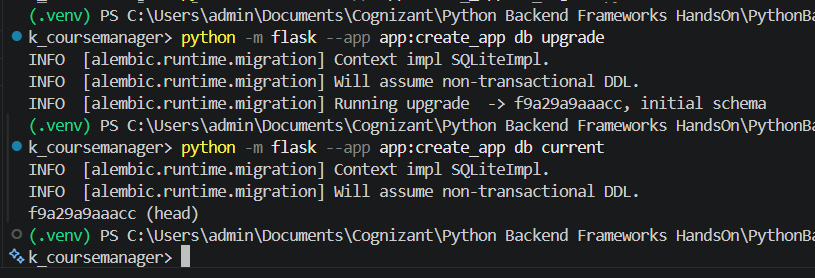

### Verify database tables

```powershell
python -c "from app import create_app, db; app=create_app(); ctx=app.app_context(); ctx.push(); print('Database URI:', app.config['SQLALCHEMY_DATABASE_URI']); print('Tables:', sorted(db.inspect(db.engine).get_table_names())); ctx.pop()"
```

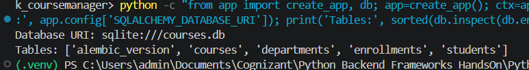

### Insert ORM data through Flask shell

```powershell
python -m flask --app app:create_app shell
```

Inside Flask shell:

```python
from app import db
from courses.models import Department, Course

cs = Department(name="Computer Science", head_of_dept="Dr. Anitha", budget=500000)
ece = Department(name="Electronics and Communication", head_of_dept="Dr. Ravi", budget=450000)

db.session.add_all([cs, ece])
db.session.flush()

python_course = Course(name="Python Programming", code="CS101", credits=4, department=cs)
database_course = Course(name="Database Systems", code="CS102", credits=3, department=cs)
electronics_course = Course(name="Digital Electronics", code="EC101", credits=4, department=ece)

db.session.add_all([python_course, database_course, electronics_course])
db.session.commit()

db.session.query(Course).all()
```

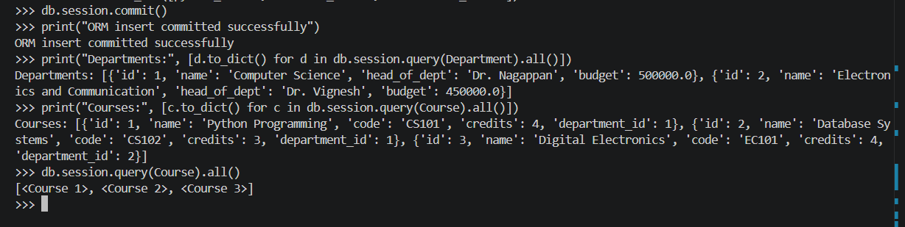

### Verify persistence

```powershell
python -c "from app import create_app, db; from courses.models import Department, Course; app=create_app(); ctx=app.app_context(); ctx.push(); print('Department count:', db.session.query(Department).count()); print('Course count:', db.session.query(Course).count()); print('Courses:', [c.to_dict() for c in db.session.query(Course).all()]); ctx.pop()"
```

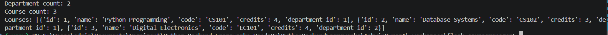

## API Testing

### Start Flask server

```powershell
python -m flask --app app:create_app run
```

### GET all courses

```powershell
Invoke-RestMethod -Uri "http://127.0.0.1:5000/api/courses/" -Method GET | ConvertTo-Json -Depth 10
```

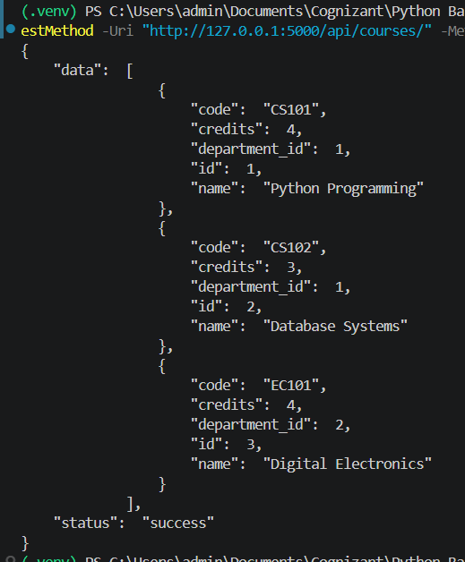

### POST course

```powershell
$body = @{
    name = "Web Development"
    code = "CS103"
    credits = 3
    department_id = 1
} | ConvertTo-Json

Invoke-RestMethod -Uri "http://127.0.0.1:5000/api/courses/" -Method POST -ContentType "application/json" -Body $body | ConvertTo-Json -Depth 10
```

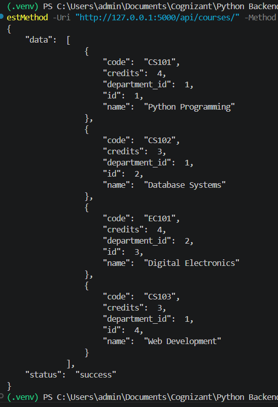

### GET and PUT course

```powershell
Invoke-RestMethod -Uri "http://127.0.0.1:5000/api/courses/1/" -Method GET | ConvertTo-Json -Depth 10

$updateBody = @{
    name = "Advanced Python Programming"
    code = "CS101"
    credits = 5
    department_id = 1
} | ConvertTo-Json

Invoke-RestMethod -Uri "http://127.0.0.1:5000/api/courses/1/" -Method PUT -ContentType "application/json" -Body $updateBody | ConvertTo-Json -Depth 10
```

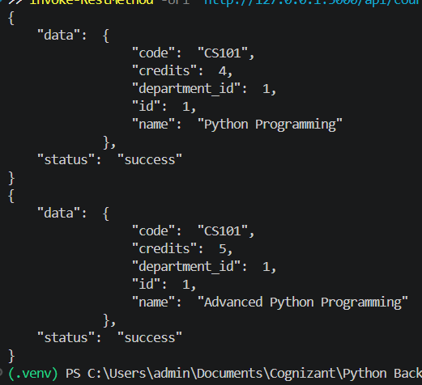

### 400 and 404 JSON errors

```powershell
$badBody = @{
    name = "Invalid Course"
} | ConvertTo-Json

try {
    Invoke-RestMethod -Uri "http://127.0.0.1:5000/api/courses/" -Method POST -ContentType "application/json" -Body $badBody
} catch {
    $_.ErrorDetails.Message
}

try {
    Invoke-RestMethod -Uri "http://127.0.0.1:5000/api/courses/999/" -Method GET
} catch {
    $_.ErrorDetails.Message
}
```

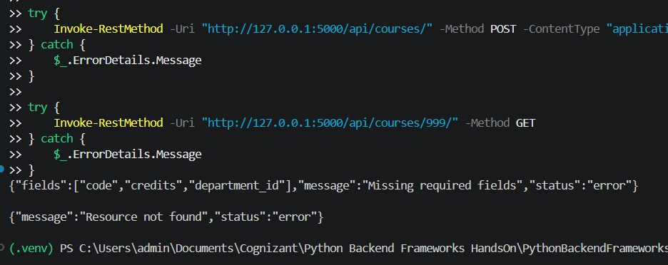

### DELETE course

```powershell
Invoke-RestMethod -Uri "http://127.0.0.1:5000/api/courses/4/" -Method DELETE | ConvertTo-Json -Depth 10

Invoke-RestMethod -Uri "http://127.0.0.1:5000/api/courses/" -Method GET | ConvertTo-Json -Depth 10
```

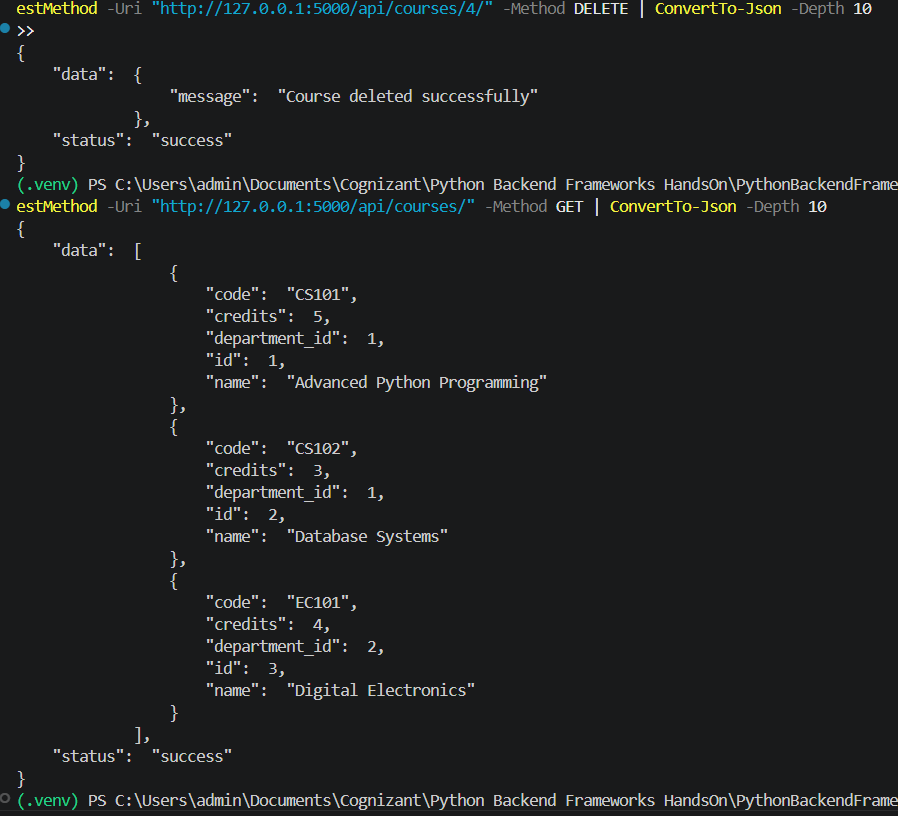

### Students JOIN route

```powershell
Invoke-RestMethod -Uri "http://127.0.0.1:5000/api/courses/1/students/" -Method GET | ConvertTo-Json -Depth 10
```

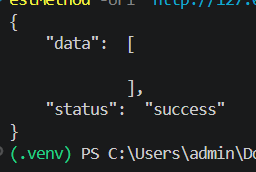

### Seed students and enrollments

```python
from datetime import date
from app import db
from courses.models import Department, Course, Student, Enrollment

cs = Department.query.filter_by(name="Computer Science").first()
course1 = Course.query.filter_by(code="CS101").first()
course2 = Course.query.filter_by(code="CS102").first()

s1 = Student(first_name="Ashwin", last_name="Kumar", email="ashwin@example.com", department_id=cs.id, enrollment_year=2026)
s2 = Student(first_name="Ravi", last_name="Kumar", email="ravi@example.com", department_id=cs.id, enrollment_year=2026)

db.session.add_all([s1, s2])
db.session.flush()

e1 = Enrollment(student_id=s1.id, course_id=course1.id, enrollment_date=date.today(), grade=None)
e2 = Enrollment(student_id=s2.id, course_id=course1.id, enrollment_date=date.today(), grade=None)
e3 = Enrollment(student_id=s1.id, course_id=course2.id, enrollment_date=date.today(), grade=None)

db.session.add_all([e1, e2, e3])
db.session.commit()
```

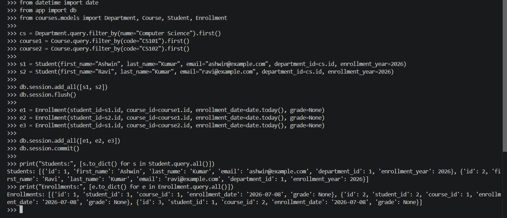

### JOIN route with results

```powershell
Invoke-RestMethod -Uri "http://127.0.0.1:5000/api/courses/1/students/" -Method GET | ConvertTo-Json -Depth 10
```

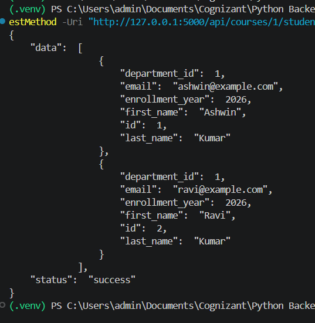

## Expected Outcomes Completed

- Flask-SQLAlchemy initialized successfully.
- Four SQLAlchemy models were created.
- Flask-Migrate was initialized.
- Initial schema migration was generated and applied.
- Database tables were verified.
- ORM shell inserts were committed successfully.
- CRUD routes now use the database instead of in-memory data.
- JSON responses are returned for API results and errors.
- JOIN route returns enrolled students for a course.

## Run Instructions

Install dependencies:

```powershell
pip install -r requirements.txt
```

Run the Flask app:

```powershell
python -m flask --app app:create_app run
```

Test API:

```powershell
Invoke-RestMethod -Uri "http://127.0.0.1:5000/api/courses/" -Method GET | ConvertTo-Json -Depth 10
```
