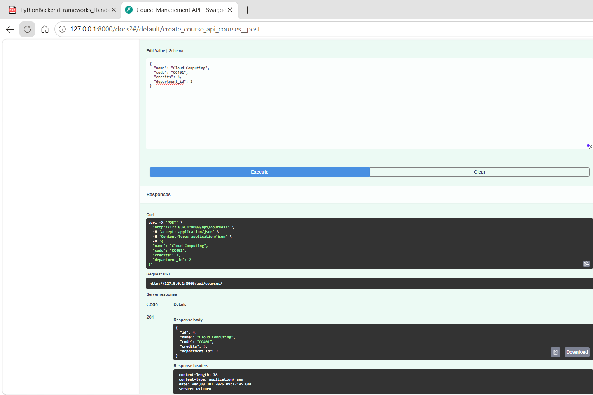
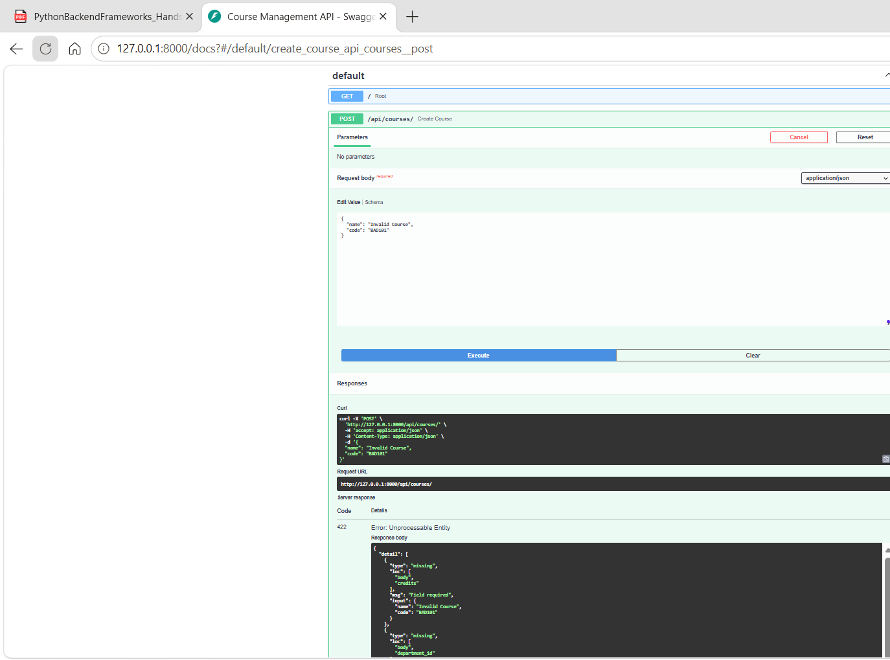
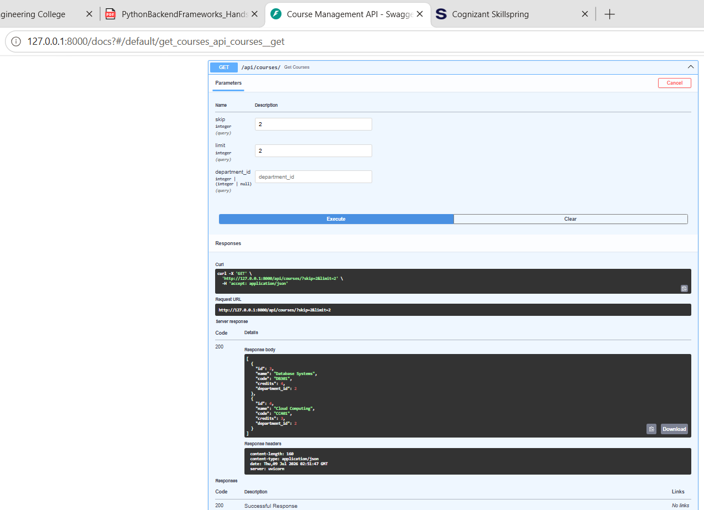
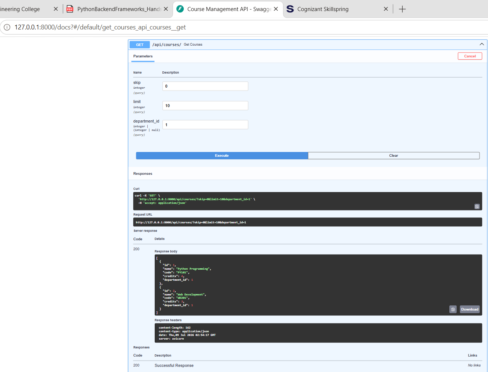
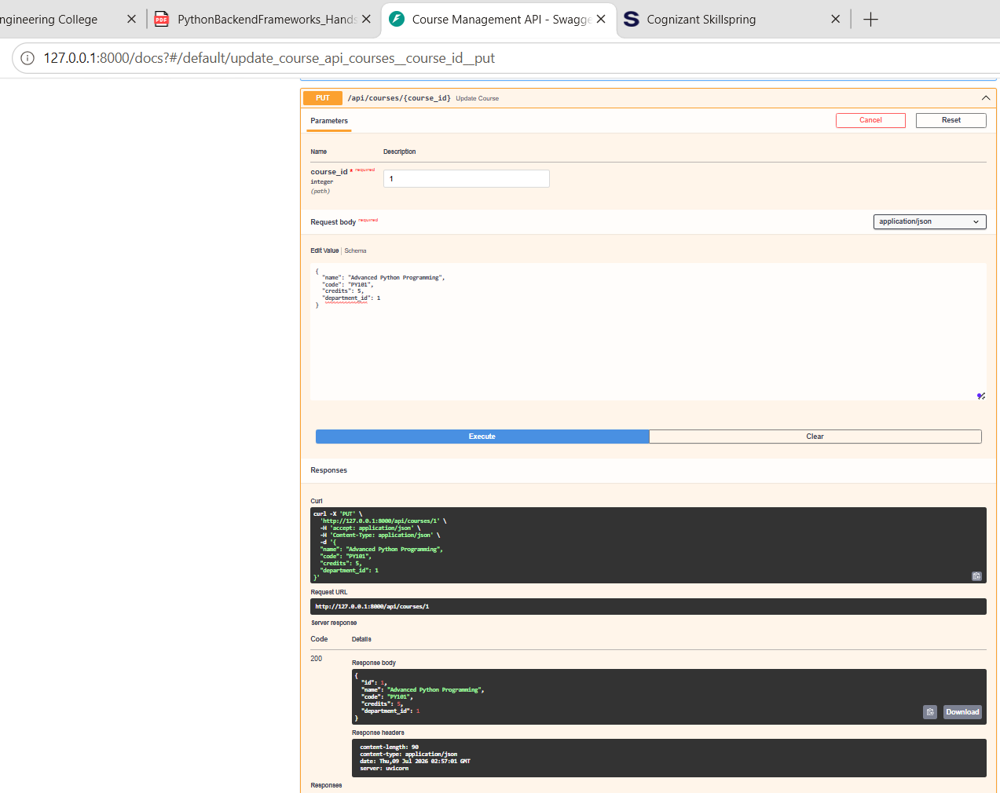
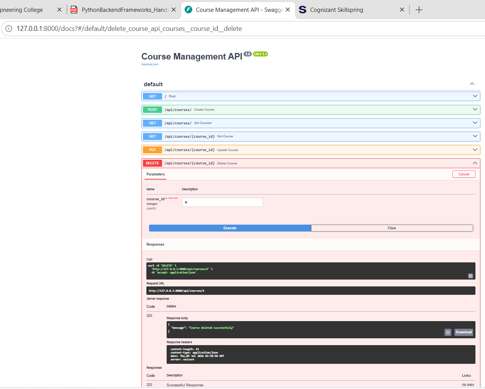

# Python Backend Frameworks - Hands-On 6

-   Name: Ashwin Kumar A
-   Track: Python Full Stack Engineering
-   Module: Python Backend Frameworks
-   Hands-On: 6
-   Title: FastAPI -- Path Parameters, Pydantic & Async Endpoints

## Objective

This Hands-On rebuilds the Course Management API using **FastAPI**. It
demonstrates FastAPI project setup, Pydantic validation, asynchronous
endpoints, async SQLAlchemy integration, path/query parameters,
pagination, filtering, and automatic Swagger/OpenAPI documentation.

## Topics Covered

-   FastAPI project setup
-   Pydantic request and response models
-   Async / Await endpoints
-   Async SQLAlchemy
-   Dependency Injection using `Depends`
-   Path parameters
-   Query parameters
-   Pagination and filtering
-   Swagger / OpenAPI documentation

## Project Structure

``` text
handson_06/
├── main.py
├── schemas.py
├── database.py
├── models.py
├── requirements.txt
├── courses.db
├── README.md
└── images/
    ├── output_01_swagger_docs_with_course_schema.png
    ├── output_02_async_post_course_success.png
    ├── output_03_pydantic_422_validation.png
    ├── output_04_path_parameter_integer_validation.png
    ├── output_05_pagination_skip_limit.png
    ├── output_06_department_filtering.png
    ├── output_07_put_course_update_success.png
    └── output_08_delete_course_success.png
```

## Important Files

### main.py

-   Creates the FastAPI application.
-   Creates database tables during startup.
-   Defines all Course CRUD endpoints.
-   Supports pagination and filtering.
-   Uses async database access.

### schemas.py

Defines the Pydantic models:

-   CourseCreate
-   CourseUpdate
-   CourseResponse
-   DepartmentResponse

These models automatically validate request and response data.

### database.py

Contains:

-   Async SQLAlchemy engine
-   AsyncSession
-   create_async_engine()
-   get_db() dependency
-   create_tables()

### models.py

Defines SQLAlchemy ORM models:

-   Department
-   Course

Relationship:

-   One Department → Many Courses

## Commands Used

### Install packages

``` powershell
python -m venv .venv
.\.venv\Scripts\Activate.ps1

pip install fastapi uvicorn sqlalchemy aiosqlite
```

### Run application

``` powershell
python -m uvicorn main:app --reload
```

Swagger UI:

``` text
http://127.0.0.1:8000/docs
```


## API Testing

### POST Course

Create a course using Swagger UI.



### Pydantic Validation

Submit an invalid request body.

Expected:

-   HTTP 422
-   Field-level validation errors



### Path Parameter Validation

Test:

    GET /api/courses/abc

Expected:

-   HTTP 422


### Pagination

Example:

    GET /api/courses/?skip=2&limit=2



### Department Filtering

Example:

    GET /api/courses/?department_id=1



### Update Course

    PUT /api/courses/{id}



### Delete Course

    DELETE /api/courses/{id}



## Expected Outcomes Completed

-   FastAPI project created.
-   Pydantic schemas implemented.
-   Async SQLAlchemy configured.
-   Async CRUD operations implemented.
-   Swagger documentation generated automatically.
-   Path parameter validation completed.
-   Query parameter pagination implemented.
-   Department filtering implemented.
-   Automatic HTTP 422 validation verified.

## Run Instructions

Install dependencies:

``` powershell
pip install -r requirements.txt
```

Run:

``` powershell
python -m uvicorn main:app --reload
```

Open:

    http://127.0.0.1:8000/docs
