# Python Backend Frameworks — Hands-On 7

## FastAPI — Dependency Injection, CRUD & OpenAPI Documentation

**Author:** Ashwin Kumar A  
**Track:** Python Full Stack Engineering  
**Module:** Python Backend Frameworks  
**Hands-On:** 7  
**Framework:** FastAPI  
**Environment:** Windows PowerShell, VS Code, Python 3.12

---

## Objective

The objective of this hands-on exercise is to deepen FastAPI skills by extending the existing Course Management API with:

- Dependency Injection
- Complete CRUD operations
- Response models
- Proper HTTP status codes
- Error handling using `HTTPException`
- JOIN queries
- Student CRUD
- Enrollment CRUD
- Background Tasks
- OpenAPI metadata customisation
- Swagger UI endpoint grouping using tags
- Endpoint summaries and response descriptions

Hands-On 7 continues the FastAPI Course Management API developed in Hands-On 6.

---

## Topics Covered

- FastAPI Dependency Injection
- CRUD Operations
- Response Models
- HTTP Status Codes
- `HTTPException`
- Async SQLAlchemy
- JOIN Queries
- Background Tasks
- OpenAPI Customisation
- Swagger UI Tags
- Endpoint Summary
- Response Description

---

## Project Structure

```text
handson_07/
├── main.py
├── schemas.py
├── database.py
├── models.py
├── requirements.txt
├── courses.db
├── README.md
└── images/
    ├── output_01_swagger_grouped_openapi_docs.png
    ├── output_02_post_course_201_created.png
    ├── output_03_post_student_201_created.png
    ├── output_04_post_enrollment_201_created.png
    ├── output_05_background_task_console_confirmation.png
    ├── output_06_course_students_join_result.png
    ├── output_07_put_course_update_success.png
    ├── output_08_course_404_json_error.png
    ├── output_09_delete_course_204_no_content.png
    ├── output_10_students_crud_list.png
    └── output_11_enrollments_crud_list.png
```

---

## Important Files

### `main.py`

Contains:

- FastAPI application setup
- OpenAPI metadata
- Startup table creation
- Dependency Injection with `Depends(get_db)`
- Course CRUD endpoints
- Student CRUD endpoints
- Enrollment CRUD endpoints
- JOIN query endpoint
- `HTTPException` error handling
- Correct HTTP status codes
- Background task implementation
- Swagger tags
- Create-course summary
- Create-course response description

### `models.py`

Contains SQLAlchemy ORM models for:

- Department
- Course
- Student
- Enrollment

Also defines relationships required for the Course Management API and the enrolled-students JOIN query.

### `schemas.py`

Contains Pydantic request and response schemas for:

- Courses
- Students
- Enrollments
- Departments

The response schemas use:

```python
ConfigDict(from_attributes=True)
```

to support ORM object responses.

### `database.py`

Contains:

- SQLite async database configuration
- `create_async_engine`
- `AsyncSession`
- `async_sessionmaker`
- `get_db()` dependency
- Database table creation

### `requirements.txt`

Contains the Python packages used by the project.

---

# Task 1 — Complete CRUD with Proper HTTP Conventions

## Step 68 — Complete Course PUT and DELETE

The Course Management API implements:

```text
PUT /api/courses/{course_id}
DELETE /api/courses/{course_id}
```

The update endpoint uses:

```python
response_model=CourseResponse
```

The API also uses response models on Course GET and POST endpoints to document and validate response shapes.

---

## Step 69 — Proper HTTP Status Codes

The Course POST endpoint uses:

```python
status_code=status.HTTP_201_CREATED
```

The Course DELETE endpoint uses:

```python
status_code=status.HTTP_204_NO_CONTENT
```

A successful DELETE returns no response body.

---

## Step 70 — Error Handling with HTTPException

When a requested Course ID does not exist, the API raises:

```python
raise HTTPException(
    status_code=404,
    detail="Course not found"
)
```

FastAPI automatically converts this into a JSON error response.

Example:

```json
{
  "detail": "Course not found"
}
```

---

## Step 71 — Course Students JOIN Endpoint

The following endpoint returns students enrolled in a specific course:

```text
GET /api/courses/{course_id}/students/
```

The implementation uses a SQLAlchemy JOIN between:

- Student
- Enrollment

Example query pattern:

```python
select(Student)
.join(Enrollment, Student.id == Enrollment.student_id)
.where(Enrollment.course_id == course_id)
```

This returns only students enrolled in the selected course.

---

## Step 72 — Student CRUD

The following Student endpoints were implemented:

```text
POST   /api/students/
GET    /api/students/
GET    /api/students/{student_id}
PUT    /api/students/{student_id}
DELETE /api/students/{student_id}
```

Student operations use:

- Pydantic request schemas
- Pydantic response schemas
- Async SQLAlchemy
- Dependency Injection
- 201 Created for POST
- 204 No Content for DELETE
- 404 error handling for missing IDs

---

## Step 72 — Enrollment CRUD

The following Enrollment endpoints were implemented:

```text
POST   /api/enrollments/
GET    /api/enrollments/
GET    /api/enrollments/{enrollment_id}
PUT    /api/enrollments/{enrollment_id}
DELETE /api/enrollments/{enrollment_id}
```

Enrollment operations follow the same CRUD patterns.

---

# Task 2 — Background Tasks and OpenAPI Customisation

## Step 73 — Background Task

A background task function was implemented:

```python
def send_confirmation_email(student_email: str):
    print(f"Sending confirmation to {student_email}")
```

The Enrollment POST endpoint accepts:

```python
background_tasks: BackgroundTasks
```

After the enrollment is successfully created, the task is added using:

```python
background_tasks.add_task(
    send_confirmation_email,
    student.email
)
```

---

## Step 74 — Verify Immediate 201 Response and Console Output

The Enrollment POST endpoint returns:

```text
201 Created
```

The background task runs after the response.

The server console displays:

```text
Sending confirmation to ashwin@student.com
```

This demonstrates that the simulated confirmation operation is handled as a FastAPI Background Task.

---

## Step 75 — OpenAPI Metadata Customisation

The FastAPI application constructor includes:

- Title
- Description
- Version
- Contact information

Example structure:

```python
app = FastAPI(
    title="Course Management API",
    description="FastAPI Course Management API with Courses, Students, Enrollments, CRUD operations, Background Tasks and OpenAPI documentation.",
    version="1.0",
    contact={
        "name": "Ashwin Kumar A",
        "email": "ashwin@example.com",
    },
)
```

---

## Step 76 — Swagger Endpoint Tags

Endpoints are grouped using tags:

```python
tags=["Courses"]
```

```python
tags=["Students"]
```

```python
tags=["Enrollments"]
```

Swagger UI therefore organises related endpoints into clear groups.

---

## Step 77 — Summary and Response Description

The create-course endpoint includes:

```python
summary="Create a new course"
```

and:

```python
response_description="The created course details"
```

These details are displayed automatically in Swagger UI.

---

# API Testing

The API was tested manually using FastAPI Swagger UI.

Start the application:

```powershell
uvicorn main:app --reload
```

Open Swagger UI:

```text
http://127.0.0.1:8000/docs
```

---

## Test 1 — Grouped OpenAPI Documentation

Swagger UI displays grouped endpoints for:

- Courses
- Students
- Enrollments
- Root

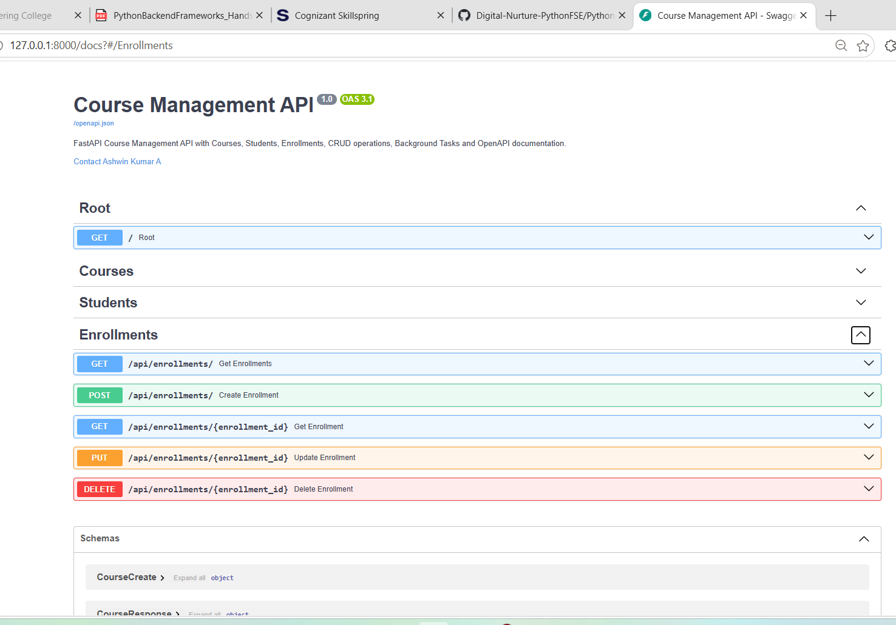

---

## Test 2 — Create Course

Endpoint:

```text
POST /api/courses/
```

Test data:

```json
{
  "name": "Python Programming",
  "code": "PY101",
  "credits": 4,
  "department_id": 1
}
```

Expected result:

```text
201 Created
```

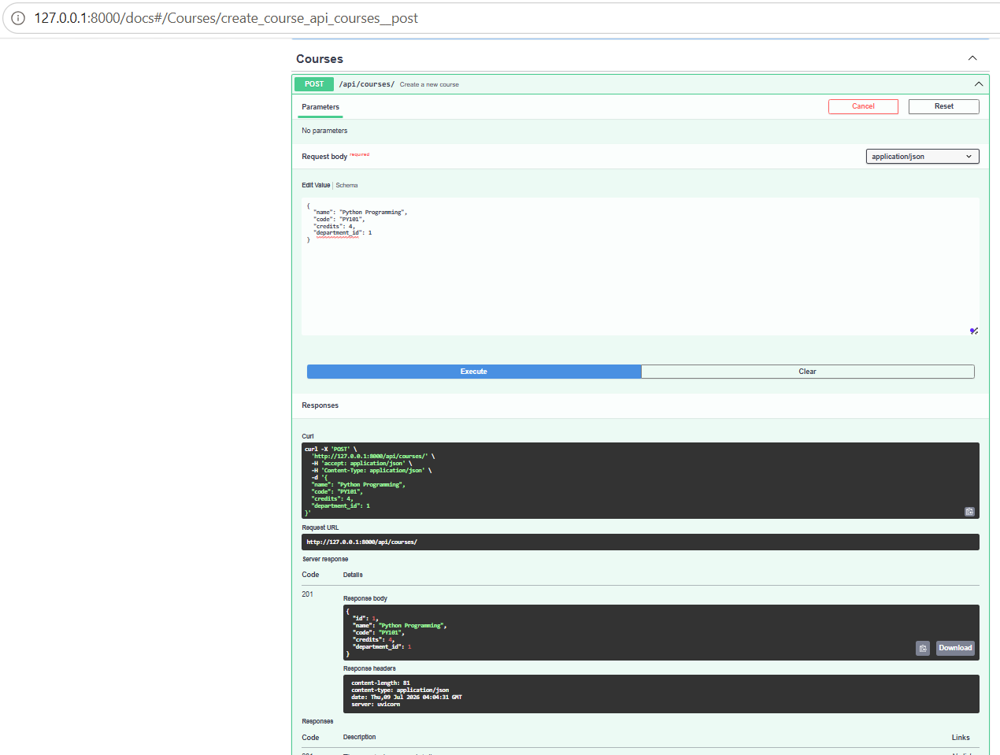

---

## Test 3 — Create Student

Endpoint:

```text
POST /api/students/
```

Test data:

```json
{
  "first_name": "Ashwin",
  "last_name": "Kumar",
  "email": "ashwin@student.com",
  "department_id": 1,
  "enrollment_year": 2026
}
```

Expected result:

```text
201 Created
```

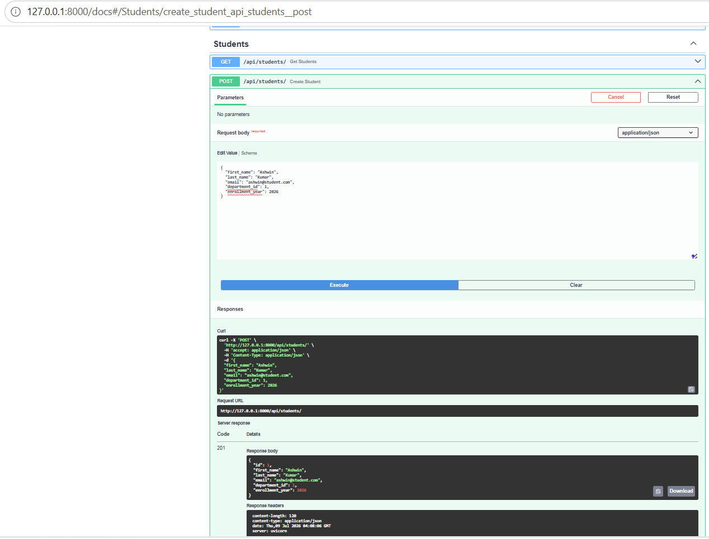

---

## Test 4 — Create Enrollment

Endpoint:

```text
POST /api/enrollments/
```

Test data:

```json
{
  "student_id": 1,
  "course_id": 1,
  "enrollment_date": "2026-07-09",
  "grade": null
}
```

Expected result:

```text
201 Created
```

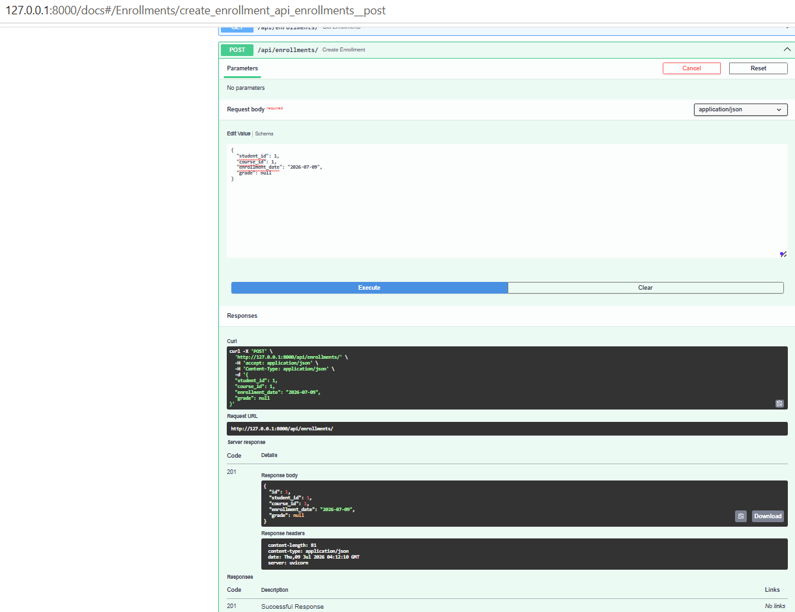

---

## Test 5 — Background Task Confirmation

After the Enrollment POST response, the server console displays:

```text
Sending confirmation to ashwin@student.com
```

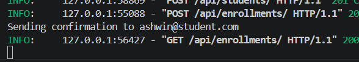

---

## Test 6 — JOIN Query Result

Endpoint:

```text
GET /api/courses/1/students/
```

Expected result:

- Only students enrolled in Course 1 are returned.

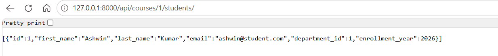

---

## Test 7 — Update Course

Endpoint:

```text
PUT /api/courses/1
```

Test data:

```json
{
  "name": "Advanced Python Programming",
  "code": "PY101",
  "credits": 5,
  "department_id": 1
}
```

Expected result:

```text
200 OK
```

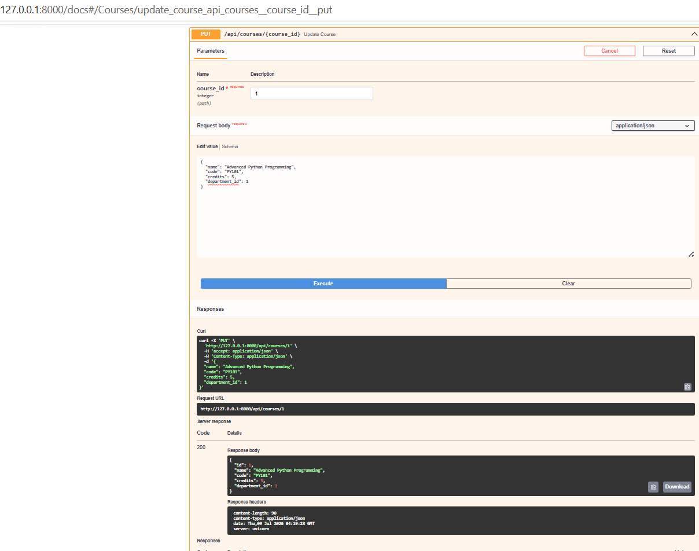

---

## Test 8 — Invalid Course ID

Endpoint:

```text
GET /api/courses/999
```

Expected result:

```text
404 Not Found
```

Expected JSON:

```json
{
  "detail": "Course not found"
}
```

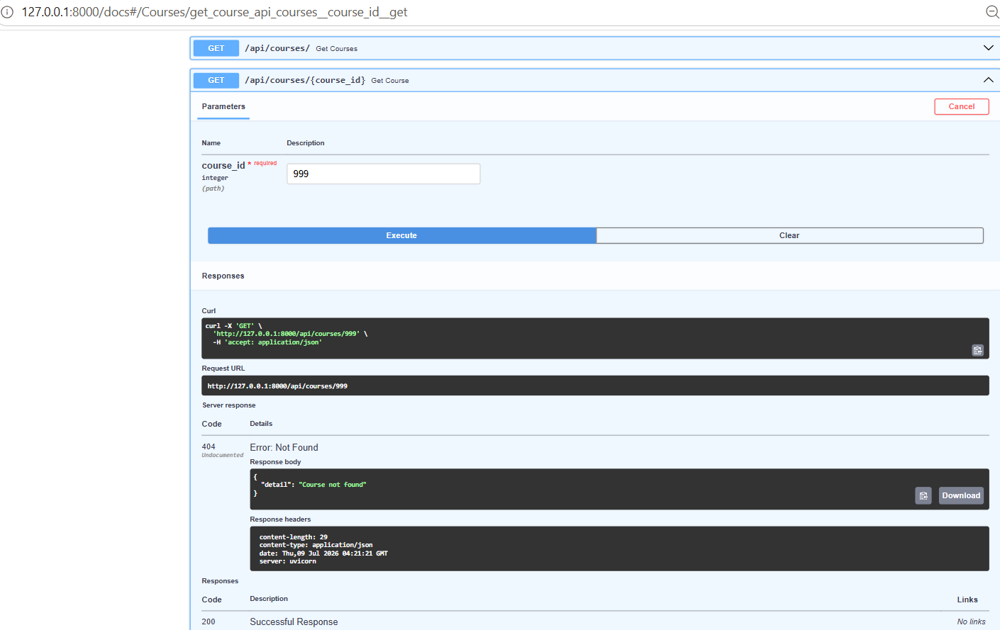

---

## Test 9 — Delete Course

Endpoint:

```text
DELETE /api/courses/1
```

Expected result:

```text
204 No Content
```

The response contains no body.

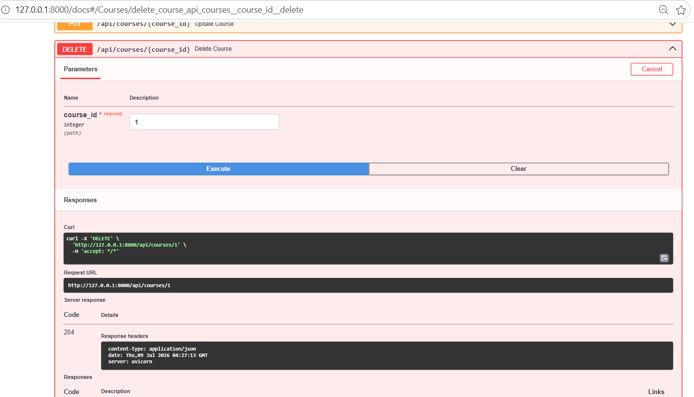

---

## Test 10 — Student CRUD List

Endpoint:

```text
GET /api/students/
```

The endpoint returns the available Student records.

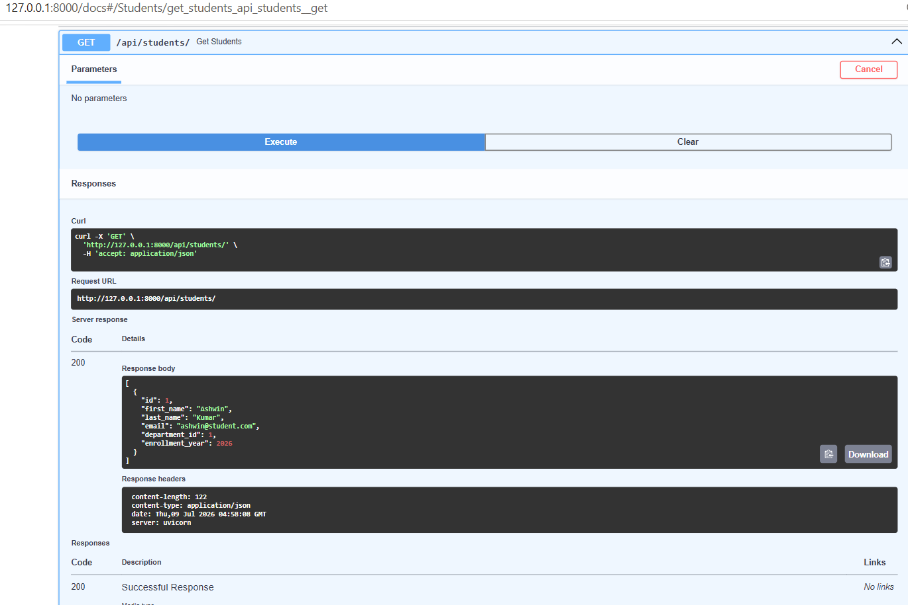

---

## Test 11 — Enrollment CRUD List

Endpoint:

```text
GET /api/enrollments/
```

The endpoint returns the available Enrollment records.

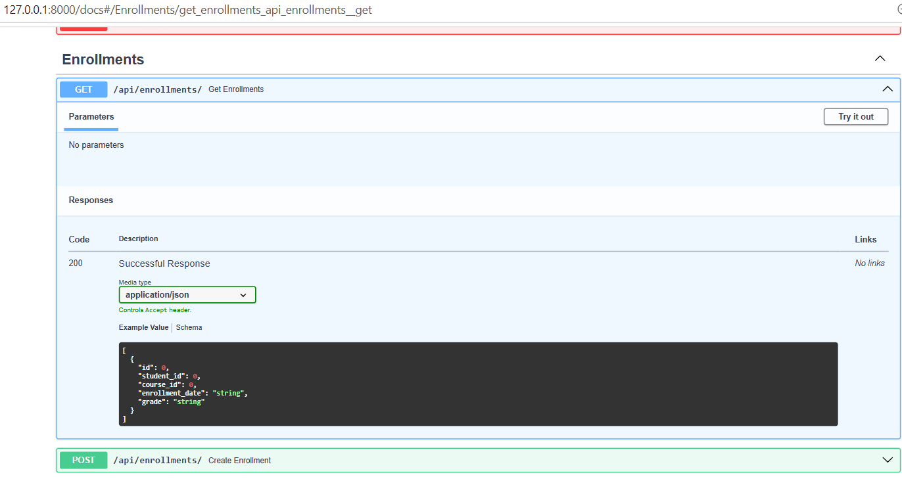

---

# Expected Outcomes Completed

The following Hands-On 7 outcomes were completed:

- Course PUT endpoint implemented
- Course DELETE endpoint implemented
- Course GET and POST response models used
- POST returns 201 Created
- DELETE returns 204 No Content
- DELETE returns no response body
- Invalid Course ID returns 404
- 404 response contains JSON detail message
- Course-to-Students JOIN endpoint implemented
- Student CRUD implemented
- Enrollment CRUD implemented
- BackgroundTasks added to Enrollment POST
- Enrollment POST returns 201
- Confirmation message appears in server console
- OpenAPI title configured
- OpenAPI description configured
- OpenAPI version configured
- OpenAPI contact information configured
- Courses endpoints grouped with tags
- Students endpoints grouped with tags
- Enrollments endpoints grouped with tags
- Create-course summary configured
- Create-course response description configured
- Swagger UI displays grouped and described endpoints

---

# How to Run

## 1. Open PowerShell in the project folder

```powershell
cd "C:\Users\admin\Documents\Cognizant\Python Backend Frameworks HandsOn\PythonBackendFrameworks\AshwinKumarA\handson_07"
```

## 2. Create a virtual environment

```powershell
python -m venv .venv
```

## 3. Activate the virtual environment

```powershell
.\.venv\Scripts\Activate.ps1
```

## 4. Install dependencies

```powershell
pip install -r requirements.txt
```

## 5. Start the FastAPI application

```powershell
uvicorn main:app --reload
```

## 6. Open Swagger UI

```text
http://127.0.0.1:8000/docs
```

---

## Conclusion

Hands-On 7 successfully extends the FastAPI Course Management API from Hands-On 6.

The completed implementation demonstrates:

- FastAPI Dependency Injection
- Async database operations
- Complete Course CRUD
- Complete Student CRUD
- Complete Enrollment CRUD
- REST-appropriate HTTP status codes
- Pydantic response models
- JSON error handling with `HTTPException`
- SQLAlchemy JOIN queries
- Background Tasks
- OpenAPI metadata customisation
- Swagger UI tags
- Endpoint summaries
- Response descriptions

All required Hands-On 7 functionality was implemented and tested successfully.