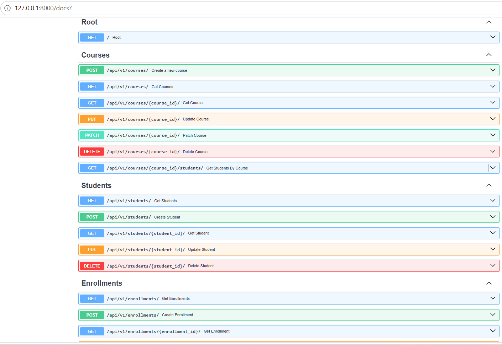
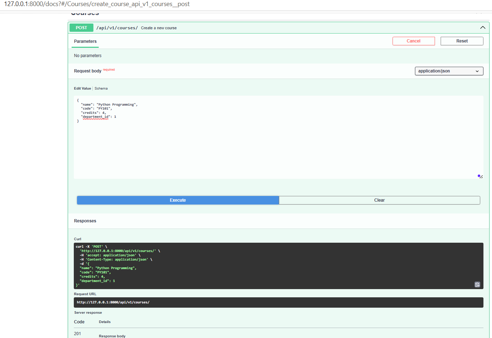
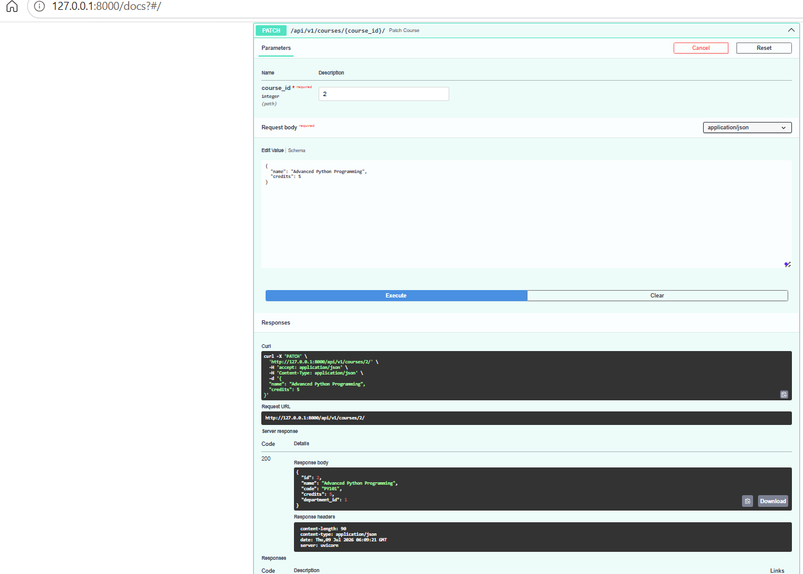
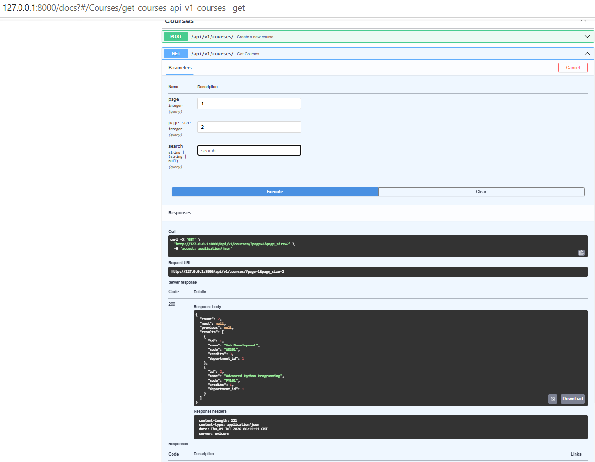
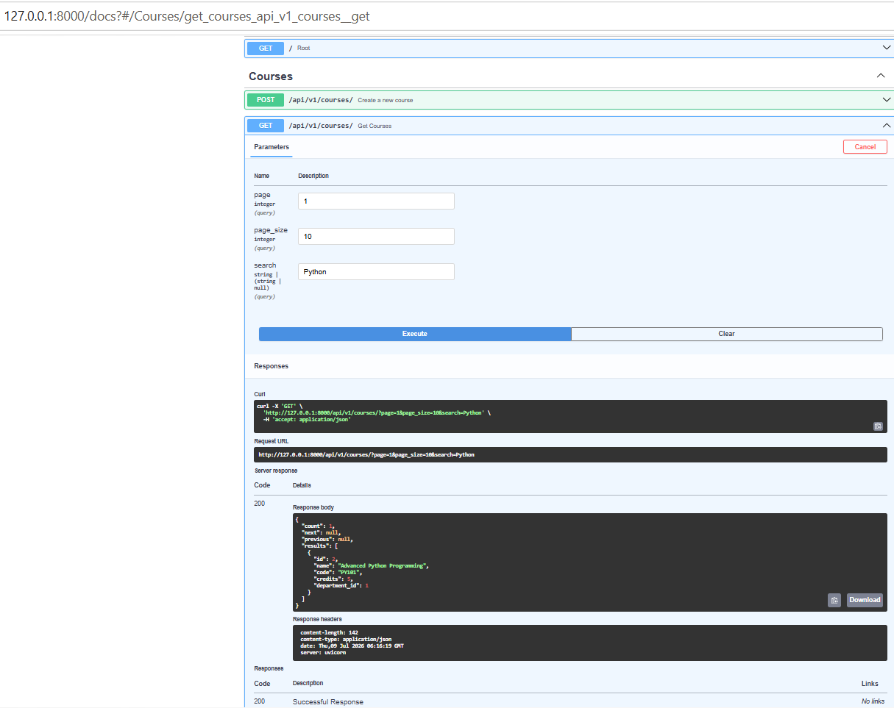
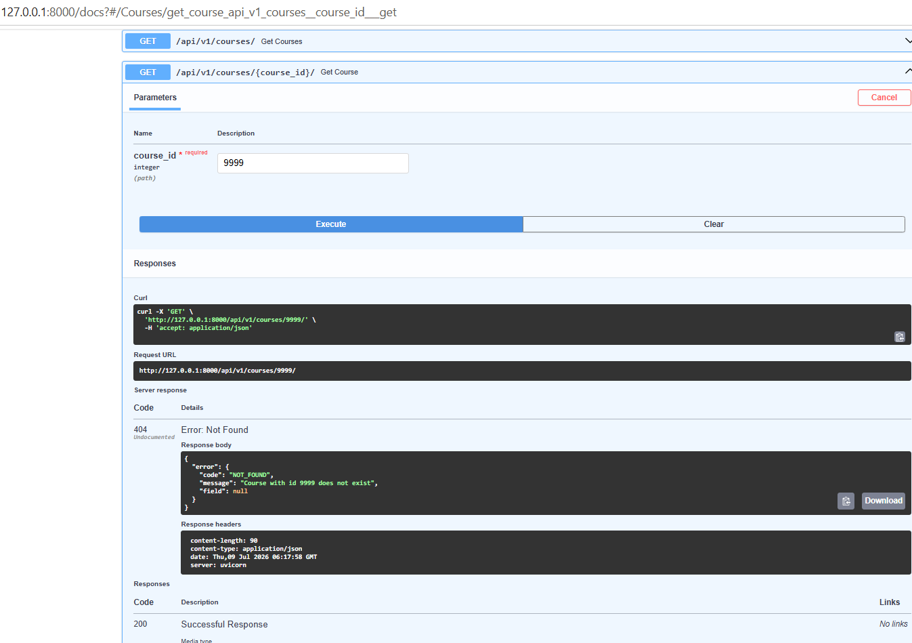

# Python Backend Frameworks — Hands-On 8

## RESTful API Design Best Practices

### Author

- **Name:** Ashwin Kumar A
- **Track:** Python Full Stack Engineering
- **Module:** Python Backend Frameworks
- **Framework Selected:** FastAPI
- **Hands-On:** 8

---

## Objective

The objective of Hands-On 8 is to audit and refactor the existing Course Management API so that it follows RESTful API design best practices.

This exercise extends the FastAPI Course Management API completed in Hands-On 7.

Hands-On 8 adds:

- REST-compliant resource naming
- API URL versioning
- Correct HTTP method semantics
- PATCH support for partial updates
- Correct HTTP status codes
- Location headers for created resources
- Page-based offset pagination
- Search filtering
- Standardised JSON error responses

---

## Framework Choice

Hands-On 8 is framework-agnostic and allows Django, Flask, or FastAPI.

FastAPI was selected because Hands-On 6 and Hands-On 7 already implemented the Course Management API using:

- FastAPI
- Pydantic
- Async SQLAlchemy
- SQLite
- aiosqlite
- Dependency Injection
- Background Tasks
- Automatic Swagger/OpenAPI documentation

The existing Hands-On 7 FastAPI project was reused and refactored instead of creating a new project from scratch.

---

## Topics Covered

- REST principles
- Resource naming conventions
- HTTP methods and status codes
- PUT versus PATCH
- Location response headers
- API versioning
- Page and page-size pagination
- Search filtering
- Standardised API error responses
- FastAPI exception handlers
- Async SQLAlchemy queries
- Swagger/OpenAPI testing

---

## Project Structure

```text
handson_08/
│
├── main.py
├── schemas.py
├── database.py
├── models.py
├── requirements.txt
├── courses.db
├── README.md
│
└── images/
    ├── output_01_swagger_versioned_rest_endpoints.png
    ├── output_02_post_course_201_location_header.png
    ├── output_03_patch_course_partial_update.png
    ├── output_04_courses_pagination_envelope.png
    ├── output_05_courses_search_filter.png
    └── output_06_standardised_404_error.png
```

---

# Hands-On 8 Implementation and Testing

## Step 1 — Verify Versioned REST Endpoints in Swagger

Run the FastAPI application:

```powershell
uvicorn main:app --reload
```

Open Swagger UI:

```text
http://127.0.0.1:8000/docs
```

Verify that the following versioned endpoints are available:

```text
/api/v1/courses/
/api/v1/students/
/api/v1/enrollments/
```

Also verify that the Course resource includes:

```text
GET
POST
PUT
PATCH
DELETE
```



---

## Step 2 — Create a Course and Verify 201 Created with Location Header

Endpoint:

```http
POST /api/v1/courses/
```

Example request:

```json
{
  "name": "Python Programming",
  "code": "PY101",
  "credits": 4,
  "department_id": 1
}
```

Expected response status:

```text
201 Created
```

Expected response header:

```text
Location: /api/v1/courses/{new_course_id}/
```

This confirms that the POST endpoint follows REST conventions by returning both `201 Created` and a `Location` header pointing to the newly created resource.



---

## Step 3 — Perform a Partial Course Update Using PATCH

Endpoint:

```http
PATCH /api/v1/courses/{course_id}/
```

Example request:

```json
{
  "name": "Advanced Python Programming",
  "credits": 5
}
```

Expected response status:

```text
200 OK
```

Only the supplied fields are changed. Existing values such as the course code and department remain unchanged.



---

## Step 4 — Verify Page-Based Pagination Envelope

Endpoint:

```http
GET /api/v1/courses/?page=1&page_size=2
```

Expected response structure:

```json
{
  "count": 2,
  "next": null,
  "previous": null,
  "results": [
    {
      "id": 1,
      "name": "Advanced Python Programming",
      "code": "PY101",
      "credits": 5,
      "department_id": 1
    }
  ]
}
```

The response includes the required pagination fields:

- `count`
- `next`
- `previous`
- `results`



---

## Step 5 — Verify Search Filtering

Endpoint:

```http
GET /api/v1/courses/?page=1&page_size=10&search=Python
```

The `search` query parameter performs a case-insensitive search against:

- Course name
- Course code

The result contains only courses matching the entered search value.



---

## Step 6 — Verify Standardised 404 Error Response

Endpoint:

```http
GET /api/v1/courses/9999/
```

Expected response status:

```text
404 Not Found
```

Expected response body:

```json
{
  "error": {
    "code": "NOT_FOUND",
    "message": "Course with id 9999 does not exist",
    "field": null
  }
}
```

This confirms that handled errors follow one consistent JSON format.



---

# RESTful API Design Details

## REST Resource Naming

All API resources use:

- Nouns instead of verbs
- Plural resource names
- Versioned URLs
- Consistent trailing slashes

Correct examples:

```text
/api/v1/courses/
/api/v1/students/
/api/v1/enrollments/
```

Incorrect styles such as the following are not used:

```text
/api/getCourses/
/api/createStudent/
```

---

## API Versioning

The API uses URL-based versioning:

```text
/api/v1/
```

Example:

```text
GET /api/v1/courses/
```

A code comment in `main.py` also explains two versioning strategies:

1. URL versioning
2. Header-based versioning

Header-based versioning example:

```text
Accept: application/vnd.api+json;version=1
```

URL versioning was selected because it is simple, visible, and easy to test using Swagger UI and browsers.

---

## HTTP Methods

| Method | Purpose |
|---|---|
| GET | Retrieve resources without side effects |
| POST | Create a new resource |
| PUT | Fully replace or update an existing resource |
| PATCH | Partially update selected fields |
| DELETE | Remove a resource |

---

## HTTP Status Codes

| Status Code | Usage |
|---|---|
| 200 OK | Successful GET, PUT, or PATCH |
| 201 Created | Successful POST |
| 204 No Content | Successful DELETE |
| 400 Bad Request | Invalid pagination values |
| 404 Not Found | Requested resource does not exist |
| 422 Unprocessable Entity | Pydantic request validation failure |

Authentication is not implemented in Hands-On 8. Therefore, no authentication-specific `401` workflow was added.

---

# API Endpoints

## Course Endpoints

```text
POST   /api/v1/courses/
GET    /api/v1/courses/
GET    /api/v1/courses/{course_id}/
PUT    /api/v1/courses/{course_id}/
PATCH  /api/v1/courses/{course_id}/
DELETE /api/v1/courses/{course_id}/
GET    /api/v1/courses/{course_id}/students/
```

### PUT Full Update

PUT requires all course fields:

```json
{
  "name": "Advanced Python Programming",
  "code": "PY101",
  "credits": 5,
  "department_id": 1
}
```

### PATCH Partial Update

PATCH accepts only the fields that need to be changed:

```json
{
  "credits": 5
}
```

### Course Students JOIN Endpoint

```http
GET /api/v1/courses/{course_id}/students/
```

This endpoint uses a SQL JOIN between:

- Students
- Enrollments
- Courses

---

## Student Endpoints

```text
POST   /api/v1/students/
GET    /api/v1/students/
GET    /api/v1/students/{student_id}/
PUT    /api/v1/students/{student_id}/
DELETE /api/v1/students/{student_id}/
```

The Student POST endpoint returns:

```text
201 Created
```

It also returns:

```text
Location: /api/v1/students/{new_student_id}/
```

---

## Enrollment Endpoints

```text
POST   /api/v1/enrollments/
GET    /api/v1/enrollments/
GET    /api/v1/enrollments/{enrollment_id}/
PUT    /api/v1/enrollments/{enrollment_id}/
DELETE /api/v1/enrollments/{enrollment_id}/
```

The Enrollment POST endpoint returns:

```text
201 Created
```

It also returns:

```text
Location: /api/v1/enrollments/{new_enrollment_id}/
```

After an enrollment is created, FastAPI runs a background task that prints a simulated confirmation message to the server console.

---

# Important Files

## `main.py`

Contains:

- FastAPI application configuration
- API versioning using `/api/v1/`
- Course CRUD endpoints
- Student CRUD endpoints
- Enrollment CRUD endpoints
- Course PATCH endpoint
- Course pagination and search
- Location headers for POST endpoints
- Standardised HTTP exception handler
- Standardised request validation handler
- Course-to-student JOIN endpoint
- Background confirmation task
- OpenAPI metadata and tags

## `schemas.py`

Contains Pydantic schemas for:

- Course creation
- Full Course PUT update
- Partial Course PATCH update
- Course responses
- Paginated Course response envelope
- Student creation and update
- Enrollment creation and update
- Department responses

## `database.py`

Contains:

- SQLite database URL
- Async SQLAlchemy engine
- Async session maker
- `get_db()` dependency
- Database table creation function

## `models.py`

Contains SQLAlchemy ORM models for:

- Department
- Course
- Student
- Enrollment

It also contains the relationships between courses, students, departments, and enrollments.

## `courses.db`

SQLite database used by the Course Management API.

## `requirements.txt`

Lists the Python packages required to run the project.

---

# Installation and Run Instructions

## Create a Virtual Environment

```powershell
python -m venv .venv
```

## Activate the Virtual Environment

```powershell
.\.venv\Scripts\Activate.ps1
```

## Install Dependencies

```powershell
pip install -r requirements.txt
```

## Run the Application

```powershell
uvicorn main:app --reload
```

Application URL:

```text
http://127.0.0.1:8000
```

Swagger UI:

```text
http://127.0.0.1:8000/docs
```

---

# Code Verification

The following commands were used to verify the Python files:

```powershell
python -m py_compile main.py
python -m py_compile schemas.py
python -m py_compile database.py
python -m py_compile models.py
```

No output from these commands indicates successful compilation.

The FastAPI application import was verified using:

```powershell
python -c "from main import app; print('Hands-On 8 main.py imports successfully')"
```

The versioned routes were verified using:

```powershell
python -c "from main import app; [print(route.path, sorted(route.methods or [])) for route in app.routes if route.path.startswith('/api/')]"
```

The old unversioned routes were checked using:

```powershell
python -c "from main import app; print([r.path for r in app.routes if r.path.startswith('/api/') and not r.path.startswith('/api/v1/')])"
```

Expected output:

```text
[]
```

---

# Testing Completed

The following Hands-On 8 requirements were tested successfully:

- Versioned `/api/v1/` endpoints
- REST-compliant plural resource names
- Course PATCH partial update
- POST returning `201 Created`
- POST Location response header
- Pagination using `page` and `page_size`
- Pagination response envelope
- Search filtering by course name and code
- Standardised 404 error response
- Existing async Course CRUD
- Existing Student CRUD
- Existing Enrollment CRUD
- Existing Course Students JOIN endpoint
- Existing BackgroundTasks feature

---

# Expected Outcomes Completed

- All endpoints use plural nouns.
- APIs use `/api/v1/` URL versioning.
- PATCH is available alongside PUT.
- PUT performs a full update.
- PATCH performs a partial update.
- POST returns `201 Created`.
- POST endpoints include Location headers.
- DELETE returns `204 No Content`.
- Course listing supports `page` and `page_size`.
- Pagination returns `count`, `next`, `previous`, and `results`.
- Course listing supports case-insensitive search.
- Error responses use a consistent JSON format.
- Existing Hands-On 7 FastAPI functionality remains available.

---

# Conclusion

Hands-On 8 successfully refactored the existing FastAPI Course Management API to follow RESTful API design best practices.

The API now provides consistent resource naming, versioned routes, correct HTTP semantics, partial updates, pagination, filtering, Location headers, and standardised error responses.
