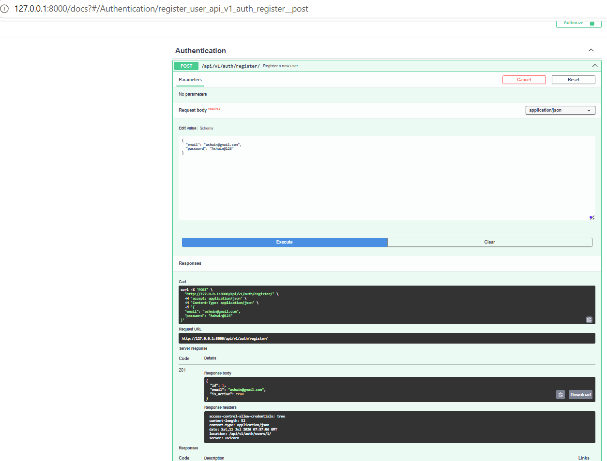
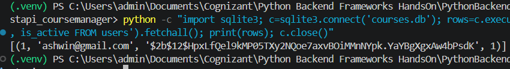
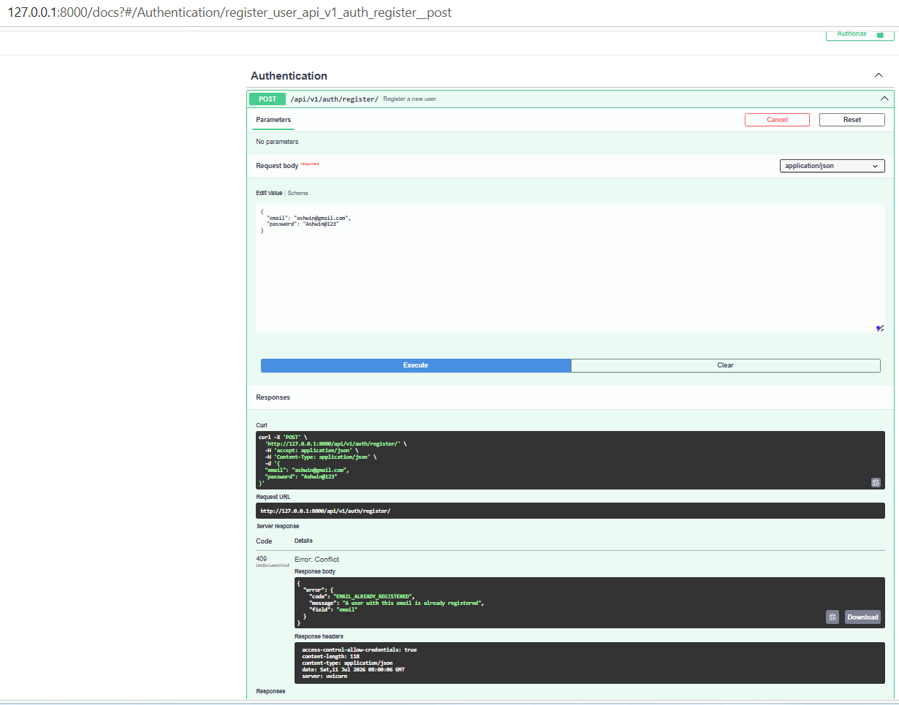
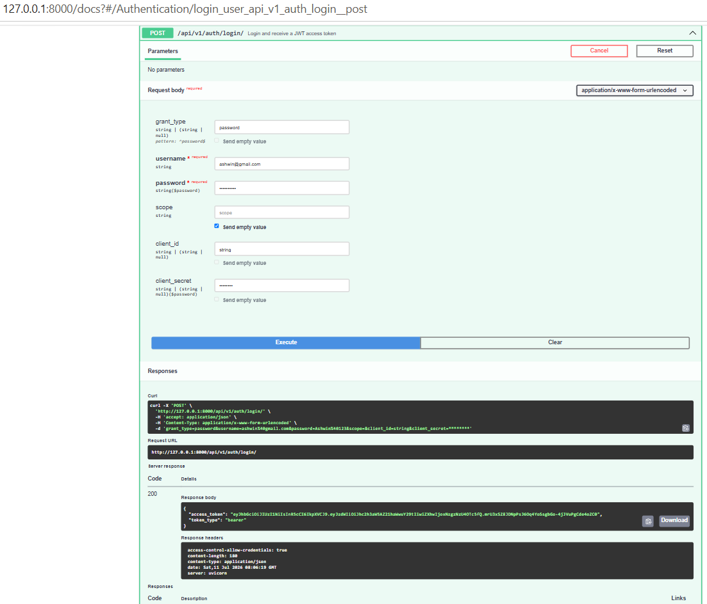
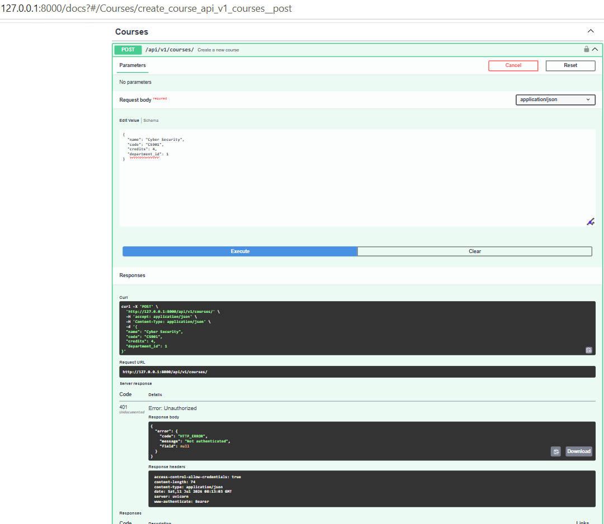
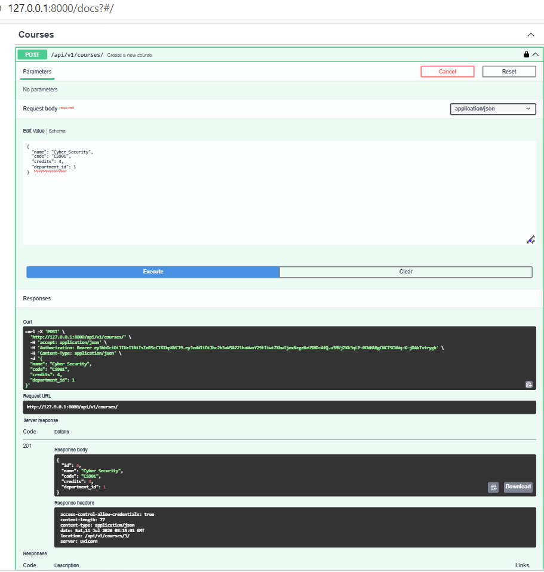
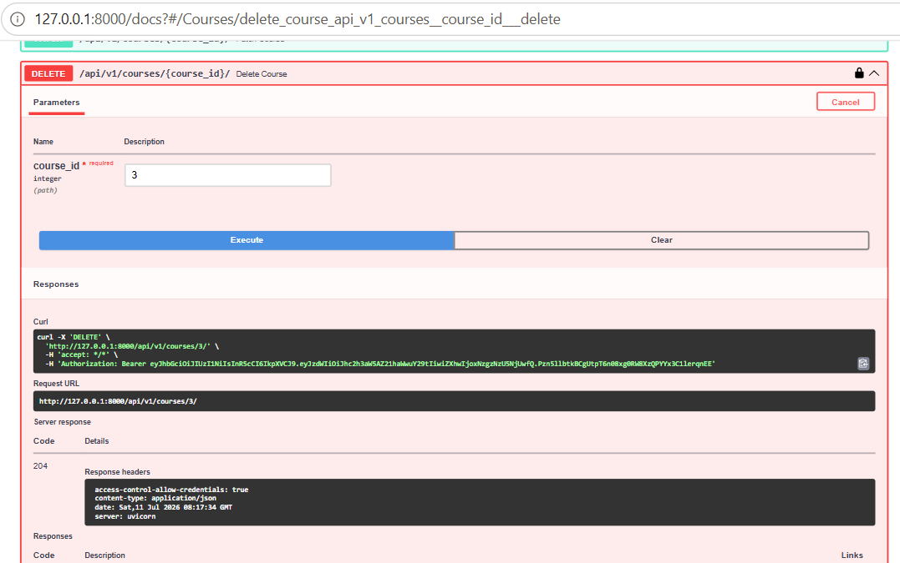
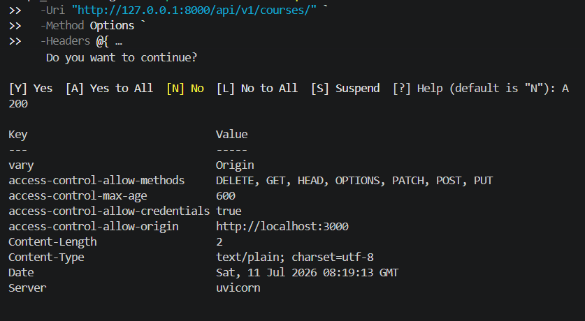

# Python Backend Frameworks — Hands-On 9

## Authentication & Security — JWT, OAuth2 & OWASP

### Author

- **Name:** Ashwin Kumar A
- **Track:** Python Full Stack Engineering
- **Module:** Python Backend Frameworks
- **Framework:** FastAPI
- **Python Version:** Python 3.12
- **Development Environment:** Windows PowerShell and VS Code

---

## Objective

The objective of Hands-On 9 is to extend the existing FastAPI Course Management API from Hands-On 8 with authentication and security features.

The implementation includes:

- Secure password hashing using bcrypt
- User registration
- Duplicate email validation
- JWT-based login
- JWT token expiry
- OAuth2 bearer-token authentication
- Protected Course API operations
- CORS configuration
- OAuth2 Authorization Code flow documentation
- Secure storage of user credentials

---

## Relationship to Hands-On 8

Hands-On 9 continues the FastAPI Course Management API completed in Hands-On 8.

The existing Hands-On 8 functionality was retained, including:

- RESTful plural resource naming
- `/api/v1/` URL versioning
- Course CRUD
- Student CRUD
- Enrollment CRUD
- PUT and PATCH operations
- Proper HTTP status codes
- Location headers
- Pagination
- Search filtering
- Standardised error responses
- Background tasks
- Async SQLAlchemy
- Swagger/OpenAPI documentation

Hands-On 9 extends this project with user authentication, JWT security, password hashing and protected endpoints.

---

## Topics Covered

- JWT token structure
- Token-based authentication
- Session-based authentication concepts
- Password hashing with bcrypt
- Passlib `CryptContext`
- OAuth2 bearer-token authentication
- OAuth2 Authorization Code flow concept
- JWT token expiry
- FastAPI dependency injection
- Protected API routes
- CORS configuration
- OWASP security awareness

---

## Project Structure

```text
handson_09/
├── main.py
├── models.py
├── schemas.py
├── database.py
├── security.py
├── requirements.txt
├── courses.db
├── README.md
└── images/
    ├── output_01_user_registration_201.png
    ├── output_02_database_bcrypt_hash.png
    ├── output_03_duplicate_registration_409.png
    ├── output_04_jwt_login_token.png
    ├── output_05_protected_course_post_401.png
    ├── output_06_authenticated_course_post_201.png
    ├── output_07_authenticated_course_delete_204.png
    └── output_08_cors_localhost_3000.png
```

---

## Important Files

### `main.py`

Contains:

- FastAPI application configuration
- CORS middleware
- JWT configuration
- JWT token creation
- User registration endpoint
- User login endpoint
- `get_current_user` authentication dependency
- Protected Course POST endpoint
- Protected Course DELETE endpoint
- Existing Course, Student and Enrollment APIs
- Standardised exception handlers
- OAuth2 Authorization Code flow explanation

### `models.py`

Contains SQLAlchemy ORM models for:

- Department
- Course
- Student
- Enrollment
- User

The `User` model contains:

- `id`
- `email`
- `hashed_password`
- `is_active`

### `schemas.py`

Contains Pydantic schemas for:

- Courses
- Students
- Enrollments
- User registration
- User response

The user response schema does not expose the password or password hash.

### `security.py`

Contains:

- Passlib `CryptContext`
- bcrypt password hashing
- `get_password_hash()`
- `verify_password()`

### `database.py`

Contains:

- Async SQLAlchemy engine
- Async session factory
- Database dependency
- Table creation function

### `courses.db`

SQLite database containing the Course Management API data and registered users.

---

## Required Packages

The main Hands-On 9 authentication packages are:

```text
python-jose[cryptography]
passlib[bcrypt]
bcrypt
python-multipart
email-validator
```

`bcrypt==4.0.1` is used for compatibility with `passlib==1.7.4`.

---

## Installation

### 1. Create a virtual environment

```powershell
python -m venv .venv
```

### 2. Activate the virtual environment

```powershell
.\.venv\Scripts\Activate.ps1
```

### 3. Install dependencies

```powershell
python -m pip install -r requirements.txt
```

---

## Run the Application

From the `handson_09` folder, run:

```powershell
uvicorn main:app --reload
```

Expected server URL:

```text
http://127.0.0.1:8000
```

Swagger UI:

```text
http://127.0.0.1:8000/docs
```

---

# Practical Implementation and Testing

## 1. User Registration

The following endpoint was created:

```text
POST /api/v1/auth/register/
```

The endpoint:

- Validates the email format
- Checks whether the email already exists
- Hashes the plain-text password using bcrypt
- Stores only the password hash
- Returns `201 Created`
- Does not return the password or hash

Example request:

```json
{
  "email": "ashwin@example.com",
  "password": "Ashwin@123"
}
```

Expected response:

```json
{
  "id": 1,
  "email": "ashwin@example.com",
  "is_active": true
}
```



---

## 2. bcrypt Password Hash Verification

The SQLite database was inspected after registration.

The database stores:

- User ID
- Email address
- bcrypt password hash
- Active status

The original plain-text password is not stored.

bcrypt is preferred over MD5 or SHA-256 because bcrypt is intentionally slow and uses a configurable work factor. This makes brute-force password attacks more computationally expensive.



---

## 3. Duplicate Email Validation

A second registration request using the same email address was tested.

Expected result:

```text
409 Conflict
```

Example error response:

```json
{
  "error": {
    "code": "EMAIL_ALREADY_REGISTERED",
    "message": "A user with this email is already registered",
    "field": "email"
  }
}
```



---

## 4. JWT Login

The following endpoint was implemented:

```text
POST /api/v1/auth/login/
```

The login endpoint:

- Accepts the registered email and password
- Verifies the bcrypt password hash
- Generates a signed JWT
- Uses a 30-minute token expiry
- Returns a bearer access token

Swagger uses the OAuth2 form field name `username`. The registered email address is entered in this field.

Expected response:

```json
{
  "access_token": "JWT_TOKEN",
  "token_type": "bearer"
}
```



---

## 5. JWT Token Contents and Security

The token contains:

- `sub` — registered user email
- `exp` — token expiration time

The JWT expires after:

```text
30 minutes
```

JWT payloads are Base64-encoded and signed, but they are not encrypted. Passwords, credit-card information and other sensitive values must never be placed inside a JWT payload.

---

## 6. Authentication Dependency

The `get_current_user` dependency:

1. Reads the bearer token from the Authorization header.
2. Decodes and verifies the JWT.
3. Validates the token expiry.
4. Reads the user email from the `sub` claim.
5. Retrieves the user from the database.
6. Checks whether the user is active.
7. Returns the authenticated user.

Invalid, missing or expired tokens return:

```text
401 Unauthorized
```

---

## 7. Protected Course POST Endpoint

The following endpoint is protected:

```text
POST /api/v1/courses/
```

An unauthenticated request was tested first.

Expected result:

```text
401 Unauthorized
```



After authenticating through Swagger, the same endpoint successfully created a course.

Expected result:

```text
201 Created
```

The response also includes a Location header pointing to the newly created course.



---

## 8. Public Course GET Endpoint

The Course list endpoint remains public:

```text
GET /api/v1/courses/
```

It works without a JWT token and returns:

```text
200 OK
```

This matches the Hands-On 9 requirement that only Course creation and deletion must be protected.

---

## 9. Protected Course DELETE Endpoint

The following endpoint is protected:

```text
DELETE /api/v1/courses/{course_id}/
```

Without authentication, it returns:

```text
401 Unauthorized
```

With a valid JWT token, the course is deleted successfully.

Expected result:

```text
204 No Content
```



---

## 10. CORS Configuration

FastAPI `CORSMiddleware` was configured to allow the frontend development origin:

```text
http://localhost:3000
```

The CORS preflight request returned the required header:

```text
access-control-allow-origin: http://localhost:3000
```

CORS is enforced by web browsers. It determines which frontend origins are allowed to call the API from browser-based applications.

CORS is not a replacement for authentication or authorisation.



---

## OAuth2 Authorization Code Flow

In the OAuth2 Authorization Code flow:

1. The user is redirected to an authorisation server.
2. The user authenticates with the authorisation server.
3. The client receives a short-lived authorisation code.
4. The client exchanges the code for an access token.
5. The access token is used to access protected resources.

This flow keeps the user's credentials away from the client application and is commonly used with third-party identity providers.

The JWT login implemented in this Hands-On is simpler:

1. The API directly receives the user's email and password.
2. The API verifies the credentials.
3. The API immediately issues a JWT.
4. There is no redirect.
5. There is no separate authorisation server.
6. There is no authorisation-code exchange.

---

## Authentication Behaviour

| Endpoint | Authentication | Expected Result |
|---|---|---|
| `POST /api/v1/auth/register/` | Not required | `201 Created` |
| `POST /api/v1/auth/login/` | Not required | JWT token |
| `GET /api/v1/courses/` | Not required | `200 OK` |
| `GET /api/v1/courses/{id}/` | Not required | `200 OK` |
| `POST /api/v1/courses/` | Required | `401` without token, `201` with token |
| `DELETE /api/v1/courses/{id}/` | Required | `401` without token, `204` with token |

---

## Security Measures Implemented

- Plain-text passwords are never stored.
- Plain-text passwords are never logged.
- Passwords are hashed using bcrypt.
- Email addresses are validated.
- Duplicate registrations return `409 Conflict`.
- JWT tokens expire after 30 minutes.
- Invalid and expired tokens return `401 Unauthorized`.
- Inactive users cannot authenticate.
- Password hashes are not returned in API responses.
- Sensitive information is not placed in JWT payloads.
- Course creation and deletion require authentication.
- CORS is limited to the required frontend origin.

---

## OWASP Awareness

The implementation considers common OWASP security risks:

### Broken Access Control

Protected Course creation and deletion endpoints require a valid authenticated user.

### Cryptographic Failures

Passwords are stored using bcrypt rather than plain text or fast general-purpose hashes.

### Injection

SQLAlchemy ORM parameterised queries are used instead of constructing SQL statements with user input.

### Identification and Authentication Failures

Authentication includes:

- Password hashing
- JWT expiry
- Token validation
- Active-user validation
- Standard `401 Unauthorized` responses

### Security Misconfiguration

CORS is configured for the required frontend origin rather than allowing unrestricted origins.

### Sensitive Data Exposure

The password and password hash are excluded from API responses and JWT payloads.

---

## Expected Outcomes Completed

- [x] Created a User model
- [x] Added unique email field
- [x] Added hashed password field
- [x] Added active-user field
- [x] Implemented bcrypt password hashing
- [x] Implemented password verification
- [x] Added secure user registration
- [x] Added email-format validation
- [x] Added duplicate email `409 Conflict`
- [x] Confirmed only the bcrypt hash is stored
- [x] Added JWT login
- [x] Added 30-minute token expiry
- [x] Added OAuth2 bearer-token dependency
- [x] Added current-user validation
- [x] Protected Course POST
- [x] Protected Course DELETE
- [x] Kept Course GET public
- [x] Added `401 Unauthorized` handling
- [x] Configured CORS for `localhost:3000`
- [x] Documented OAuth2 Authorization Code flow
- [x] Retained Hands-On 8 REST API features
- [x] Tested all required outcomes through Swagger UI

---

## Final Result

Hands-On 9 successfully extends the existing FastAPI Course Management API with secure user registration, bcrypt password hashing, JWT login, OAuth2 bearer authentication, protected routes and CORS support.

The required authentication and security outcomes were implemented and verified successfully.