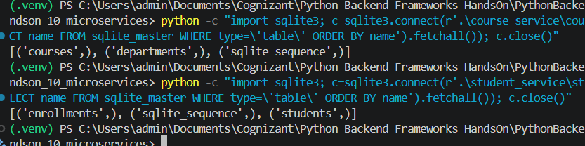
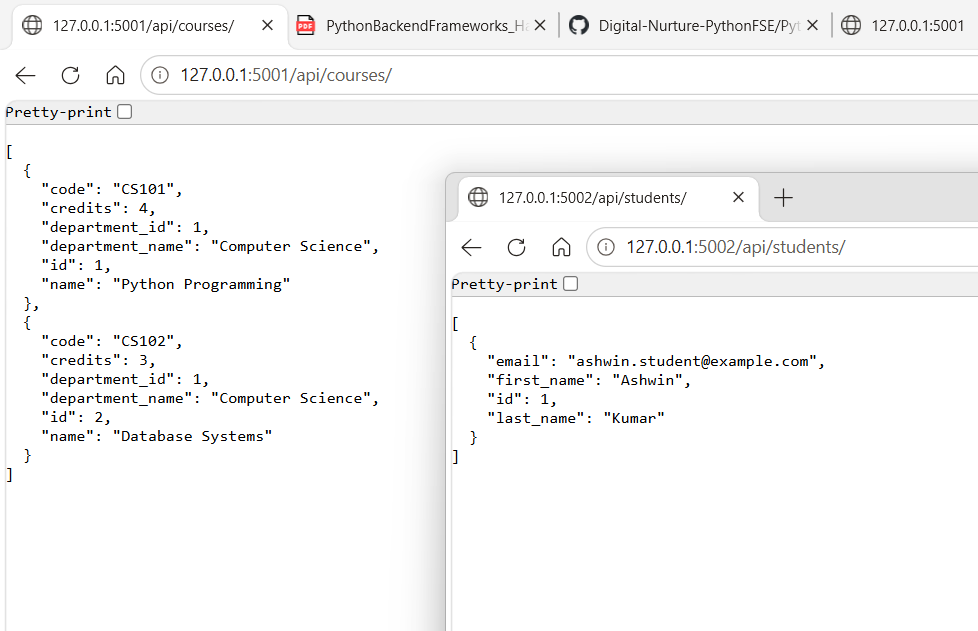
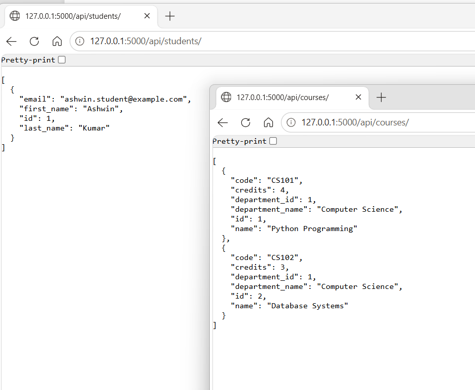
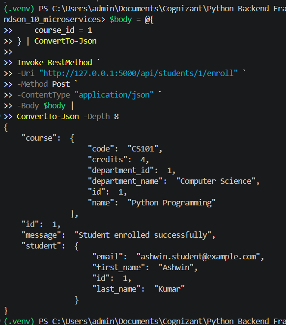
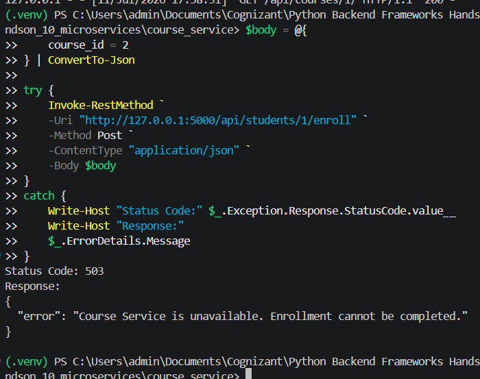

# Python Backend Frameworks — Hands-On 10

## Microservices Architecture — Concepts & Decomposition

### Author

- **Name:** Ashwin Kumar A
- **Track:** Python Full Stack Engineering
- **Module:** Python Backend Frameworks
- **Framework:** Flask
- **Environment:** Windows PowerShell, VS Code, Python 3.12

---

## Objective

The objective of Hands-On 10 is to decompose the Course Management API into small independent Flask microservices, implement synchronous inter-service communication, and demonstrate the API Gateway pattern.

This implementation contains:

- Course Service
- Student Service
- Separate SQLite databases
- Student enrollment through inter-service HTTP calls
- API Gateway routing
- Service-unavailable handling
- Documentation of synchronous and asynchronous communication trade-offs

---

## Relationship to Previous Hands-On Exercises

Hands-On 8 and Hands-On 9 used a FastAPI Course Management API.

Hands-On 10 does not modify the completed FastAPI project. Instead, it demonstrates how the monolithic Course Management system can be decomposed into separate Flask microservices.

Each service owns its own data and exposes only its own endpoints.

---

## Bounded Contexts

| Service Name | Responsibility | Endpoints It Owns | Database It Owns |
|---|---|---|---|
| Course Service | Manages departments and courses | `/api/courses/`, `/api/courses/{id}/` | `course_service.db` |
| Student Service | Manages students and enrollments | `/api/students/`, `/api/students/{id}/`, `/api/students/{id}/enroll` | `student_service.db` |
| Auth Service | Registration, login and token validation | Authentication endpoints from Hands-On 9 | Separate authentication database in a production design |
| Notification Service | Sends enrollment confirmation emails | Internal notification operations | Separate notification storage or message queue in a production design |

Only Course Service and Student Service were implemented as Flask applications, as required by the exercise.

---

## Project Structure

```text
handson_10/
├── course_service/
│   ├── app.py
│   └── course_service.db
├── student_service/
│   ├── app.py
│   └── student_service.db
├── gateway/
│   └── app.py
├── images/
│   ├── output_01_independent_service_databases.png
│   ├── output_02_services_running_independently.png
│   ├── output_03_gateway_routes_services.png
│   ├── output_04_gateway_enrollment_success.png
│   └── output_05_course_service_unavailable_503.png
├── requirements.txt
└── README.md
```

---

## Services and Ports

| Component | Port | Responsibility |
|---|---:|---|
| API Gateway | 5000 | Routes client requests |
| Course Service | 5001 | Course and department data |
| Student Service | 5002 | Student and enrollment data |

---

## Installation

Create a virtual environment:

```powershell
python -m venv .venv
```

Activate it:

```powershell
.\.venv\Scripts\Activate.ps1
```

Install dependencies:

```powershell
python -m pip install -r requirements.txt
```

---

## Run the Applications

Each application must run in a separate PowerShell terminal.

### Course Service

```powershell
cd course_service
python app.py
```

URL:

```text
http://127.0.0.1:5001
```

### Student Service

```powershell
cd student_service
python app.py
```

URL:

```text
http://127.0.0.1:5002
```

### API Gateway

```powershell
cd gateway
python app.py
```

URL:

```text
http://127.0.0.1:5000
```

---

# Task 1 — Decompose the Monolith

## Course Service

Course Service owns:

- Departments
- Courses
- Course creation
- Course listing
- Course lookup by ID

Endpoints:

```text
GET  /api/courses/
POST /api/courses/
GET  /api/courses/{id}/
```

Database:

```text
course_service/course_service.db
```

## Student Service

Student Service owns:

- Students
- Enrollments
- Student creation
- Student listing
- Student lookup
- Enrollment creation

Endpoints:

```text
GET  /api/students/
POST /api/students/
GET  /api/students/{id}/
GET  /api/students/{id}/enrollments/
POST /api/students/{id}/enroll
```

Database:

```text
student_service/student_service.db
```

## Independent Database Ownership

Course Service and Student Service do not share a database.

Course Service contains only:

```text
courses
departments
```

Student Service contains only:

```text
students
enrollments
```

Student Service never directly queries Course Service's SQLite database. It communicates with Course Service through HTTP.



---

## Services Running Independently

Course Service runs independently on port `5001`.

Student Service runs independently on port `5002`.

Each service can be started and stopped separately.



---

# Task 2 — Inter-Service Communication and API Gateway

## API Gateway

The API Gateway runs on port `5000`.

Routing rules:

```text
/api/courses/*  → Course Service on port 5001
/api/students/* → Student Service on port 5002
```

The gateway uses `requests.request()` to forward:

- HTTP method
- Request body
- Query parameters
- Relevant headers

It returns the downstream service response to the client.



---

## Full Enrollment Flow

Enrollment endpoint:

```text
POST /api/students/{id}/enroll
```

Example request through the gateway:

```text
POST http://127.0.0.1:5000/api/students/1/enroll
```

Request body:

```json
{
  "course_id": 1
}
```

Processing flow:

```text
Client
→ API Gateway on port 5000
→ Student Service on port 5002
→ Course Service on port 5001
→ Student Service database
→ Client response
```

Student Service sends:

```text
GET /api/courses/{id}/
```

to Course Service to verify that the requested course exists.

After successful verification, Student Service stores the enrollment in its own database.



---

## Course Service Unavailable

Student Service catches connection failures when Course Service is unavailable.

When Course Service is stopped, enrollment returns:

```text
503 Service Unavailable
```

Example response:

```json
{
  "error": "Course Service is unavailable. Enrollment cannot be completed."
}
```



---

## Synchronous HTTP Communication

Advantages:

- Simple to understand
- Immediate response
- Easy to implement with REST APIs
- Suitable when the caller requires an immediate result
- Useful for course-existence validation

Disadvantages:

- Creates runtime coupling
- Student Service depends on Course Service availability
- Network delays affect the complete request
- Failures can propagate between services
- Long chains of HTTP calls reduce reliability

In this exercise, Student Service must verify that a course exists before storing the enrollment, so a synchronous HTTP call is appropriate.

---

## Asynchronous Message Queue Communication

Message queues such as RabbitMQ or Kafka allow services to exchange events without waiting for immediate responses.

Advantages:

- Services are more loosely coupled
- Temporary service outages do not always block processing
- Messages can be retried
- Suitable for background operations
- Supports event-driven architectures
- Can handle high-volume workloads

Disadvantages:

- Adds infrastructure and operational complexity
- Processing may be delayed
- Eventual consistency must be handled
- Duplicate messages and retries require careful design
- Debugging distributed event flows is more difficult

Message queues are appropriate for:

- Sending confirmation emails
- Audit logging
- Analytics events
- Notifications
- Background report generation
- Long-running processing
- Events that do not require an immediate client response

For example, the Notification Service could receive an `EnrollmentCreated` event and send an email asynchronously.

---

## API Gateway Pattern

The API Gateway provides one entry point for clients.

In this exercise it routes requests to the correct service.

A production API Gateway may also handle:

- Authentication
- Authorisation
- Rate limiting
- SSL termination
- Request logging
- Monitoring
- Response aggregation
- Load balancing

The gateway in this project is intentionally minimal and demonstrates only routing and proxying.

---

## Service Discovery Concept

The example uses fixed service URLs:

```text
http://127.0.0.1:5001
http://127.0.0.1:5002
```

In production, service locations may change dynamically.

Service discovery tools allow services and gateways to find healthy service instances. Examples include:

- Kubernetes Services
- Consul
- Eureka
- DNS-based discovery

Service discovery is documented as a concept only and is not implemented in this exercise.

---

## Monolith vs Microservices

### Monolith

Advantages:

- Easier initial development
- Simple local deployment
- Easier transactions
- Simpler debugging
- Fewer network calls

Disadvantages:

- Components are tightly coupled
- Scaling one feature scales the entire application
- Large deployments affect all modules
- Technology changes are harder

### Microservices

Advantages:

- Independent deployment
- Independent scaling
- Clear service boundaries
- Separate database ownership
- Teams can work independently
- Failures can be isolated

Disadvantages:

- More operational complexity
- Network failures must be handled
- Distributed tracing is required
- Data consistency is harder
- Deployment and monitoring are more complex

Microservices are useful when system size, team structure, scalability or independent deployment needs justify the added complexity.

---

## Expected Outcomes Completed

- [x] Identified bounded contexts
- [x] Documented service responsibilities
- [x] Created Course Service
- [x] Created Student Service
- [x] Used Flask for both services
- [x] Course Service runs on port 5001
- [x] Student Service runs on port 5002
- [x] API Gateway runs on port 5000
- [x] Created independent SQLite databases
- [x] Ensured endpoints do not overlap
- [x] Added student enrollment endpoint
- [x] Student Service verifies courses through HTTP
- [x] Used Python `requests`
- [x] Handled Course Service connection failure
- [x] Returned 503 Service Unavailable
- [x] Created API Gateway proxy routing
- [x] Routed course requests to Course Service
- [x] Routed student requests to Student Service
- [x] Tested successful enrollment through gateway
- [x] Tested Course Service unavailable behavior
- [x] Documented synchronous communication
- [x] Documented asynchronous message queues
- [x] Documented API Gateway pattern
- [x] Documented service discovery concept

---

## Final Result

Hands-On 10 successfully demonstrates how a Course Management monolith can be decomposed into independent Flask microservices.

Course Service and Student Service own separate databases, communicate through HTTP, and are accessed through a simple API Gateway. The project also handles downstream service failure by returning a clear `503 Service Unavailable` response.