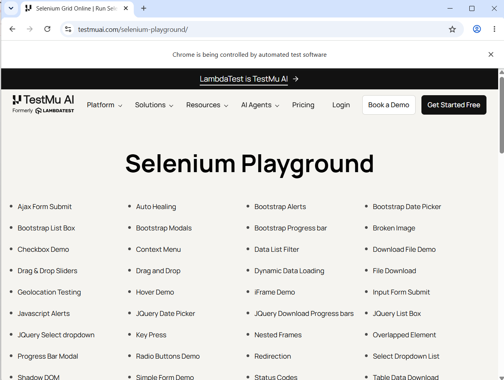
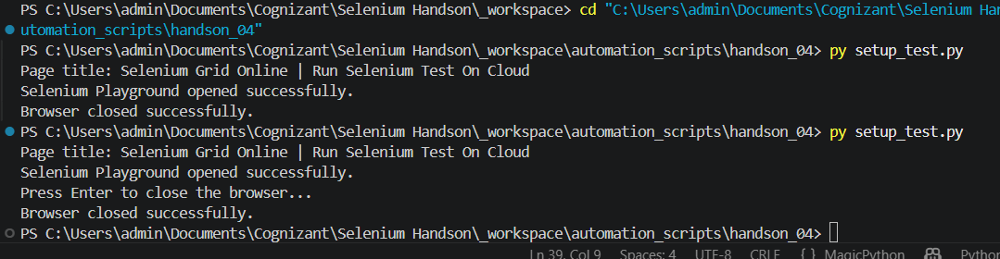
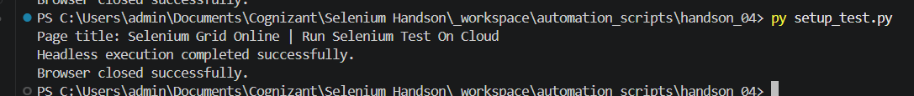
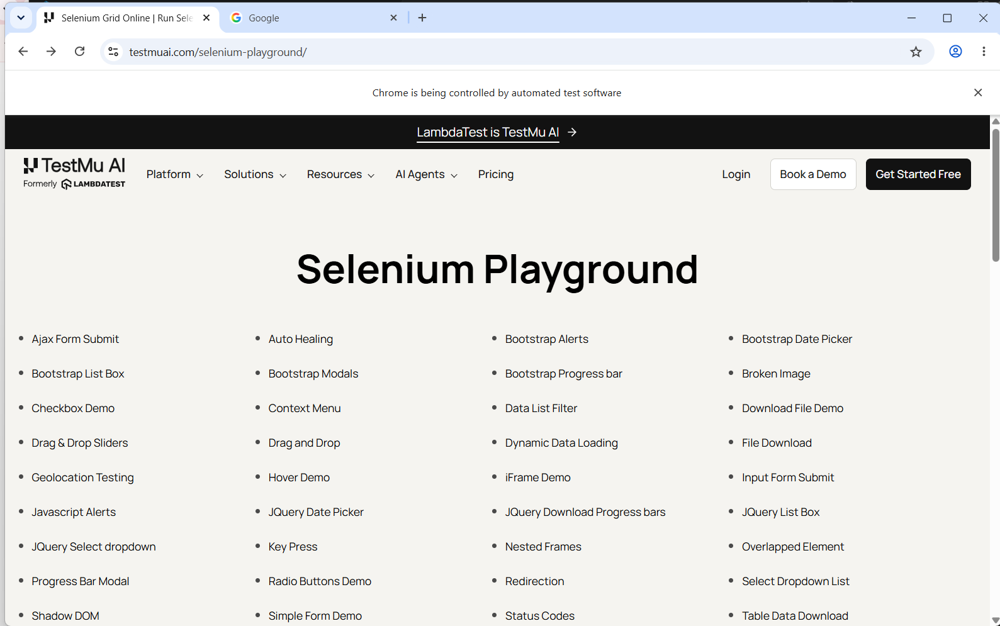
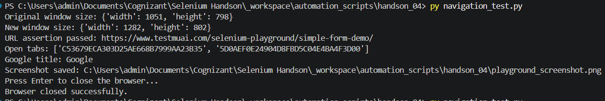
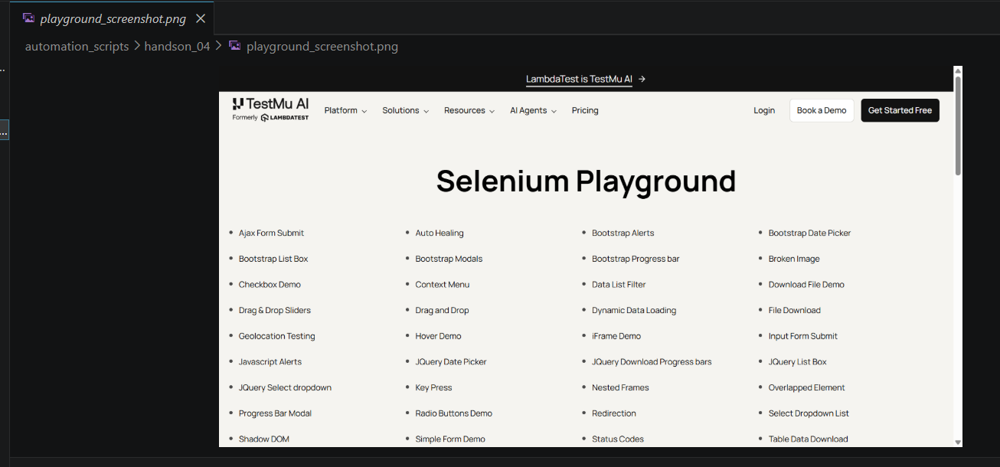

# Hands-On 4 - Selenium WebDriver Setup and Basic Commands

**Student Name:** Ashwin Kumar A

## Objective

This Hands-On covers Selenium WebDriver setup, browser navigation, multiple tabs, window handling, and screenshot capture.

---

## Folder Structure

```text
handson_04
│
├── setup_test.py
├── navigation_test.py
├── playground_screenshot.png
├── README.md
└── images
    ├── task1_01_visible_browser_execution.png
    ├── task1_02_visible_mode_terminal_output.png
    ├── task1_03_headless_terminal_output.png
    ├── task2_01_multiple_tabs.png
    ├── task2_02_terminal_output.png
    └── task2_03_saved_playground_screenshot.png
```

---

# Task 1 - Selenium Setup

## File

[Open setup_test.py](setup_test.py)

## Summary

- Configured Selenium WebDriver.
- Opened LambdaTest Selenium Playground.
- Printed the page title.
- Executed the script in normal mode.
- Executed the script in headless mode.

## Screenshots

### Visible Browser Execution




**Explanation:** Chrome opened successfully and loaded the LambdaTest Selenium Playground.

### Visible Mode Terminal Output




**Explanation:** The terminal displayed the page title and confirmed successful browser execution.

### Headless Terminal Output




**Explanation:** The script executed successfully in headless mode without opening a visible browser window.

---

# Task 2 - Navigation and Window Commands

## File

[Open navigation_test.py](navigation_test.py)

## Summary

- Opened Simple Form Demo.
- Verified the URL.
- Navigated back.
- Opened Google in a new tab.
- Switched between browser tabs.
- Changed the browser window size.
- Captured a screenshot.

## Screenshots

### Multiple Browser Tabs




**Explanation:** Selenium opened a second tab and switched between the Selenium Playground and Google tabs.

### Task 2 Terminal Output




**Explanation:** The terminal showed the URL validation, Google title, screenshot path, and successful browser closure.

### Saved Playground Screenshot



**Explanation:** This image was generated using `driver.save_screenshot()`.

---

## Generated Output File

[Open playground_screenshot.png](playground_screenshot.png)

---

## Result

Hands-On 4 was completed successfully. All required tasks were executed and all screenshots were captured.
