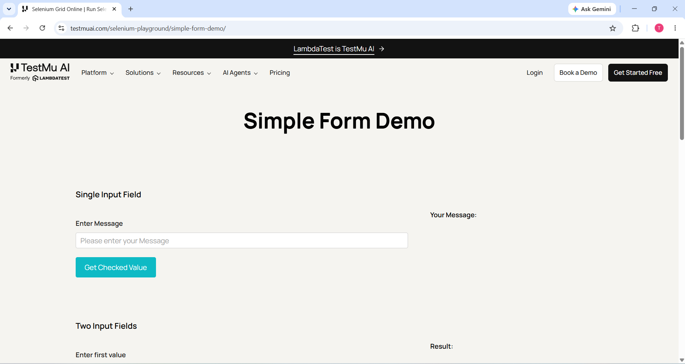
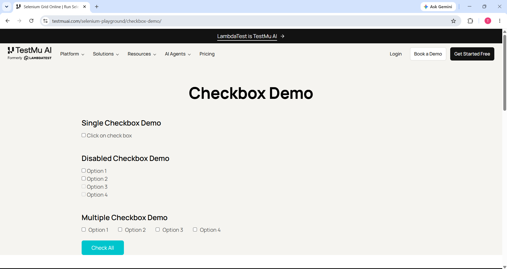
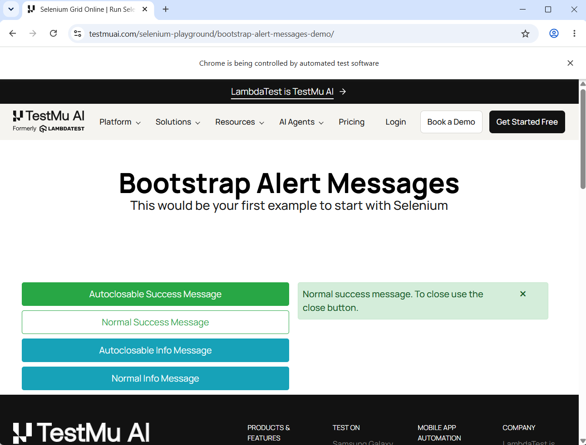
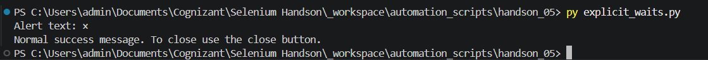
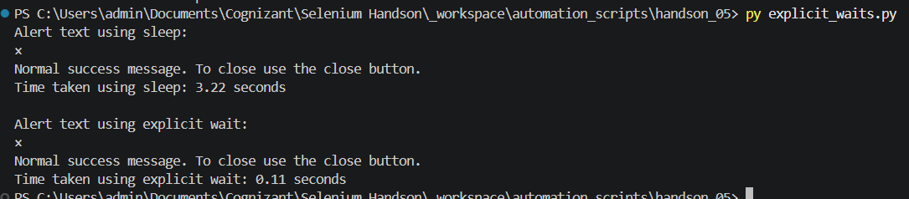
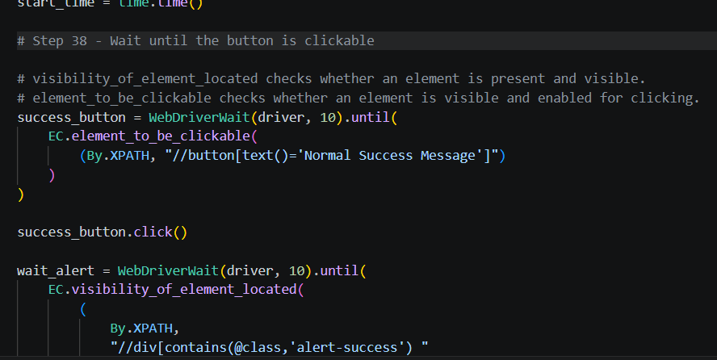
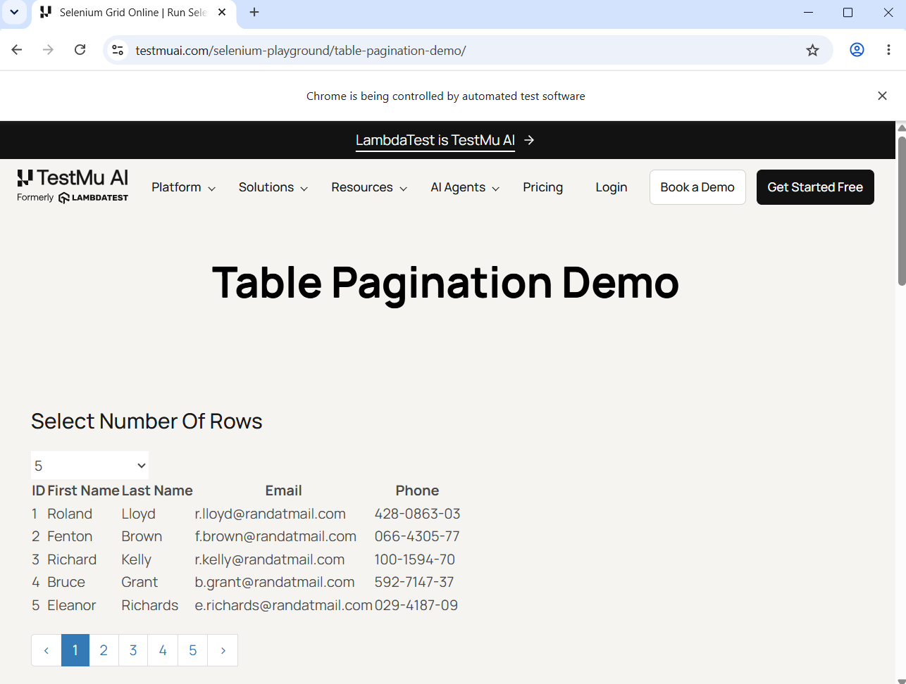
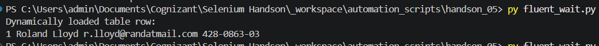

# Hands-On 5 - Locators and Explicit Waits

**Student Name:** Ashwin Kumar A

## Objective

This Hands-On covers Selenium locator strategies, XPath, CSS selectors, explicit waits, clickable waits, timing comparison using `time.sleep()` and `WebDriverWait`, and FluentWait.

---

## Folder Structure

```text
handson_05
│
├── locator_strategies.py
├── explicit_waits.py
├── README.md
└── images
    ├── task1_01_simple_form.png
    ├── task1_02_checkbox_demo.png
    ├── task2_01_success_alert.png
    ├── task2_02_terminal_output.png
    ├── task2_03_timing_comparison.png
    ├── task2_04_clickable_wait_code.png
    ├── task2_05_fluent_wait_table.png
    └── task2_06_fluent_wait_output.png
```

---

# Task 1 - Locator Strategies

## File

[Open locator_strategies.py](locator_strategies.py)

## Summary

- Opened the Simple Form Demo page.
- Located the message input using ID, Name, Class Name, Tag Name, absolute XPath, and relative XPath.
- Located the same input using three CSS selector patterns.
- Opened the Checkbox Demo page.
- Used XPath `text()` to locate the first option label.
- Used XPath `contains()` to locate all option labels.
- Ranked the locator strategies based on uniqueness, readability, and maintainability.

## Screenshots

### Simple Form Demo



**Explanation:** The Simple Form Demo page was opened and the message input field was inspected and located using multiple Selenium locator strategies.

### Checkbox Demo



**Explanation:** The Checkbox Demo page was used to locate checkbox labels using XPath `text()` and `contains()`.

---

# Task 2 - WebDriverWait and Expected Conditions

## File

[Open explicit_waits.py](explicit_waits.py)

## Summary

- Opened the Bootstrap Alerts demo page.
- Clicked the Normal Success Message button.
- Waited for the success alert using `WebDriverWait`.
- Verified the alert text using an assertion.
- Compared `time.sleep(3)` with an explicit wait.
- Measured and printed the execution time of both methods.
- Used `element_to_be_clickable()` before clicking the button.
- Used FluentWait with a polling interval of 500 milliseconds.
- Ignored `NoSuchElementException` during FluentWait polling.
- Waited for and printed a table row.

## Screenshots

### Success Alert



**Explanation:** The Bootstrap Alerts page displayed the Normal Success Message after Selenium clicked the button.

### Step 36 Terminal Output



**Explanation:** The terminal displayed the success alert text and confirmed that the explicit wait completed successfully.

### Timing Comparison



**Explanation:** The terminal compared the execution time of `time.sleep(3)` and `WebDriverWait`. The explicit wait continued as soon as the alert became visible.

### Clickable Wait Code



**Explanation:** The code used `element_to_be_clickable()` and documented the difference between visibility and clickability.

### FluentWait Table



**Explanation:** The table page was opened and Selenium waited for the table row using FluentWait.

### FluentWait Terminal Output



**Explanation:** The terminal displayed the dynamically located table row after FluentWait completed successfully.

## Result

Hands-On 5 was completed successfully. All required locator strategies, waits, assertions, timing comparisons, and FluentWait operations were implemented. The source files and screenshots are included for review in GitHub and VS Code Markdown Preview.
