# Hands-On 6 - Running Selenium Tests with pytest

**Student Name:** Ashwin Kumar A

## Objective

This Hands-On covers running Selenium automation tests using `pytest`, creating shared fixtures using `conftest.py`, using assertions, parameterized tests, generating HTML reports, capturing screenshots on test failure, using a reusable `base_url` fixture, and selecting dropdown values using Selenium's `Select` class.

---

## Folder Structure

```text
handson_06
│
├── conftest.py
├── test_playground.py
├── report.html
├── README.md
└── images
    ├── task1_01_step40_test_discovery.png
    ├── task1_02_step41_driver_fixture.png
    ├── task1_03_step42_simple_form_test.png
    ├── task1_04_step43_checkbox_test.png
    ├── task1_05_step44_pytest_pass.png
    ├── task2_01_step45_parameterized_tests.png
    ├── task2_02_step46_screenshot_on_failure.png
    ├── task2_03_step47_html_report.png
    ├── task2_04_step48_base_url_fixture.png
    ├── task2_05_step49_dropdown_test.png
    ├── test_checkbox_interaction_failure.png
    ├── test_simple_form_submission[12345]_failure.png
    ├── test_simple_form_submission[Hello]_failure.png
    └── test_simple_form_submission[Selenium Automation]_failure.png
```

---

# Task 1 - Organise Scripts into pytest Tests

## Files

[Open test_playground.py](test_playground.py)

[Open conftest.py](conftest.py)

## Summary

- Created pytest test functions using names beginning with `test_`.
- Created a shared WebDriver fixture in `conftest.py`.
- Used function scope to create a new browser instance for each test.
- Used `yield` for fixture setup and teardown.
- Automated the Simple Form Demo.
- Entered a message and verified the displayed result using an assertion.
- Automated the Checkbox Demo.
- Selected and deselected the first checkbox.
- Verified the checkbox state using `is_selected()`.
- Ran the tests using pytest verbose mode.

## Screenshots

### Step 40 - Test Discovery

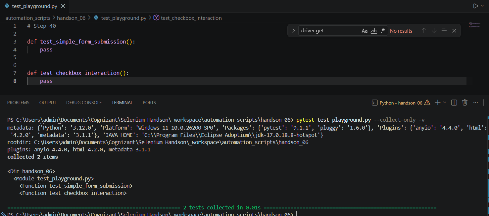

**Explanation:** pytest discovered the test functions because their names begin with `test_`.

### Step 41 - Driver Fixture

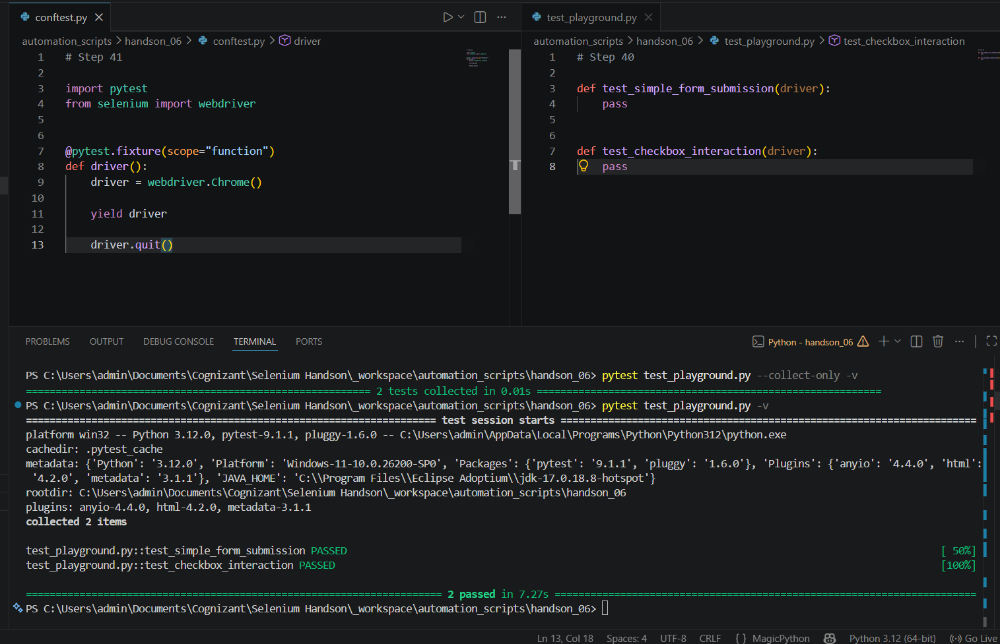

**Explanation:** The shared WebDriver fixture created a new Chrome browser for each test and closed it after the test completed.

### Step 42 - Simple Form Test

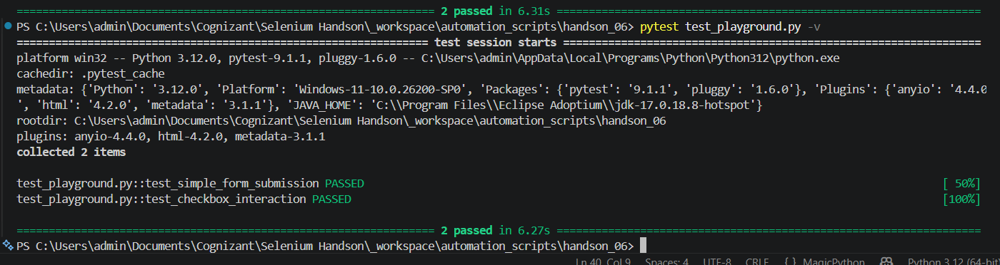

**Explanation:** Selenium entered a message in the Simple Form Demo and verified that the displayed message matched the entered value.

### Step 43 - Checkbox Test

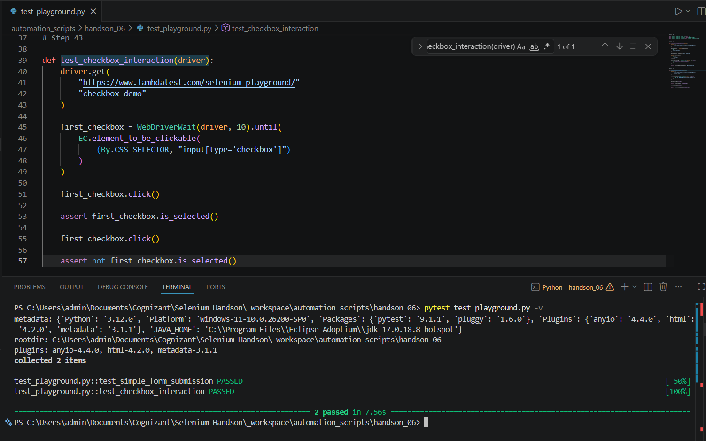

**Explanation:** Selenium selected the first checkbox, verified that it was selected, deselected it, and verified that it was no longer selected.

### Step 44 - pytest Execution

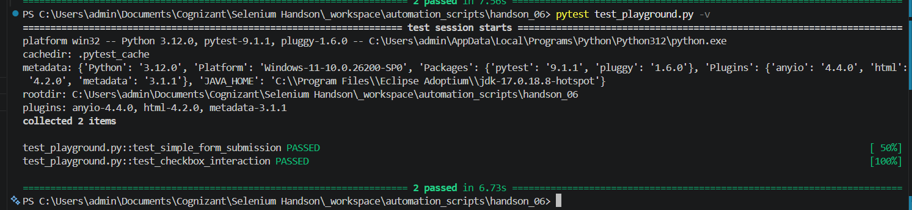

**Explanation:** The terminal confirmed that both pytest tests passed successfully.

---

# Task 2 - Parameterisation, Reporting and Screenshot on Failure

## Files

[Open test_playground.py](test_playground.py)

[Open conftest.py](conftest.py)

[Open report.html](report.html)

## Summary

- Parameterized the form submission test with three input values.
- Executed each parameter as a separate pytest test case.
- Added a pytest hook to capture screenshots when tests fail.
- Stored failure screenshots inside the `images` folder.
- Generated a self-contained HTML test report.
- Added a session-scoped `base_url` fixture.
- Used the shared `base_url` fixture in all tests.
- Automated the Select Dropdown List demo.
- Selected `Wednesday` using Selenium's `Select` class.
- Verified the selected option using an assertion.

## Screenshots

### Step 45 - Parameterized Tests

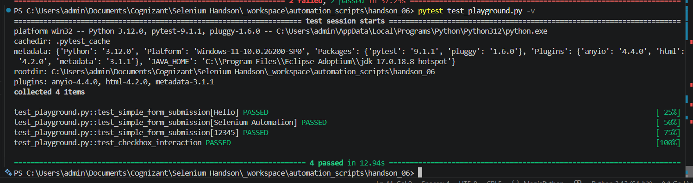

**Explanation:** The Simple Form test ran separately with `Hello`, `Selenium Automation`, and `12345`.

### Step 46 - Screenshot on Failure

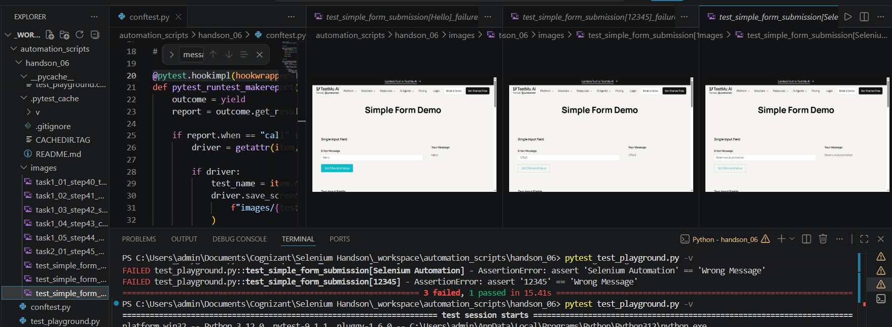

**Explanation:** The pytest failure hook captured screenshots automatically when a test failed.

### Failure Screenshot - Checkbox Test

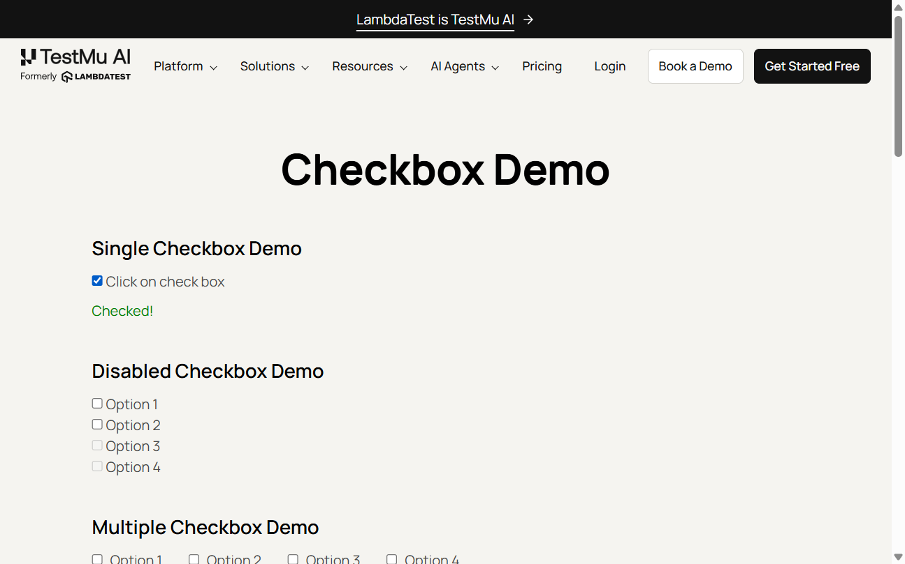

**Explanation:** This screenshot was captured automatically when the checkbox test failed.

### Failure Screenshot - 12345

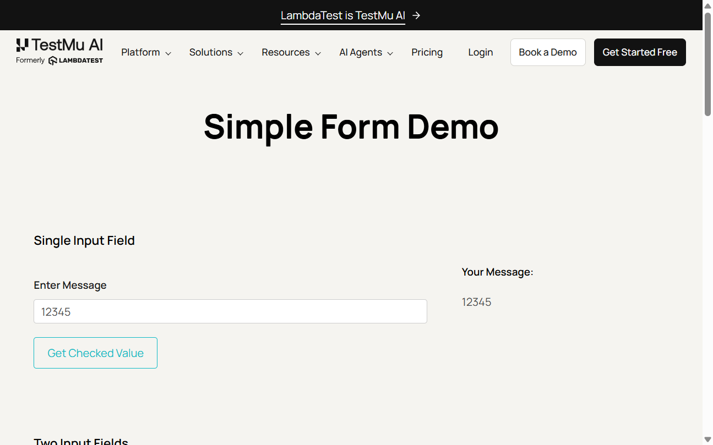

**Explanation:** This screenshot was captured automatically when the parameterized form test failed for the `12345` input.

### Failure Screenshot - Hello

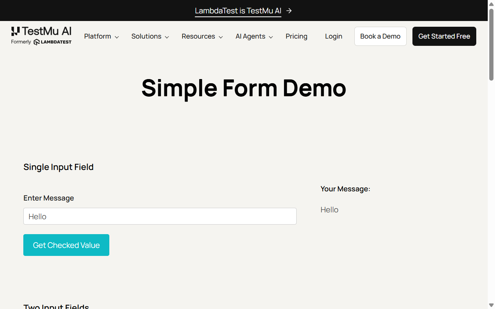

**Explanation:** This screenshot was captured automatically when the parameterized form test failed for the `Hello` input.

### Failure Screenshot - Selenium Automation


**Explanation:** This screenshot was captured automatically when the parameterized form test failed for the `Selenium Automation` input.

### Step 47 - HTML Report

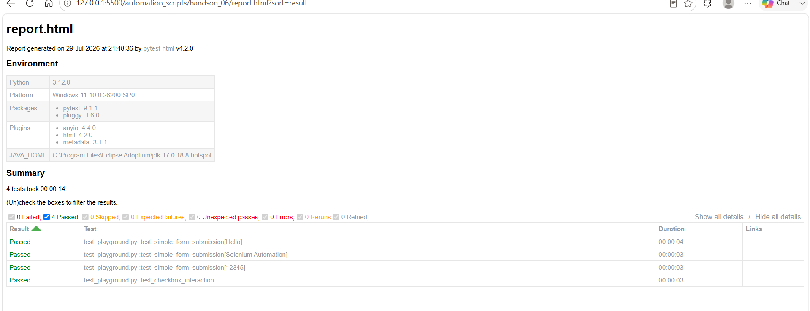

**Explanation:** pytest-html generated a self-contained report showing the test names, result status, and execution duration.

### Step 48 - Base URL Fixture

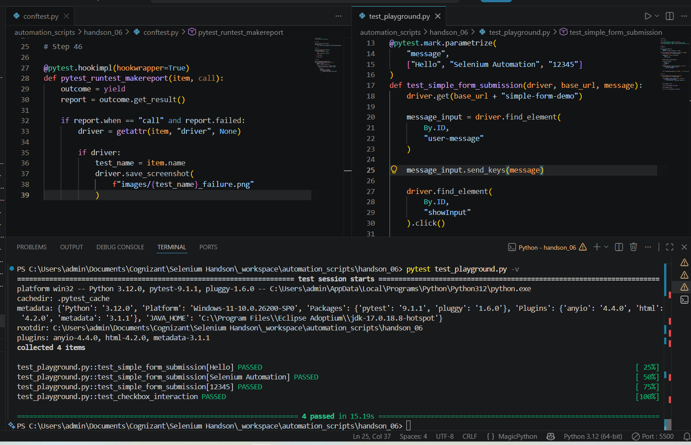

**Explanation:** A session-scoped `base_url` fixture was added and used by all test functions instead of repeating the full URL.

### Step 49 - Dropdown Test

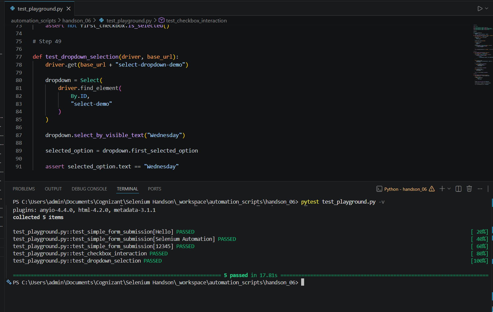

**Explanation:** Selenium selected `Wednesday` from the dropdown using the `Select` class and verified the selected option.

---


## Result

Hands-On 6 was completed successfully. Selenium scripts were organised as pytest test cases using fixtures, assertions, parameterization, HTML reporting, screenshot capture on failure, a reusable base URL fixture, and dropdown automation. The source files, report, and screenshots are included for review in GitHub and VS Code Markdown Preview.
