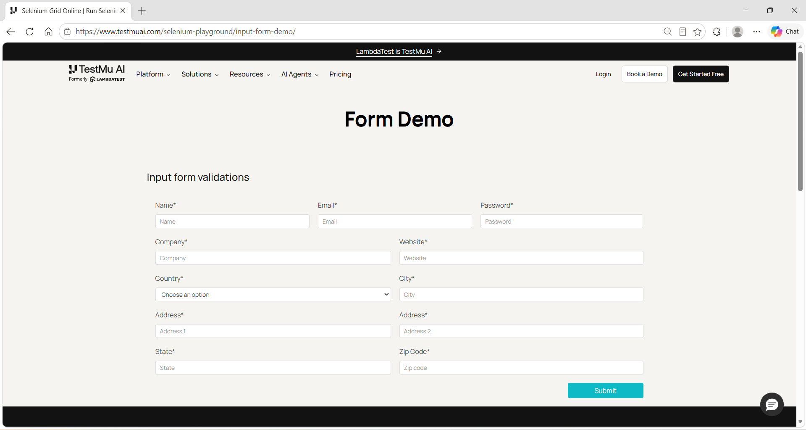
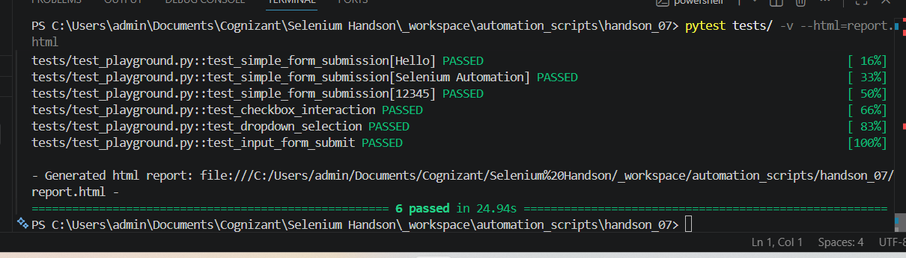
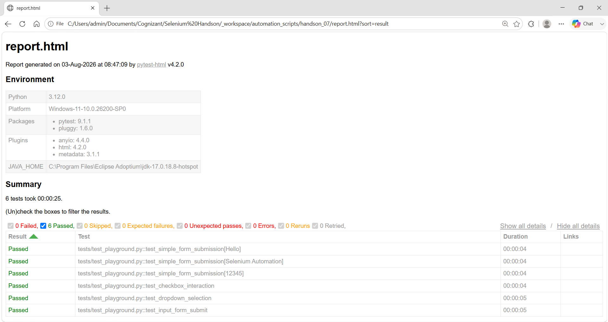
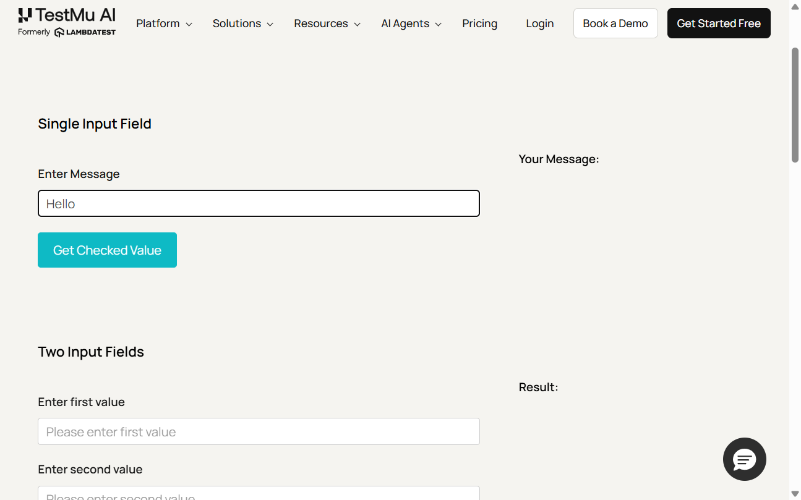
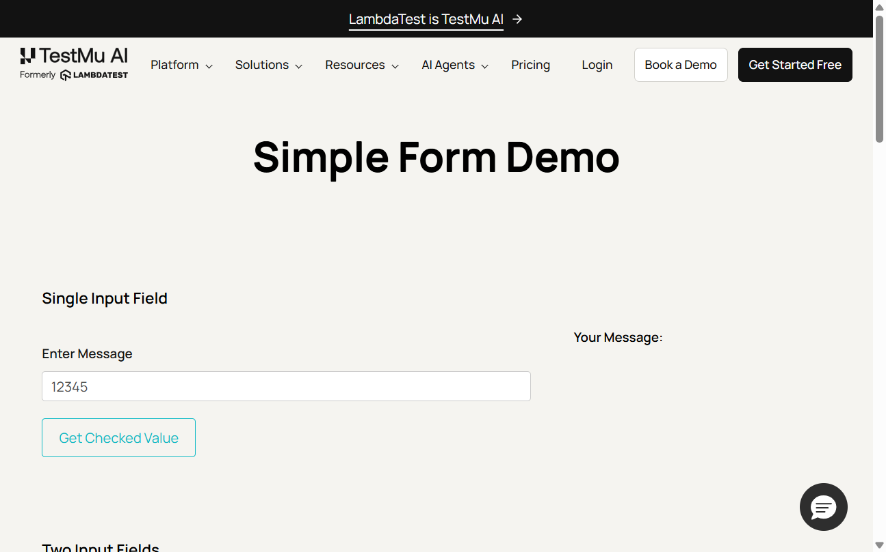

# Hands-On 7 - Page Object Model (POM)

**Student Name:** Ashwin Kumar A

## Objective

This Hands-On covers implementing the Page Object Model (POM) using Selenium, creating reusable page classes, refactoring Selenium tests using Page Objects, automating the Input Form Demo, and generating an HTML report.

---

## Folder Structure

```text
handson_07
│
├── pages
│   ├── base_page.py
│   ├── simple_form_page.py
│   ├── checkbox_page.py
│   ├── dropdown_page.py
│   └── input_form_page.py
│
├── tests
│   └── test_playground.py
│
├── conftest.py
├── report.html
├── README.md
└── images
    ├── task2_01_input_form_fields.png
    ├── task2_02_complete_test_suite.png
    ├── task2_03_html_report.png
    ├── test_simple_form_submission[12345]_failure.png
    ├── test_simple_form_submission[Hello]_failure.png
    └── test_simple_form_submission[Selenium Automation]_failure.png
```

---

# Task 1 - Build Page Classes

## Files

[Open base_page.py](pages/base_page.py)

[Open simple_form_page.py](pages/simple_form_page.py)

[Open checkbox_page.py](pages/checkbox_page.py)

[Open dropdown_page.py](pages/dropdown_page.py)

## Summary

- Created a reusable BasePage class.
- Created SimpleFormPage, CheckboxPage and DropdownPage.
- Moved locators into Page Object classes.
- Added reusable methods for page interactions.
- Removed direct page interaction logic from the test file.

## Screenshots

### Step 57 - Input Form Page



**Explanation:** Input Form Demo page used for automating form submission using the Page Object Model.

---

# Task 2 - Refactor Tests using Page Object Model

## Files

[Open input_form_page.py](pages/input_form_page.py)

[Open test_playground.py](tests/test_playground.py)

[Open conftest.py](conftest.py)

[Open report.html](report.html)

## Summary

- Refactored all Selenium tests to use Page Objects.
- Added InputFormPage for Input Form automation.
- Executed all tests successfully using pytest.
- Generated an HTML report.
- Verified all tests passed successfully.

## Screenshots

### Step 58 - Complete Test Suite



**Explanation:** The terminal confirmed that all Selenium tests passed successfully.

### Step 58 - HTML Report



**Explanation:** pytest-html generated a self-contained report showing the test results.

### Failure Screenshot - Hello



**Explanation:** Screenshot captured automatically when the parameterized test failed for the `Hello` input.

### Failure Screenshot - Selenium Automation


**Explanation:** Screenshot captured automatically when the parameterized test failed for the `Selenium Automation` input.

### Failure Screenshot - 12345



**Explanation:** Screenshot captured automatically when the parameterized test failed for the `12345` input.

---

## Step 59 - POM Maintenance Benefit

If a flat (non-POM) Selenium script used:

```python
driver.find_element(By.ID, "submit")
```

and the button ID changed from **`submit`** to **`btn-submit`**, every test containing that locator would need to be updated individually.

With the **Page Object Model (POM)**, the locator is stored only once inside the corresponding Page Object class. Updating the locator in that single class automatically fixes all tests that use the page methods, making the framework easier to maintain.

---

## Result

Hands-On 7 was completed successfully. Selenium scripts were organised using the Page Object Model (POM), reusable page classes, pytest, HTML reporting, and Input Form automation. The source files, report, and screenshots are included for review in GitHub and VS Code Markdown Preview.
